---
## Front matter
lang: ru-RU
title: Лабораторная работа №1
subtitle: Курс "Операционные Системы"
author:
  - Гибшер К.В. , НКАбд-01-22
institute:
  - Российский университет дружбы народов, Москва, Россия
  
date: 13 февраля 2023

## i18n babel
babel-lang: russian
babel-otherlangs: english

## Formatting pdf
toc: false
toc-title: Содержание
slide_level: 2
aspectratio: 169
section-titles: true
theme: metropolis
header-includes:
 - \metroset{progressbar=frametitle,sectionpage=progressbar,numbering=fraction}
 - '\makeatletter'
 - '\beamer@ignorenonframefalse'
 - '\makeatother'
---

## Докладчик

:::::::::::::: {.columns align=center}
::: {.column width="70%"}

  * Гибшер Кирилл Владимирович
  * студент группы НКАбд-01-22
  *  кафедры Компьютерные и информационные науки 
  * Российский университет дружбы народов
  * [kirill.gibsher@gmail.com](mailto:kirill.gibsher@gmail.com)
  

:::
::: {.column width="30%"}

:::
::::::::::::::

## Цели и задачи

- Приобретение практических навыков установки операционной системы на виртуальную машину
- Настройка минимально необходимых для дальнейшей работы сервисов
- Создать отчет по ходу лаборатной работы и презентацию в Markdown

# Выполнение лабораторной работы 

## Базовые обновления 

Так как виртуальная машина и ОС Linux Fedora были у меня установлены намного раньше, весь процесс настройки ВМ не удалось запечатлить. Таким образом, приступаю сразу к настройке ОС с автоматического обновления с помощью команды dnf install dnf-automatic и запускаю таймер с помощью команды systemctl enable --now dnf-automatic.timer 

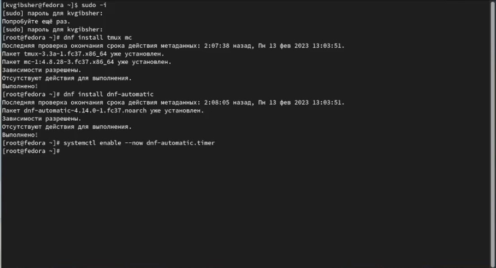

## SELinux

Отключение системы безопасности SELinux 

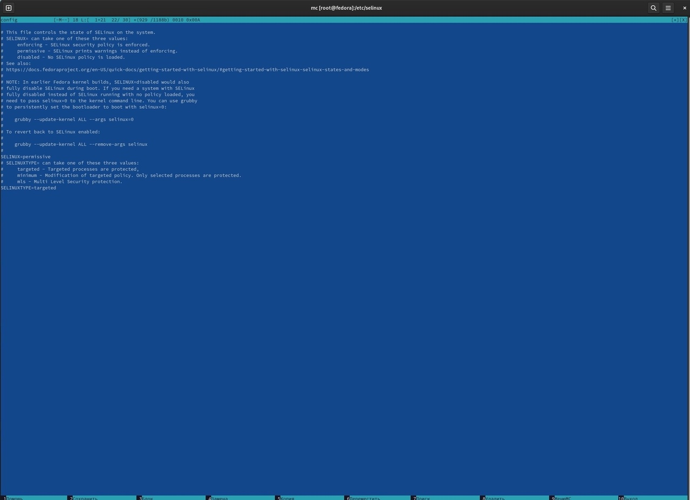

## Драйвера ВМ 

 Установка драйверов для VirtualBox 

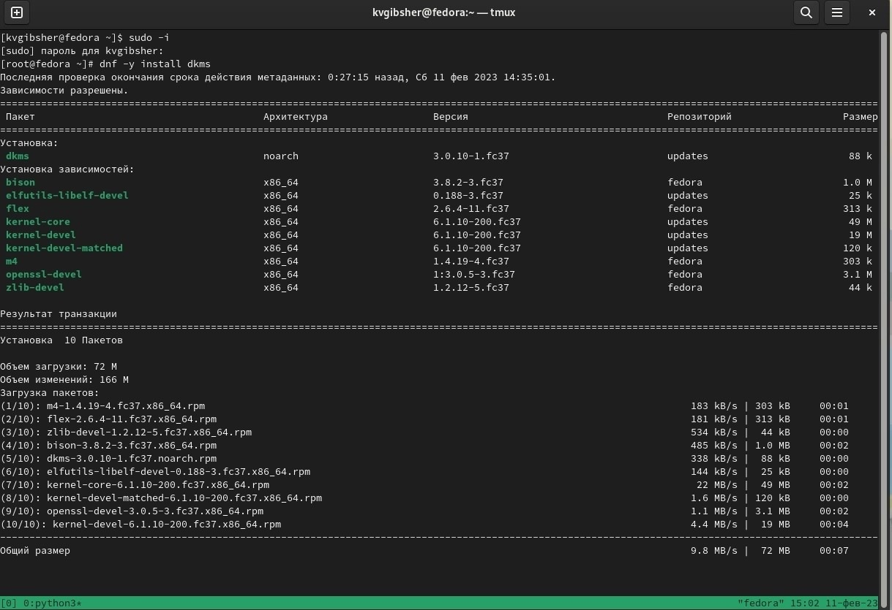

## Образ диска дополнений 

В меню виртуальной машины подключаем образ диска дополнений гостевой ОС и наблюдаем за установкой драйверов. 

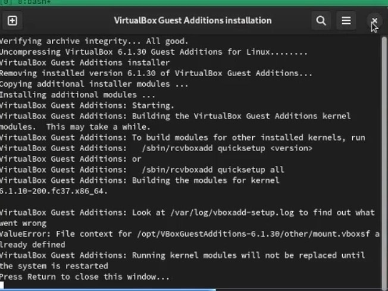

## Найстройка раскладки

Редактирование конфигурационного файла /etc/X11/xorg.conf.d/00-keyboard.conf для настройки раскладки. 

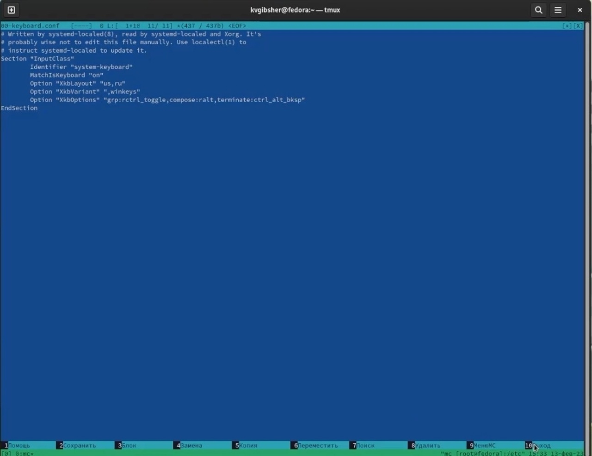

## Pandoc

Так как pandoc был устанавлен у меня раннее на скриншоте показано его наличие в моей ОС. 

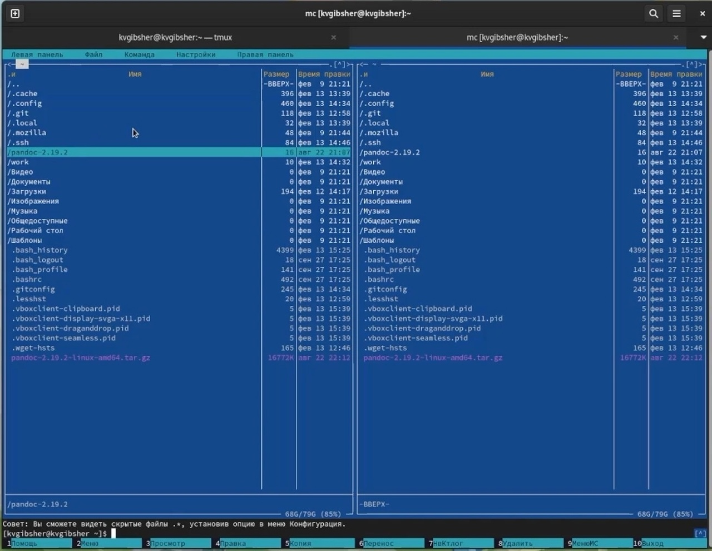

## Расширения Pandoc

Но необходимых для курса расширений у меня нет, поэтому провожу установку данных расширений. 

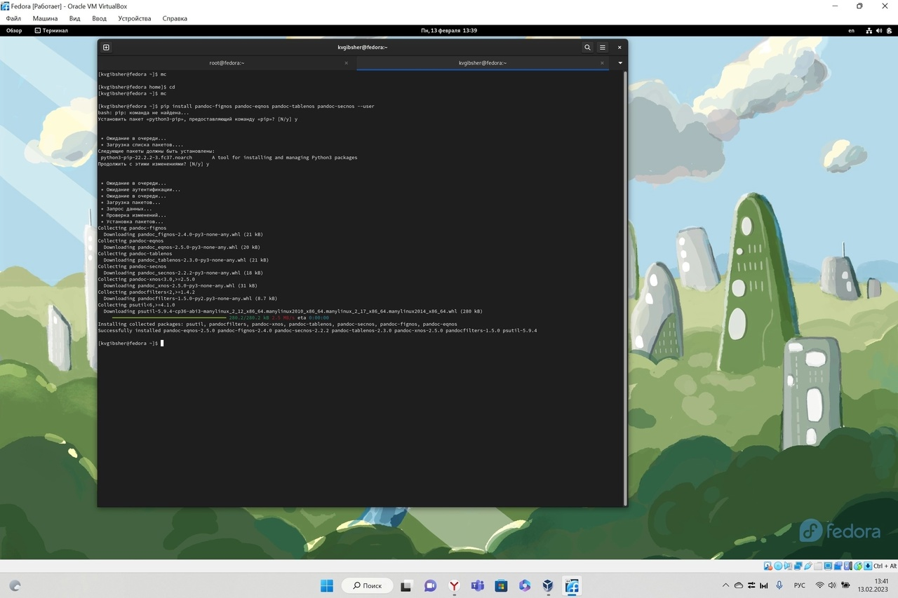

## TeXLive

Так как ситуация с TexLive у меня такая же как и pandoc и у меня он уже установлен в подтверждение я привожу скриншот ниже, на котором показано завершение установки TexLive. 

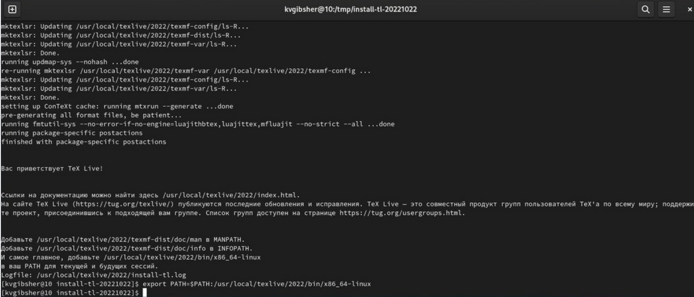

## Домашнее задание

Далее приступаю к выполнению домашнего задания и начинаю с того , что дождитесь загрузки графического окружения и открываю терминал. В окне терминала провожу анализ последовательность загрузки системы, выполнив команду dmesg. 

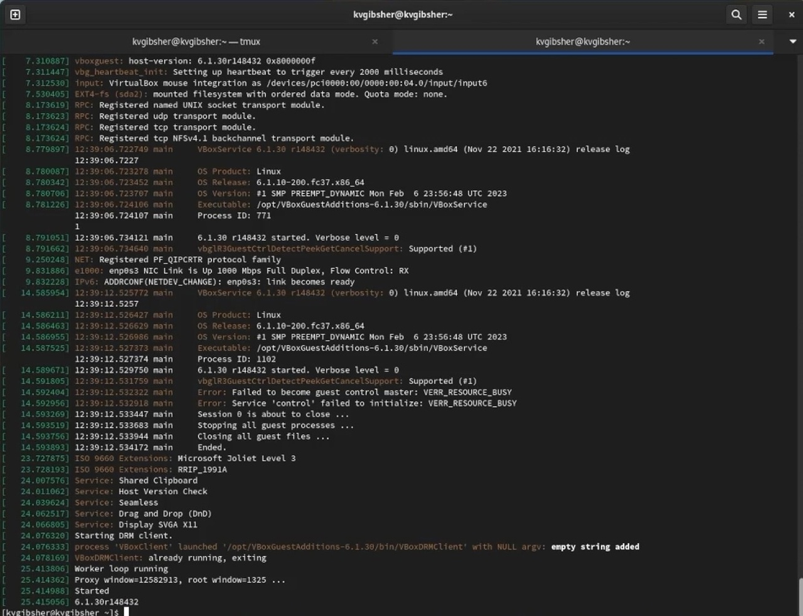

## Информация о системе 

Далее с помощью необходимых команд я получаю следующую информацию: Версия ядра Linux,частота процессора,модель процессора,объём доступной оперативной памяти,тип обнаруженного гипервизора,тип файловой системы корневого раздела и последовательность монтирования файловых систем. 

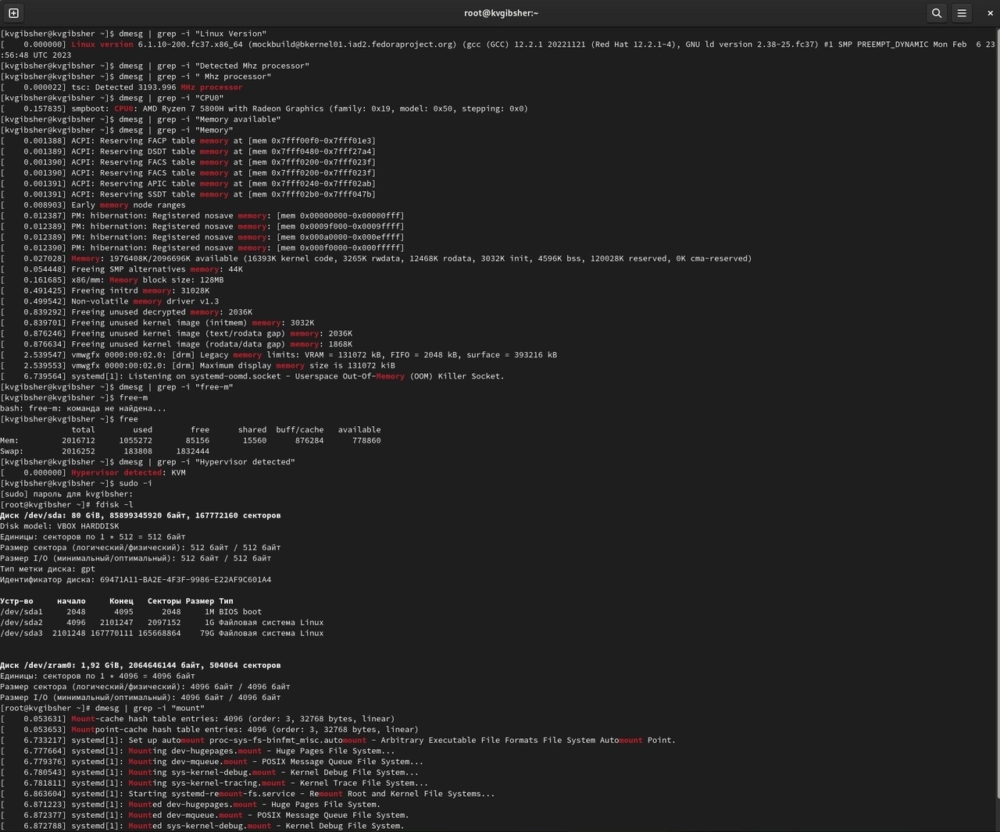

## Последовательность монтирования файловых систем

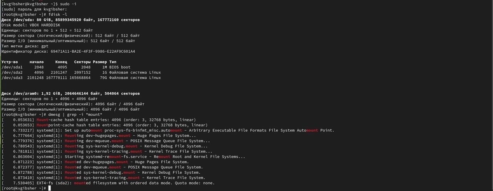

# Результаты

## Выводы

Таким образом, проделав самостоятельно всю лабораторную работу, я приобрел навыки в настройке Виртуальной машины,установки ОС Linux Fedora и последующую загрузку обновлений и расширений для ее составляющих, таких как pandoc , TexLive. Также научился первоначальным этапам настройки этой операционной системы начиная с имени пользователя и хоста и заканчивая настройкой раскладки клавиатуры. 
Каждый человек, связывающий себя с компьютерными науками должен знать базу! 

:::

