---
## Front matter
title: "Отчёт по лабораторной работе №1"
subtitle: "Операционные Системы"
author: "Гибшер Кирилл Владимирович,НКАбд-01-22"

## Generic otions
lang: ru-RU
toc-title: "Содержание"

## Bibliography
bibliography: bib/cite.bib
csl: pandoc/csl/gost-r-7-0-5-2008-numeric.csl

## Pdf output format
toc: true # Table of contents
toc-depth: 2
lof: true # List of figures
lot: true # List of tables
fontsize: 12pt
linestretch: 1.5
papersize: a4
documentclass: scrreprt
## I18n polyglossia
polyglossia-lang:
  name: russian
  options:
	- spelling=modern
	- babelshorthands=true
polyglossia-otherlangs:
  name: english
## I18n babel
babel-lang: russian
babel-otherlangs: english
## Fonts
mainfont: PT Serif
romanfont: PT Serif
sansfont: PT Sans
monofont: PT Mono
mainfontoptions: Ligatures=TeX
romanfontoptions: Ligatures=TeX
sansfontoptions: Ligatures=TeX,Scale=MatchLowercase
monofontoptions: Scale=MatchLowercase,Scale=0.9
## Biblatex
biblatex: true
biblio-style: "gost-numeric"
biblatexoptions:
  - parentracker=true
  - backend=biber
  - hyperref=auto
  - language=auto
  - autolang=other*
  - citestyle=gost-numeric
## Pandoc-crossref LaTeX customization
figureTitle: "Рис."
tableTitle: "Таблица"
listingTitle: "Листинг"
lofTitle: "Список иллюстраций"
lotTitle: "Список таблиц"
lolTitle: "Листинги"
## Misc options
indent: true
header-includes:
  - \usepackage{indentfirst}
  - \usepackage{float} # keep figures where there are in the text
  - \floatplacement{figure}{H} # keep figures where there are in the text
---

# Цель работы

Целью данной работы является приобретение практических навыков установки операционной системы на виртуальную машину, настройки минимально необходимых для дальнейшей работы сервисов.

# Задание
1. Установить и настроить виртуальную машину с операционной системой Linux(Fedora). 
2. Произвести первоначальные настройки ВМ.
3. Настройка хост-клавиш. 
4. Установка обновлений ОС, после запуска виртуальной машины. 
5. Отключение SELinux.
6. Установить дополнительные драйвера для VirtualBox. 
7. Настроить раскладку клавиатуры. 
8. Установка имени пользователя и имя хоста. 
9. Установка ПО для создания документации. 
10. Выполнение домашнего задания.

# Теоретическое введение

## Техническое обеспечение 
Лабораторная работа подразумевает установку на виртуальную машину VirtualBox (https://www.virtualbox.org/) операционной системы Linux (дистрибутив Fedora).
Выполнение работы возможно как в дисплейном классе факультета физико-математических и естественных наук РУДН, так и дома. Описание выполнения работы приведено для дисплейного класса со следующими характеристиками техники:
Intel Core i3-550 3.2 GHz, 4 GB оперативной памяти, 80 GB свободного места на жёстком диске;
ОС Linux Gentoo ;
VirtualBox версии 7.0 или новее.
Для установки в виртуальную машину используется дистрибутив Linux Fedora , вариант с менеджером окон i3.
При выполнении лабораторной работы на своей технике  необходимо скачать необходимый образ операционной системы.

### Соглашение об именовании 
При выполнении работ следует придерживаться следующих правил именования:

Пользователь внутри виртуальной машины должен иметь имя, совпадающее с учётной записью студента, выполняющего лабораторную работу.
Имя хоста вашей виртуальной машины должно совпадать с учётной записью студента, выполняющего лабораторную работу.
Имя виртуальной машины должно совпадать с учётной записью студента, выполняющего лабораторную работу.
В дисплейных классах вы можете посмотреть имя вашей учётной записи, набрав в терминале необходимую команду.
При установке на своей технике необходимо использовать имя вашей учётной записи дисплейных классов. Например, если студента зовут Остап Сулейманович Бендер, то его учётная запись имеет вид osbender.

# Выполнение лабораторной работы

Так как виртуальная машина и ОС Linux Fedora были у меня установлены намного раньше, весь процесс настройки ВМ не удалось запечатлить. Таким образом, приступаю сразу к настройке ОС с автоматического обновления с помощью команды dnf install dnf-automatic и запускаю таймер с помощью команды systemctl enable --now dnf-automatic.timer (рис. [-@fig:001]).

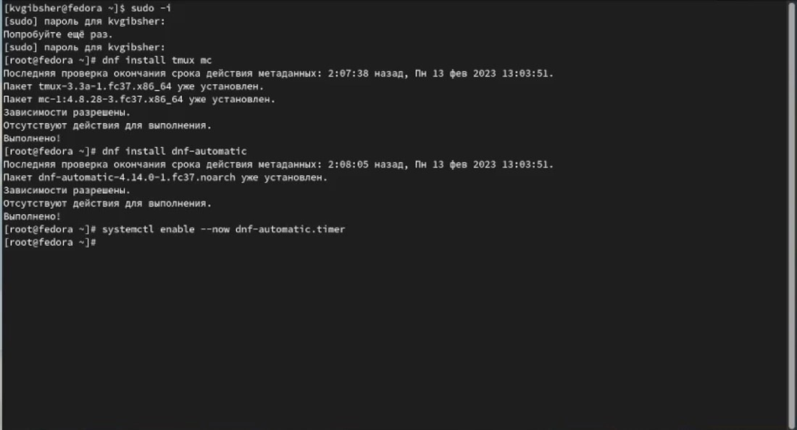{#fig:001 width=70%}

Затем, так как в данном курсе мы не будем рассматривать работу с системой безопасности SELinux я отключаю его с помощью измения необходимого для работы SELinux файла config.(рис. [-@fig:002]).

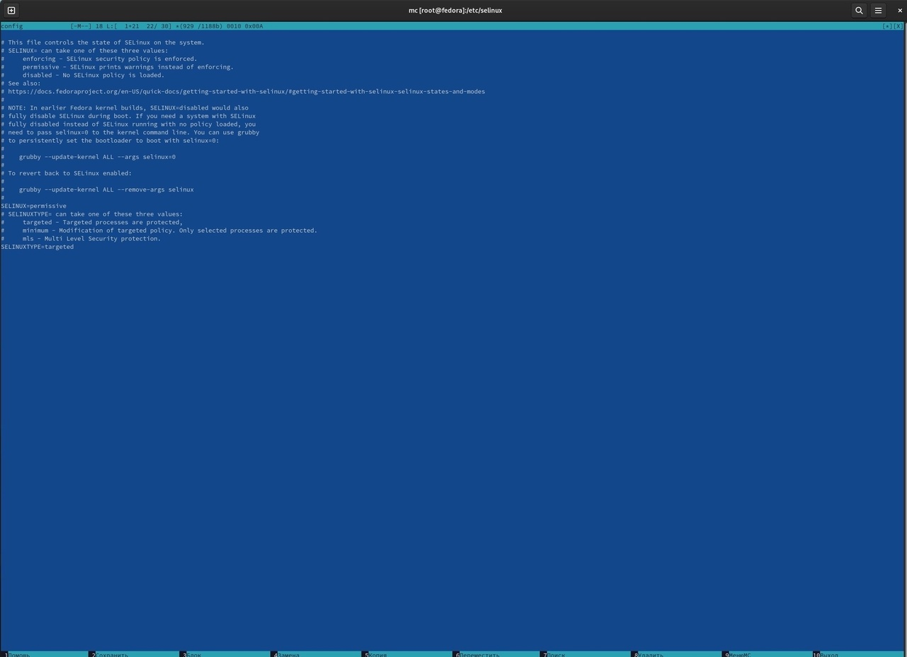{#fig:002 width=70%}

Затем приступаю к установке драйверов для VirtualBox , для этого открываем с помощью команды tmux терминальный мультиплексор и устанавливаем пакет DKMS. (рис. [-@fig:003]).

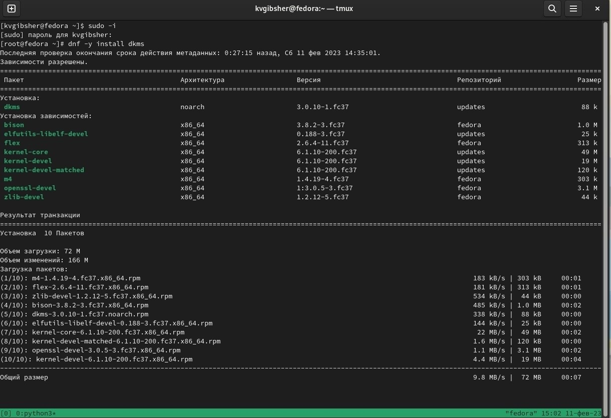{#fig:003 width=70%}

В меню виртуальной машины подключаем образ диска дополнений гостевой ОС и наблюдаем за установкой драйверов. (рис. [-@fig:004]).

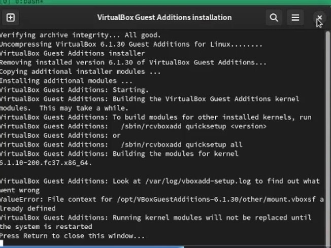{#fig:004 width=70%}

Затем подмонтируем диск , с помощью команды mount /dev/sr0 /media , и загрузим еще пакет драйверов.Затем перезагрузим систему. (рис. [-@fig:005]).

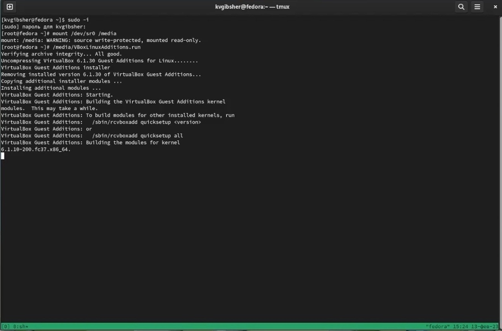{#fig:005 width=70%}

Приступим к настройке раскладки клавиатуры и сделаем это с помощью редактирования конфигурационный файла /etc/X11/xorg.conf.d/00-keyboard.conf и вновь перезапустим систему. (рис. [-@fig:006]).

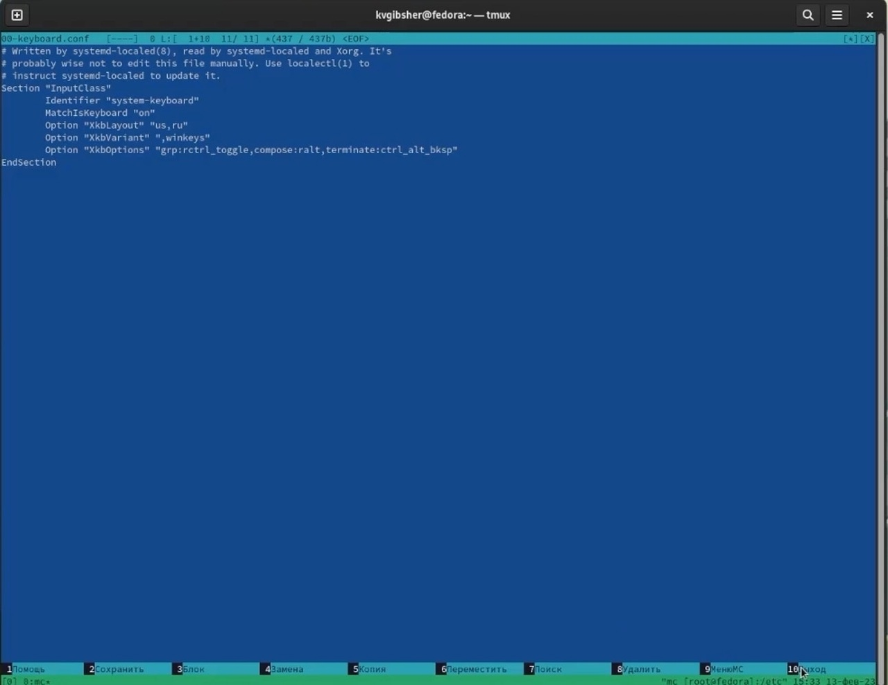{#fig:006 width=70%}

Хоть я и изначально установил правильное имя хоста и пользователя, для самопроверки я еще раз проведу данную операцию только через терминал. С помощью команд показанных на скриншоте, я проверил и убедился, что все настроено согласно соглашению об наименовании. (рис. [-@fig:007]).

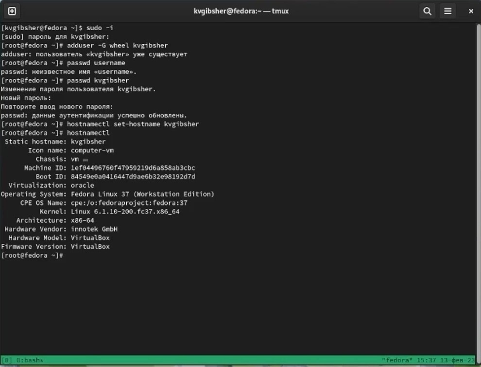{#fig:007 width=70%}

Так как pandoc был устанавлен у меня раннее на скриншоте показано его наличие в моей ОС. (рис. [-@fig:008]).

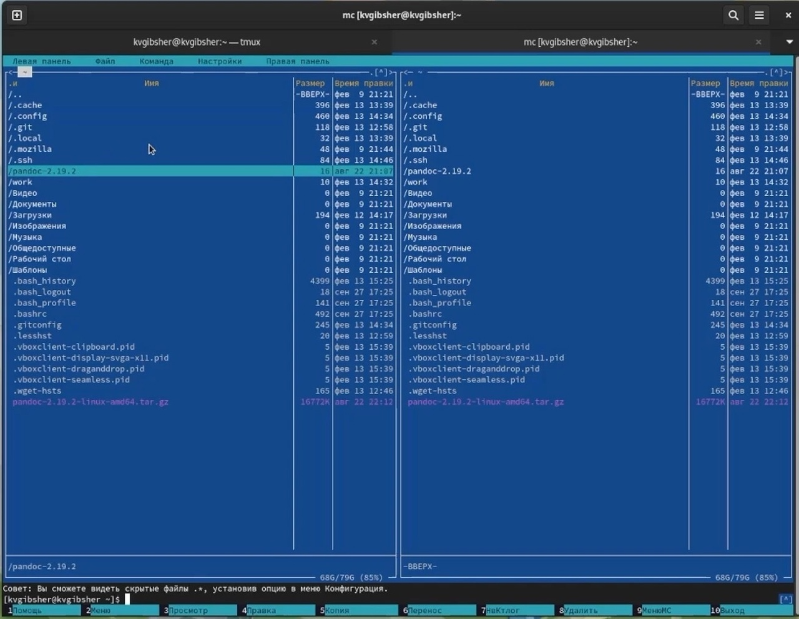{#fig:008 width=70%}

Но необходимых для курса расширений у меня нет, поэтому провожу установку данных расширений. (рис. [-@fig:009]).

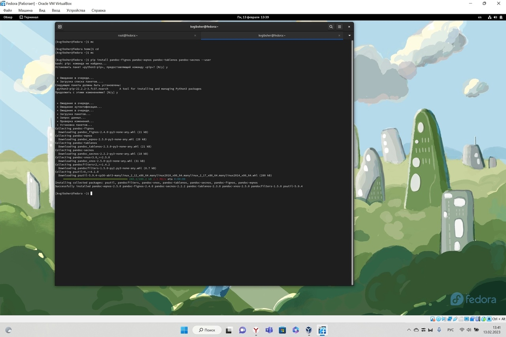{#fig:009 width=70%}

Так как ситуация с TexLive у меня такая же как и pandoc и у меня он уже установлен в подтверждение я привожу скриншот ниже, на котором показано завершение установки TexLive. (рис. [-@fig:010]).

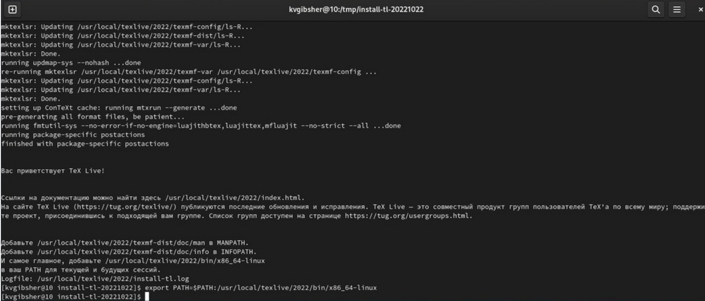{#fig:010 width=70%}

Далее приступаю к выполнению домашнего задания и начинаю с того , что дождитесь загрузки графического окружения и открываю терминал. В окне терминала провожу анализ последовательность загрузки системы, выполнив команду dmesg. (рис. [-@fig:011]).

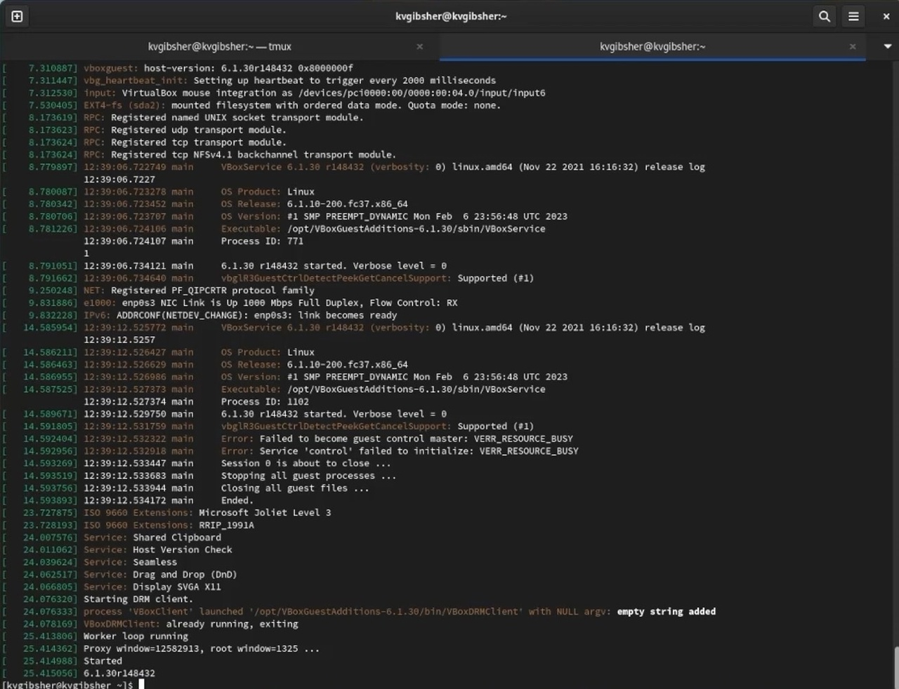{#fig:011 width=70%}

Далее с помощью необходимых команд я получаю следующую информацию: Версия ядра Linux,частота процессора,модель процессора,объём доступной оперативной памяти,тип обнаруженного гипервизора,тип файловой системы корневого раздела и последовательность монтирования файловых систем. (рис. [-@fig:012]).

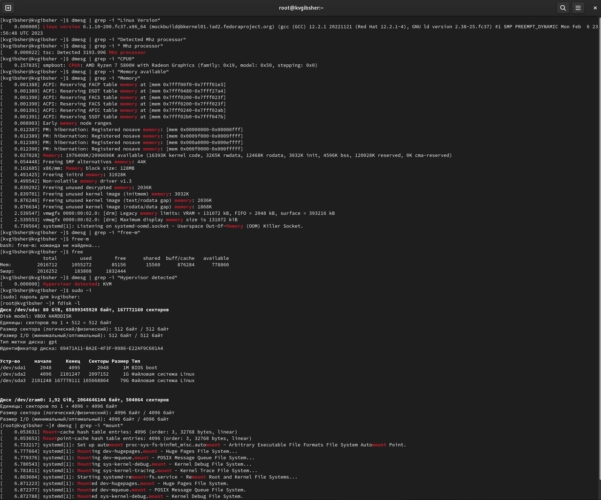{#fig:012 width=70%}

Последний пункт - информация об последовательности монтирования файловых систем. (рис. [-@fig:013]).

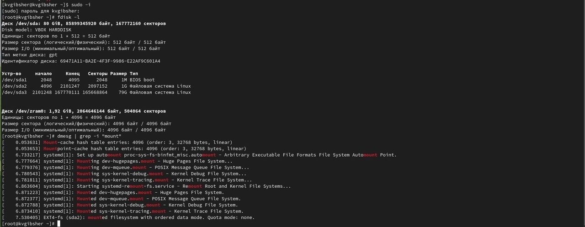{#fig:013 width=70%}

# Контрольные вопросы

1. Какую информацию содержит учётная запись пользователя?

УЗ содержить информацию о имени пользователя, о пароле , индетификационном номере , индетификационном номере группы пользователя. Также содержит информацию о домашнем каталоге и о командном интерпретаторе пользователя. 

2. Укажите команды терминала и приведите примеры:

для получения справки по команде используется man <название команды> , например man ls 
для перемещения по файловой системе cd , cd /home 
для просмотра содержимого каталога; ls , ls /etc 
для определения объёма каталога; du , du /kvgibsher
для создания / удаления каталогов / файлов; mkdir , mkdir /work , touch 1.txt , rm 1.txt, 
для задания определённых прав на файл / каталог; chmod + x имя файла/каталога
для просмотра истории команд. history 

3. Что такое файловая система? Приведите примеры с краткой характеристикой.
Файловая система - Порядок, определяющий способ организации, хранения и именования данных на носителях информации в компьютерах, а также в другом электронном оборудовании: цифровых фотоаппаратах, мобильных телефонах и т. п. Файловая система определяет формат содержимого и способ физического хранения информации, которую принято группировать в виде файлов. Конкретная файловая система определяет размер имен файлов (и каталогов), максимальный возможный размер файла и раздела, набор атрибутов файла. Некоторые файловые системы предоставляют сервисные возможности, например, разграничение доступа или шифрование файлов.

Файловая система NTFS - Отличительные свойства данной файловой системы: поддержка больших файлов и дисков,низкий уровень фрагментации,поддержка длинных символьных имен,контроль доступа к каталогам и отдельным файлам.

XFS - высокопроизводительная файловая система. Плюсы: высокая скорость работы с большими файлами, отложенное выделение места, увеличение разделова на лету и незначительный размер служебной информации.

4. Как посмотреть, какие файловые системы подмонтированы в ОС?
С помощью команды mount 

5. Как удалить зависший процесс?
с помощью команды kill

# Выводы

Таким образом, благодаря данной лабораторной работе я приобрел практических навыков установки операционной системы на виртуальную машину, настройки минимально необходимых для дальнейшей работы сервисов.

# Список литературы{.unnumbered}

1. Лекция учетные записи в Linuх [электронный ресурс] – Режим доступа:https://intuit.ru/studies/courses/23/23/lecture/27143

2. Файловая система [электронный ресурс] – Режим доступа:https://ru.wikipedia.org/wiki/Файловая_система

3. Примеры файловых систем [электронный ресурс] – Режим доступа:https://studfile.net/preview/9106985/page:8/

::: {#refs}
:::
