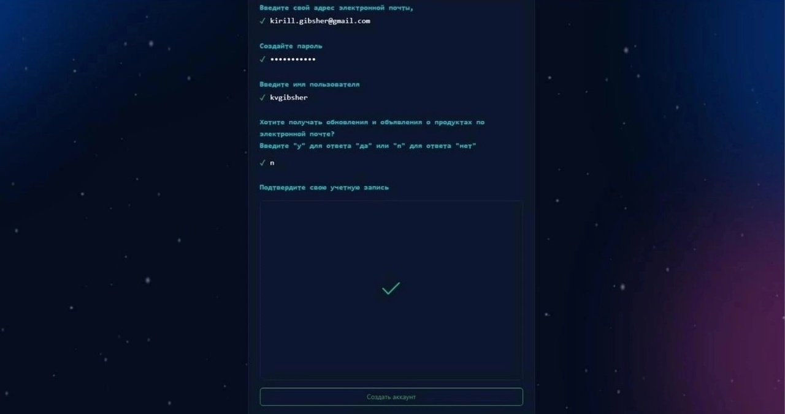
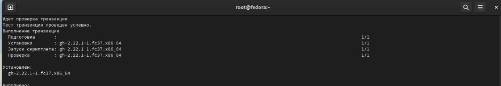
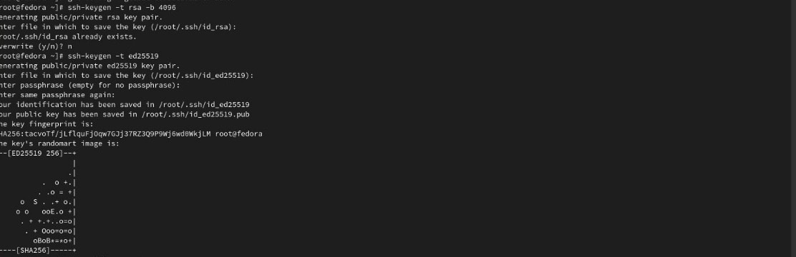
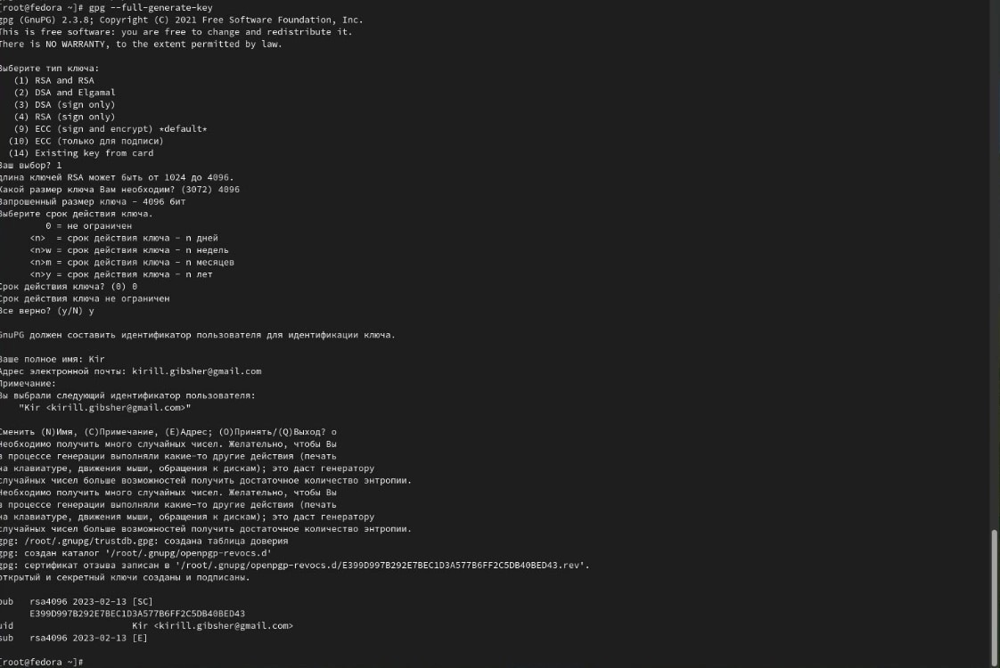
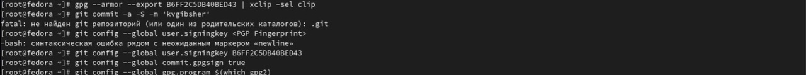
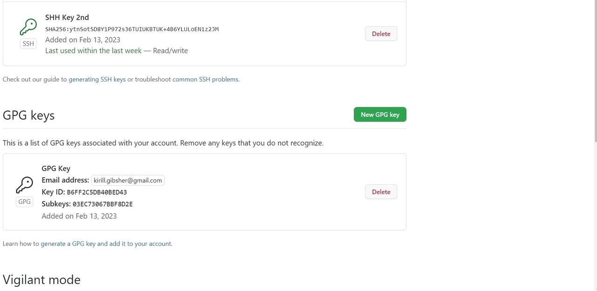
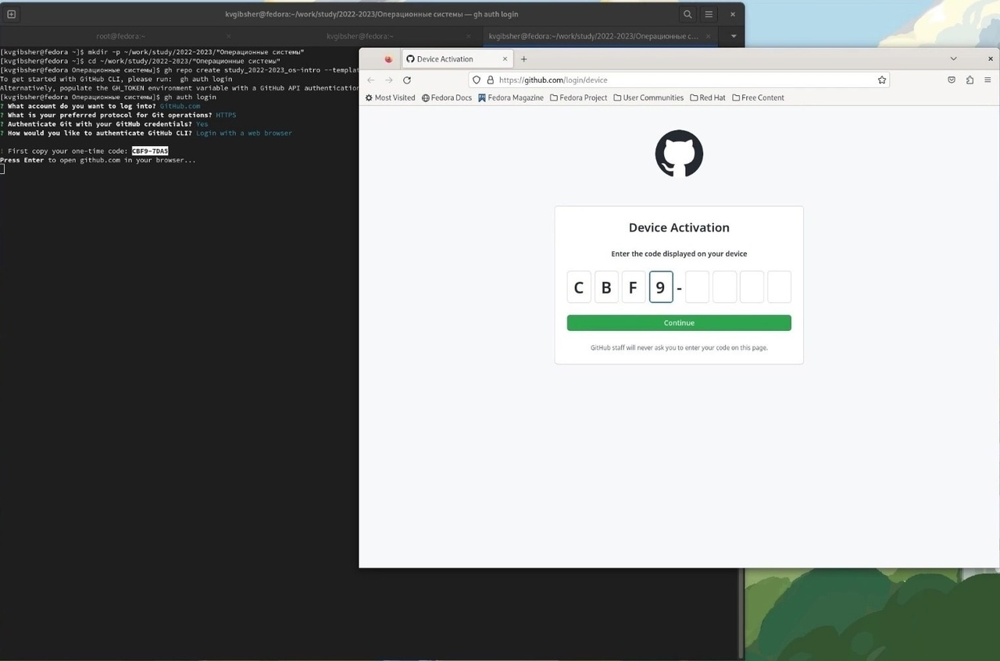
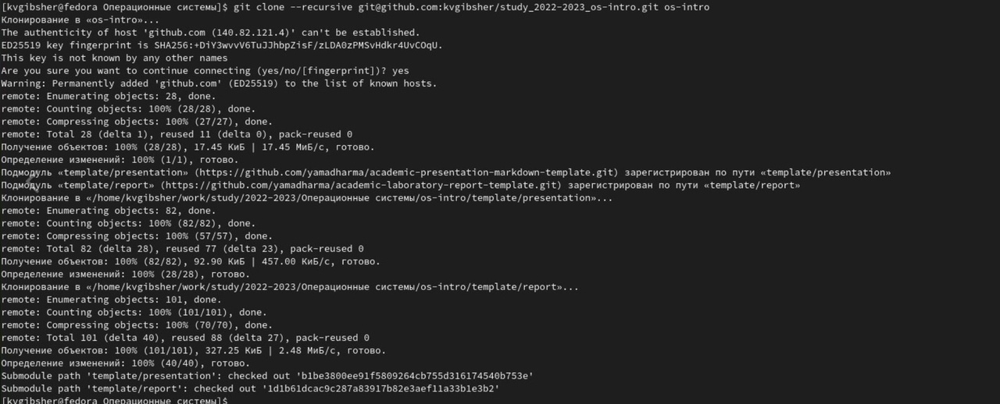
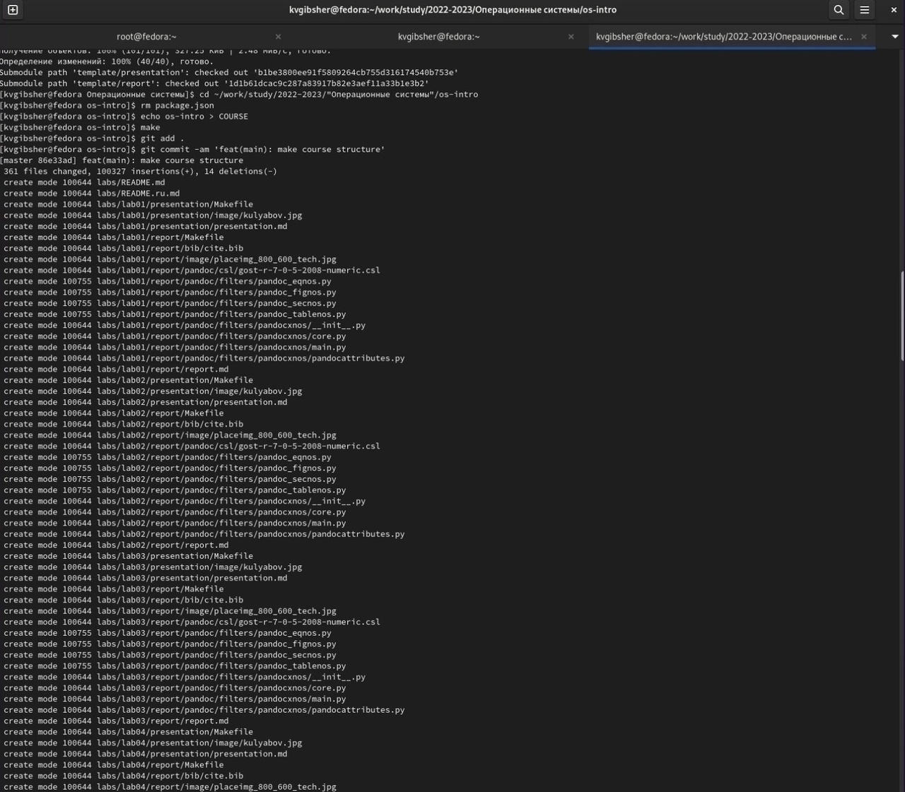
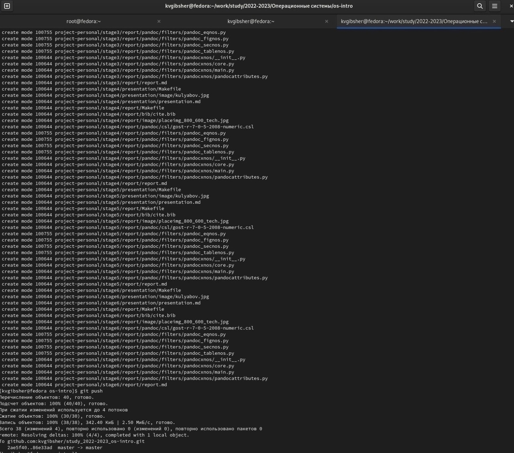

---
## Front matter
lang: ru-RU
title: Лабораторная работа №2
subtitle: Курс "Операционные Системы"
author:
  - Гибшер К.В. , НКАбд-01-22
institute:
  - Российский университет дружбы народов, Москва, Россия
  
date: 13 февраля 2023

## i18n babel
babel-lang: russian
babel-otherlangs: english

## Formatting pdf
toc: false
toc-title: Содержание
slide_level: 2
aspectratio: 169
section-titles: true
theme: metropolis
header-includes:
 - \metroset{progressbar=frametitle,sectionpage=progressbar,numbering=fraction}
 - '\makeatletter'
 - '\beamer@ignorenonframefalse'
 - '\makeatother'
---

## Докладчик

:::::::::::::: {.columns align=center}
::: {.column width="70%"}

  * Гибшер Кирилл Владимирович
  * студент группы НКАбд-01-22
  *  кафедры Компьютерные и информационные науки 
  * Российский университет дружбы народов
  * [kirill.gibsher@gmail.com](mailto:kirill.gibsher@gmail.com)
  

:::
::: {.column width="30%"}

:::
::::::::::::::

## Цели и задачи
1. Изучить идеологию и применение средств контроля версий.
2. Освоить умения по работе с git.
3. Создать базовую конфигурацию для работы с git.
4. Создать ключ SSH.
5. Создать ключ PGP.
6. Настроить подписи git.
7. Зарегистрироваться на Github.
8. Создать локальный каталог для выполнения заданий по предмету.

# Выполнение лабораторной работы 

## Создание GitHub

Аккаунт у меня был создан раннее, поэтому прикрепляю прошлый скриншот создания моего аккаунта.

## Установка gh

Произвожу установку gh с помощью команды dnf install gh

## Базовая настройка Git

С помощью команд, указанных на скриншоте произвожу настройку Git и прописываю параметры.

## Генерация ключей SSH

Сгенерируем ключ rsa с размером  4096 с помощью команды ssh-keygen -t rsa -b 4096 и ключ  по алгоритму ed25519 ssh-keygen -t ed25519

## Генерация PGP ключа 

Cоздадим PGP ключ с помощью команды gpg --full-generate-key со следующими параметрами: тип RSA and RSA; размер 4096; срок действия; значение по умолчанию — 0 (срок действия не истекает никогда).GPG запросит личную информацию, которая сохранится в ключе:Имя (не менее 5 символов).Адрес электронной почты

## Добавления PGP ключа на GItHub 

ыводим список ключей и копируем отпечаток приватного ключа: gpg --list-secret-keys --keyid-format LONG \ gpg --armor --export PGP Fingerprint | xclip -sel clip. Перейдем в настройки GitHub, нажмем на кнопку New GPG key и вставьте полученный ключ в поле ввода.

## Доказательство успешного формирования ключа

## Авторизация на gh

авторизируемся с помощью команды gh auth

## Создание рабочего пространства в нашей ОС и связка с GitHub

## Настройка каталогов курса 

Далее приступим к настройке каталога курса, для этого удалим лишние файлы командой rm package.json . Создадим необходимые каталоги echo os-intro > COURSE и make. 

## Отправка файлов на сервер 

Отправляем файлы на сервер с помощью git add . и git push 

# Результаты

## Выводы

Таким образом, проделав самостоятельно всю лабораторнуб работу я научился работать с GitHub , использовать сторонние шаблоны для организацими рабочего пространства в своей виртуальной ОС. Научился генерировать ключи и настраивать их. Научился работать с каталогами внутреннего пространства системы и научился составлять отчеты в MarkDown. Данная лабораторная работа необходима для дальнейшего понимания структуры OC. 

:::

