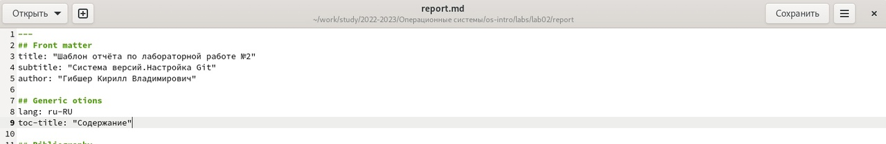
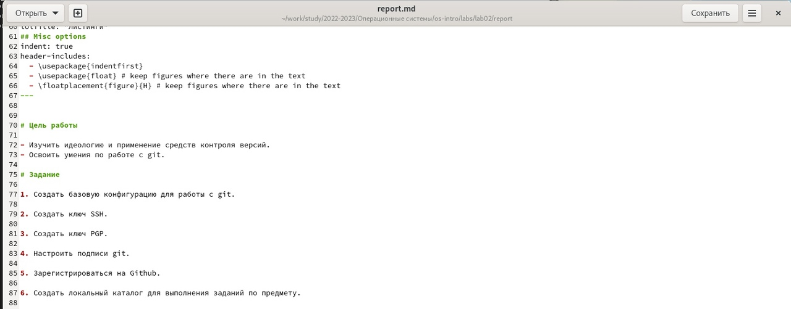
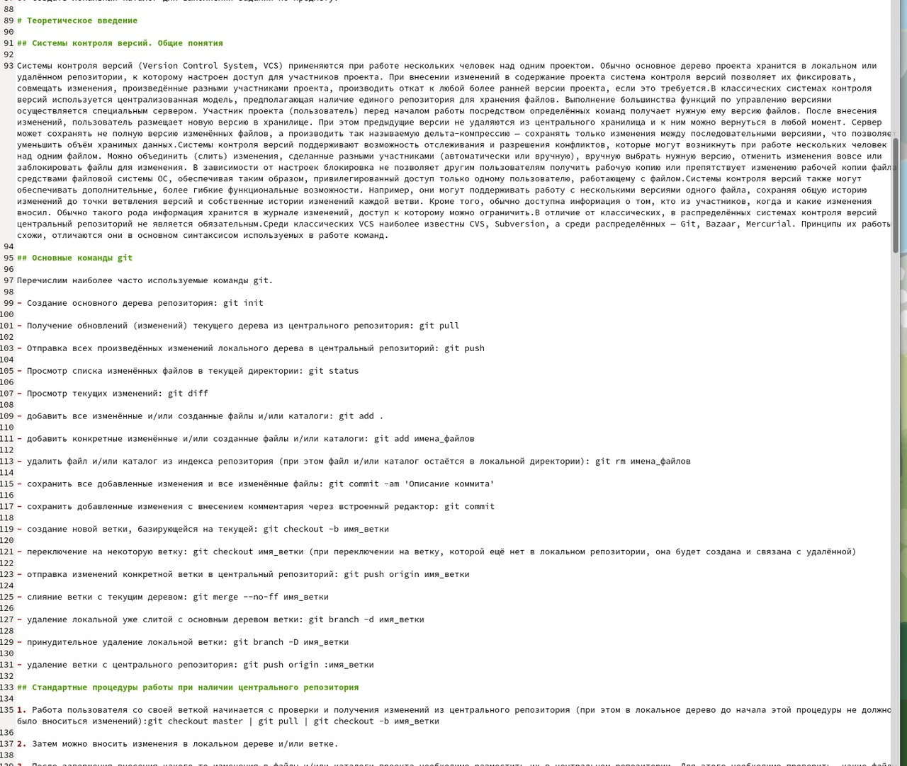
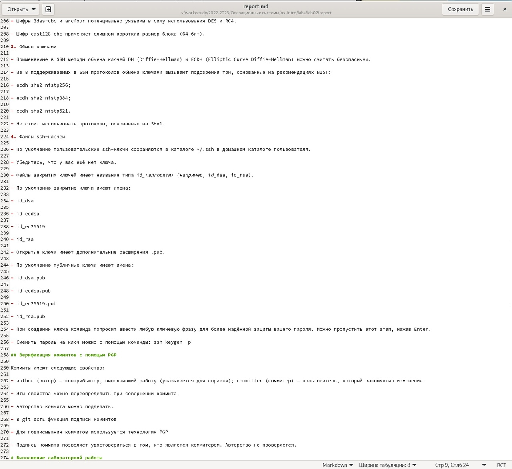
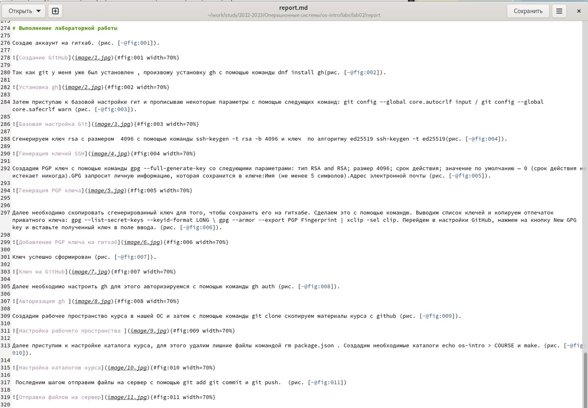
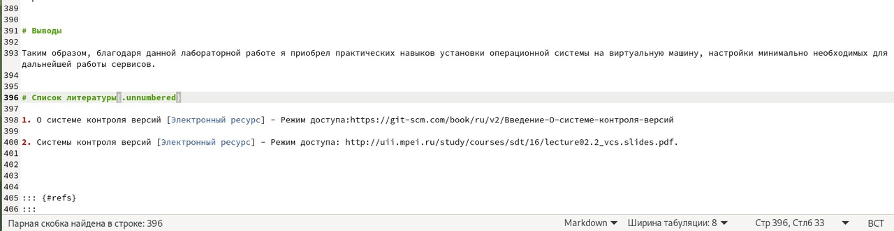

---
## Front matter
lang: ru-RU
title: Лабораторная работа №3
subtitle: Курс "Операционные Системы"
author:
  - Гибшер К.В. , НКАбд-01-22
institute:
  - Российский университет дружбы народов, Москва, Россия
  
date: 23 февраля 2023

## i18n babel
babel-lang: russian
babel-otherlangs: english

## Formatting pdf
toc: false
toc-title: Содержание
slide_level: 2
aspectratio: 169
section-titles: true
theme: metropolis
header-includes:
 - \metroset{progressbar=frametitle,sectionpage=progressbar,numbering=fraction}
 - '\makeatletter'
 - '\beamer@ignorenonframefalse'
 - '\makeatother'
---

## Докладчик

:::::::::::::: {.columns align=center}
::: {.column width="70%"}

  * Гибшер Кирилл Владимирович
  * студент группы НКАбд-01-22
  *  кафедры Компьютерные и информационные науки 
  * Российский университет дружбы народов
  * [kirill.gibsher@gmail.com](mailto:kirill.gibsher@gmail.com)
  

:::
::: {.column width="30%"}

:::
::::::::::::::

## Цели и задачи

 - Научиться оформлять отчёты с помощью легковесного языка разметки Markdown. 

1. Сделать отчет по предыдущей лабораторной работе в MarkDown

2. Предоставить отчет в форматах doc,pdf,md.

# Выполнение лабораторной работы 

## Создание шапки отчета

## Демонстрация целей и задач

## Теоретическое введение лабораторной работы

1 часть теор. части. 

## Теоретическое введение лабораторной работы

2 часть теор. части.

## Запись хода лабораторной работы

## Вывод и ссылки на научные источники

# Результаты

## Выводы

Изучив способности Markdown мы может намного легче составлять отчеты по лабораторным работам!

:::

