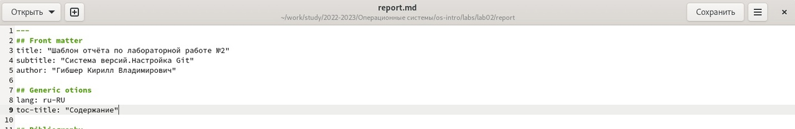
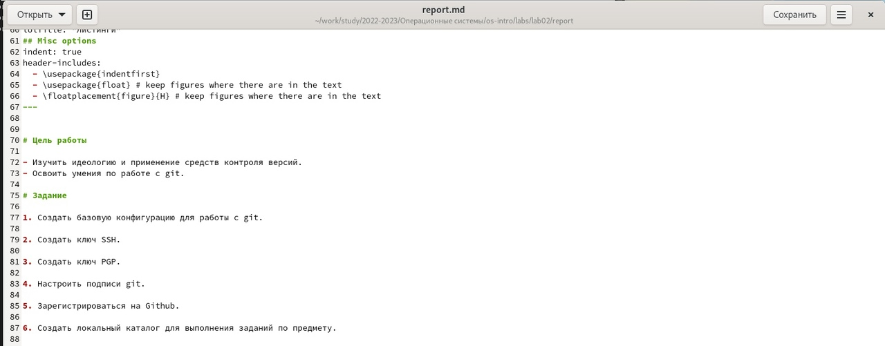
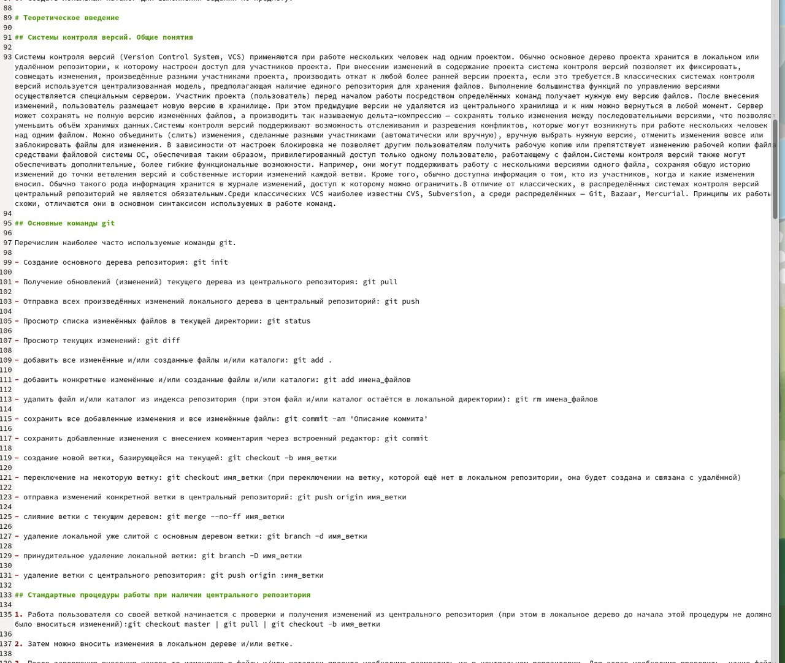
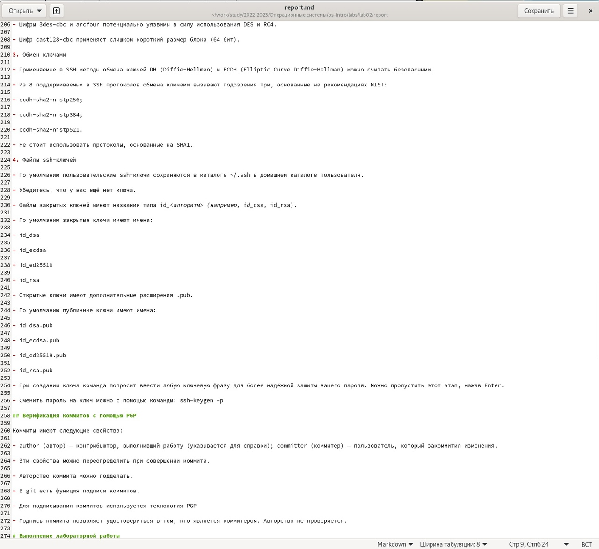
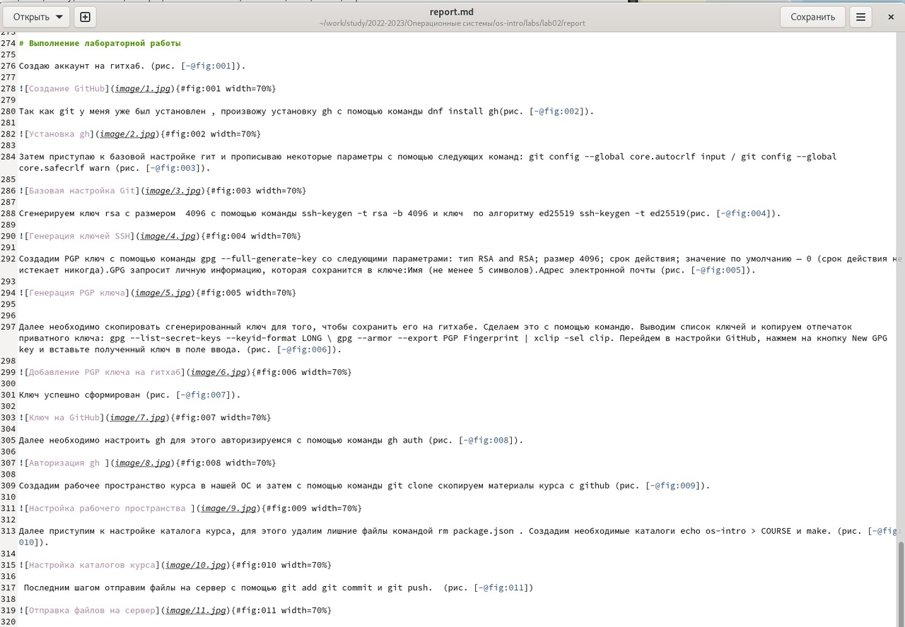
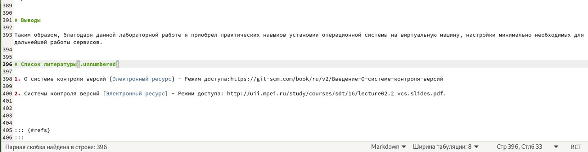

---
## Front matter
title: "Шаблон отчёта по лабораторной работе №3"
subtitle: "Работа с Markdown"
author: "Гибшер Кирилл Владимирович"

## Generic otions
lang: ru-RU
toc-title: "Содержание"

## Bibliography
bibliography: bib/cite.bib
csl: pandoc/csl/gost-r-7-0-5-2008-numeric.csl

## Pdf output format
toc: true # Table of contents
toc-depth: 2
lof: true # List of figures
lot: true # List of tables
fontsize: 12pt
linestretch: 1.5
papersize: a4
documentclass: scrreprt
## I18n polyglossia
polyglossia-lang:
  name: russian
  options:
	- spelling=modern
	- babelshorthands=true
polyglossia-otherlangs:
  name: english
## I18n babel
babel-lang: russian
babel-otherlangs: english
## Fonts
mainfont: PT Serif
romanfont: PT Serif
sansfont: PT Sans
monofont: PT Mono
mainfontoptions: Ligatures=TeX
romanfontoptions: Ligatures=TeX
sansfontoptions: Ligatures=TeX,Scale=MatchLowercase
monofontoptions: Scale=MatchLowercase,Scale=0.9
## Biblatex
biblatex: true
biblio-style: "gost-numeric"
biblatexoptions:
  - parentracker=true
  - backend=biber
  - hyperref=auto
  - language=auto
  - autolang=other*
  - citestyle=gost-numeric
## Pandoc-crossref LaTeX customization
figureTitle: "Рис."
tableTitle: "Таблица"
listingTitle: "Листинг"
lofTitle: "Список иллюстраций"
lotTitle: "Список таблиц"
lolTitle: "Листинги"
## Misc options
indent: true
header-includes:
  - \usepackage{indentfirst}
  - \usepackage{float} # keep figures where there are in the text
  - \floatplacement{figure}{H} # keep figures where there are in the text
---

# Цель работы

- Научиться оформлять отчёты с помощью легковесного языка разметки Markdown.

# Задание

1. Сделать отчет по предыдущей лабораторной работе в MarkDown

2. Предоставить отчет в форматах doc,pdf,md.

# Теоретическое введение

## Базовые сведения о Markdown.

1. Чтобы создать заголовок, используйте знак ( # ) 

2. Чтобы задать для текста полужирное начертание, заключите его в двойные звездочки - This text is **bold** 

3. Чтобы задать для текста курсивное начертание, заключите его в одинарные звездочки: *Cursiiiiiiiiiv check* 

4. Чтобы задать для текста полужирное и курсивное начертание, заключите его в тройные звездочки: ***Vse svmeste***

5. Блоки цитирования создаются с помощью символа (>) 

>  The drought had lasted now for ten million years

6. Неупорядоченный (маркированный) список можно отформатировать с помощью звездочек или тире

7. Упорядоченный список можно отформатировать с помощью соответствующих цифр

8. Чтобы вложить один список в другой, добавьте отступ для элементов дочернего списка

9. Синтаксис Markdown для встроенной ссылки состоит из части [link text] , представляющей текст гиперссылки, и части (file-name.md) – URL-адреса или имени файла, на который дается ссылка.

10. Markdown поддерживает как встраивание фрагментов кода в предложение, так и их размещение между предложениями в виде отдельных огражденных блоков. Огражденные блоки кода — это простой способ выделить синтаксис для фрагментов кода. Общий формат огражденных блоков кода.

11. Нижние индексы записываются с помощью (~)  H~2~O , верхние же с помощью (^) 2^10^

12. Внутритекстовые формулы делаются аналогично формулам LaTeX. 

# Выполнение лабораторной работы

 Создаем шапку отчета. (рис. [-@fig:001]).

{#fig:001 width=70%}

Прописываем цели и задачи лаб работы.(рис. [-@fig:002]).

{#fig:002 width=70%}

Пишем первую часть теоритерического введения. (рис. [-@fig:003]).

{#fig:003 width=70%}

Пишем вторую часть теоретического введения. (рис. [-@fig:004]).

{#fig:004 width=70%}

Прописываем ход лабораторной работы. рис. ([-@fig:005]).

{#fig:005 width=70%}

Пишем выводы и ссылки на научные источники. (рис. [-@fig:006]).

{#fig:006 width=70%}

# Выводы

Я научился работать в языке MarkDown , что пригодиться мне для дальнейшей работы с документацией, а именно с отчетами по лабораторным работам!!!!

# Список литературы{.unnumbered}

1. Лабораторная работа №3 [Электронный ресурс] - Режим доступа:https://esystem.rudn.ru/pluginfile.php/1975764/mod_resource/content/3/003-lab_markdown.pdf

::: {#refs}
:::
