---
## Front matter
lang: ru-RU
title: Лабораторная работа №4
subtitle: Курс "Операционные Системы"
author:
  - Гибшер К.В. , НКАбд-01-22
institute:
  - Российский университет дружбы народов, Москва, Россия
  
date: 23 февраля 2023

## i18n babel
babel-lang: russian
babel-otherlangs: english

## Formatting pdf
toc: false
toc-title: Содержание
slide_level: 2
aspectratio: 169
section-titles: true
theme: metropolis
header-includes:
 - \metroset{progressbar=frametitle,sectionpage=progressbar,numbering=fraction}
 - '\makeatletter'
 - '\beamer@ignorenonframefalse'
 - '\makeatother'
---

## Докладчик

:::::::::::::: {.columns align=center}
::: {.column width="70%"}

  * Гибшер Кирилл Владимирович
  * студент группы НКАбд-01-22
  *  кафедры Компьютерные и информационные науки 
  * Российский университет дружбы народов
  * [kirill.gibsher@gmail.com](mailto:kirill.gibsher@gmail.com)
  

:::
::: {.column width="30%"}

:::
::::::::::::::

## Цели и задачи

 
- Приобретение практических навыков взаимодействия пользователя с системой посредством командной строки.

1. Изучить основные способы взаимодействия с командной строкой с помощью команд cd,pwd,ls,mkdir,rmdir,rm,man

2. Использоывть команду man для просмотра описания следующих команд: cd, pwd, mkdir, rmdir, rm. Изучить основные опции этих команд.

3. Используя информацию, полученную при помощи команды history, выполнить модификацию и исполнение нескольких команд из буфера команд.

# Выполнение лабораторной работы 

## Домашний каталог 

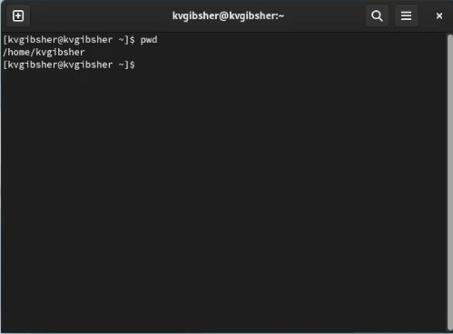

## Использование команды ls в /tmp 

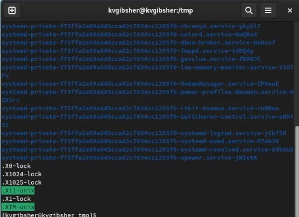

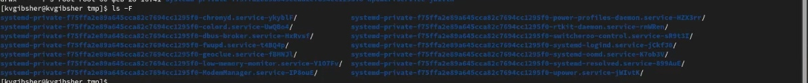

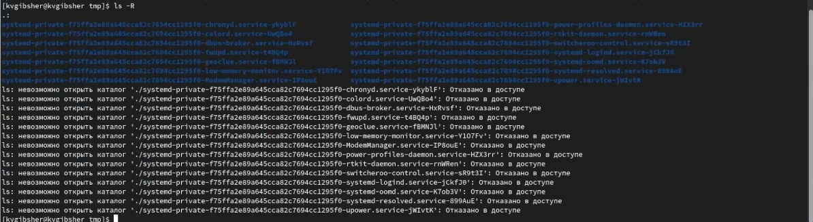

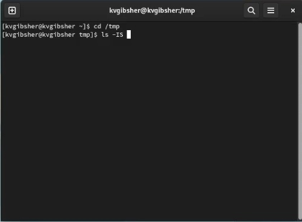

## Поиск каталога cron в /var/spool 

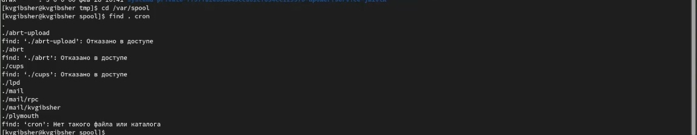

## Содержимое домашнего каталога и владелец файлов. 

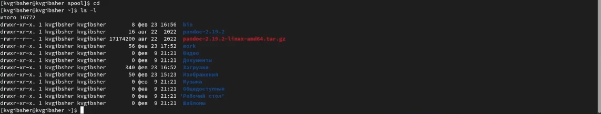

## Создание каталогов и подкаталогов/ их удаление. 

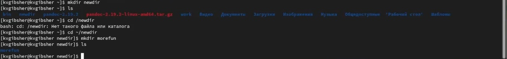

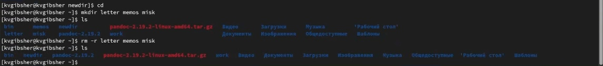

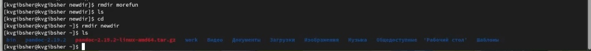

## Команда history 

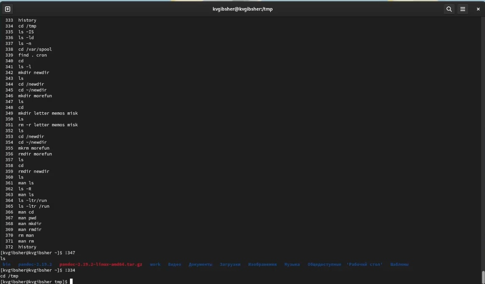

## Выводы

Благодаря данной лабораторной работе я приобрел практические навыки взаимодействия пользователя с системой посредством командной строки. Изучил базовые команды и их функционал.

:::

