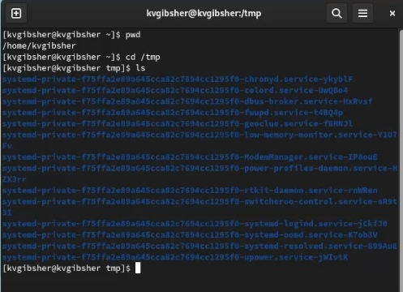

---
## Front matter
title: "Шаблон отчёта по лабораторной работе №4"
subtitle: "Основы интерфейса взаимодействия пользователя с системой Unix на уровне командной строки"
author: "Гибшер Кирилл Владимирович"

## Generic otions
lang: ru-RU
toc-title: "Содержание"

## Bibliography
bibliography: bib/cite.bib
csl: pandoc/csl/gost-r-7-0-5-2008-numeric.csl

## Pdf output format
toc: true # Table of contents
toc-depth: 2
lof: true # List of figures
lot: true # List of tables
fontsize: 12pt
linestretch: 1.5
papersize: a4
documentclass: scrreprt
## I18n polyglossia
polyglossia-lang:
  name: russian
  options:
	- spelling=modern
	- babelshorthands=true
polyglossia-otherlangs:
  name: english
## I18n babel
babel-lang: russian
babel-otherlangs: english
## Fonts
mainfont: PT Serif
romanfont: PT Serif
sansfont: PT Sans
monofont: PT Mono
mainfontoptions: Ligatures=TeX
romanfontoptions: Ligatures=TeX
sansfontoptions: Ligatures=TeX,Scale=MatchLowercase
monofontoptions: Scale=MatchLowercase,Scale=0.9
## Biblatex
biblatex: true
biblio-style: "gost-numeric"
biblatexoptions:
  - parentracker=true
  - backend=biber
  - hyperref=auto
  - language=auto
  - autolang=other*
  - citestyle=gost-numeric
## Pandoc-crossref LaTeX customization
figureTitle: "Рис."
tableTitle: "Таблица"
listingTitle: "Листинг"
lofTitle: "Список иллюстраций"
lotTitle: "Список таблиц"
lolTitle: "Листинги"
## Misc options
indent: true
header-includes:
  - \usepackage{indentfirst}
  - \usepackage{float} # keep figures where there are in the text
  - \floatplacement{figure}{H} # keep figures where there are in the text
---

# Цель работы

- Приобретение практических навыков взаимодействия пользователя с системой посредством командной строки.

# Задание

1. Изучить основные способы взаимодействия с командной строкой с помощью команд cd,pwd,ls,mkdir,rmdir,rm,man

2. Использоывть команду man для просмотра описания следующих команд: cd, pwd, mkdir, rmdir, rm. Изучить основные опции этих команд.

3. Используя информацию, полученную при помощи команды history, выполнить модификацию и исполнение нескольких команд из буфера команд.

# Теоретическое введение

## Формат команды. 

Командой в операционной системе называется записанный по специальным правилам текст (возможно с аргументами), представляющий собой указание на выполнение какой-либо функций (или действий) в операционной системе.Обычно первым словом идёт имя команды, остальной текст — аргументы или опции,конкретизирующие действие.

Общий формат команд можно представить следующим образом:

- <имя_команды><разделитель><аргументы>

## Команда man

Команда man используется для просмотра (оперативная помощь) в диалоговом режиме руководства (manual) по основным командам операционной системы типа Linux. Формат команды: man <команда>

Для управления просмотром результата выполнения команды man можно использовать следующие клавиши:

- Space — перемещение по документу на одну страницу вперёд;

-  Enter — перемещение по документу на одну строку вперёд;

- q — выход из режима просмотра описания.

## Команда cd

Команда cd используется для перемещения по файловой системе операционной системы типа Linux.

## Команда pwd 

Для определения абсолютного пути к текущему каталогу используется команда pwd (print working directory).

## Команда ls 

Команда ls используется для просмотра содержимого каталога

Некоторые файлы в операционной системе скрыты от просмотра и обычно используются для настройки рабочей среды. Имена таких файлов начинаются с точки. Для того, чтобы отобразить имена скрытых файлов, необходимо использовать команду ls с опцией a: ls -a

Чтобы вывести на экран подробную информацию о файлах и каталогах, необходимо
использовать опцию l. При этом о каждом файле и каталоге будет выведена следующая информация:
- тип файла,
- право доступа,
- число ссылок,
- владелец,
- размер,
- дата последней ревизии,
- имя файла или каталога.

## Команда mkdir 

Команда mkdir используется для создания каталогов. Формат команды: mkdir имя_каталога1 [имя_каталога2...]

Интересны следующие опции:
- --mode (или -m) — установка атрибутов доступа;
- --parents (или -p)— создание каталога вместе с родительскими по отношению к нему каталогами

## Команда rm

Команда rm используется для удаления файлов и/или каталогов. Формат команды: rm -опции файл
Если требуется, чтобы выдавался запрос подтверждения на удаление файла, то необходимо использовать опцию i. Чтобы удалить каталог, содержащий файлы, нужно использовать опцию r. Без указания этой опции команда не будет выполняться.

Если каталог пуст, то можно воспользоваться командой rmdir. Если удаляемый каталог содержит файлы, то команда не будет выполнена — нужно использовать rm -r имя_каталога.

## Команда history

Для вывода на экран списка ранее выполненных команд используется команда history. Выводимые на экран команды в списке нумеруются. К любой команде из выведенного на экран списка можно обратиться по её номеру в списке, воспользовавшись конструкцией !<номер_команды>.

# Выполнение лабораторной работы

Определение полного имени домашнего каталога (рис. [-@fig:001]).

{#fig:001 width=70%}

Переходим в каталог tmp и выводим его содержимое с помощью команды ls (рис. [-@fig:002]).

{#fig:002 width=70%}

Использование команды ls с опцией -a для показа скрытых файлов (рис. [-@fig:003]).

{#fig:003 width=70%}

Использование команды ls с опцией -F для демонстрации файлов с / на конце (рис. [-@fig:004]).

{#fig:004 width=70%}

Использование команды ls с опцией -R для вывода подробного списка содержимого каталога (рис. ([-@fig:005]).

{#fig:005 width=70%}

Использование команды ls с опцией -IS для демонстрации каталогов и файлов по размеру начиная с большего по размеру (рис. [-@fig:006]).

{#fig:006 width=70%}

Использование команды ls с опцией -ld для демонстрации информации о каталоге (рис. [-@fig:007]).

{#fig:007 width=70%}

Переходим в /var/spool и с помощью команды find пытаемся узнать существует ли внутри подкаталог с именем cron (рис. [-@fig:008]).

{#fig:008 width=70%}

Переходим в  домашний каталог и выводим на экран его содержимое. На экране показан владельц файлов и подкаталогов (рис. [-@fig:009]).

{#fig:009 width=70%}

В домашнем каталоге создаем новый каталог с именем newdir. В каталоге ~/newdir создаем новый каталог с именем morefun (рис. [-@fig:010]).

{#fig:010 width=70%}

В домашнем каталоге создаем одной командой три новых каталога с именами letters, memos, misk. Затем удаляем эти каталоги одной командой (рис. [-@fig:011]).

{#fig:011 width=70%}

Удаляем раннее созданные newdir и morefun (рис. [-@fig:012]).

{#fig:012 width=70%}

С помощью команды man определяем, какую опцию команды ls нужно использовать для просмотра содержимого не только указанного каталога, но и подкаталогов, входящих в него. Приходим к выводу, что подходящая опция это -R (рис. [-@fig:013]).

{#fig:013 width=70%}

С помощью команды man определяем набор опций команды ls, позволяющий отсортировать по времени последнего изменения выводимый список содержимого каталога с развёрнутым описанием файлов. (рис. [-@fig:014]).

{#fig:014 width=70%}

С помощью команды man просматриваем описание cd. (рис. [-@fig:015]).

{#fig:015 width=70%}

С помощью команды man просматриваем описание команды pwd (рис. [-@fig:016]).

{#fig:016 width=70%}

С помощью команды man просматриваем описание команды mkdir (рис. [-@fig:017]).

{#fig:017 width=70%}

С помощью команды man просматриваем описание команды rmdir (рис. [-@fig:018]).

{#fig:018 width=70%}

С помощью команды man просматриваем описание команды rm (рис. [-@fig:019]).

{#fig:019 width=70%}

Используя информацию, полученную при помощи команды history, выполняем модификацию и исполняем нескольких команд из буфера команд (рис. [-@fig:020]).

{#fig:020 width=70%}

# Выводы

- Я приобрел практические навыки взаимодействия пользователя с системой посредством командной строки.

# Список литературы{.unnumbered}

1. Лабораторная работа №4 [Электронный ресурс] - Режим доступа:https://esystem.rudn.ru/course/view.php?id=113

::: {#refs}
:::
