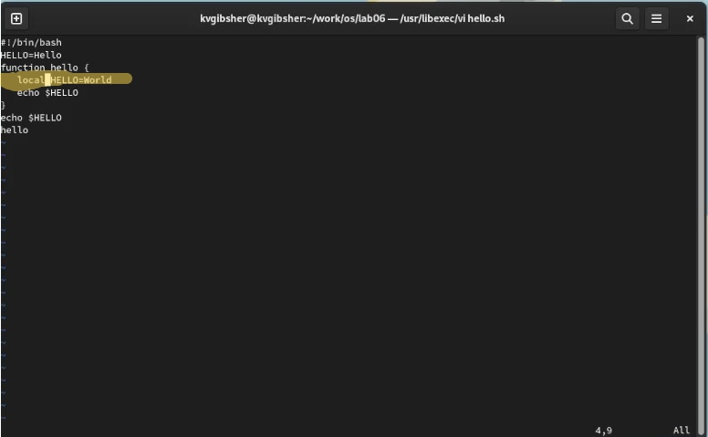

---
## Front matter
lang: ru-RU
title: Лабораторная работа №8
subtitle: Курс "Операционные Системы"
author:
  - Гибшер К.В. , НКАбд-01-22
institute:
  - Российский университет дружбы народов, Москва, Россия
  
date: 29 марта 2023

## i18n babel
babel-lang: russian
babel-otherlangs: english

## Formatting pdf
toc: false
toc-title: Содержание
slide_level: 2
aspectratio: 169
section-titles: true
theme: metropolis
header-includes:
 - \metroset{progressbar=frametitle,sectionpage=progressbar,numbering=fraction}
 - '\makeatletter'
 - '\beamer@ignorenonframefalse'
 - '\makeatother'
---

## Докладчик

:::::::::::::: {.columns align=center}
::: {.column width="70%"}

  * Гибшер Кирилл Владимирович
  * студент группы НКАбд-01-22
  *  кафедры Компьютерные и информационные науки 
  * Российский университет дружбы народов
  * [kirill.gibsher@gmail.com](mailto:kirill.gibsher@gmail.com)
  

:::
::: {.column width="30%"}

:::
::::::::::::::

## Цели и задачи

- Познакомиться с операционной системой Linux. Получить практические навыки работы с редактором vi, установленным по умолчанию практически во всех дистрибутивах.

Часть 1:
1. Создайте каталог с именем ~/work/os/lab06.

2. Перейдите во вновь созданный каталог.

3. Вызовите vi и создайте файл hello.sh

4. Вписать текст с лабораторной работы

5. Нажмите клавишу Esc для перехода в командный режим после завершения ввода текста.

6. Нажмите : для перехода в режим последней строки и внизу вашего экрана появится приглашение в виде двоеточия.

7. Нажмите w (записать) и q (выйти), а затем нажмите клавишу Enter для сохранения вашего текста и завершения работы.

8. Сделайте файл исполняемым

Часть 2:

1. Вызовите vi на редактирование файла

2. Установите курсор в конец слова HELL второй строки.

3. Перейдите в режим вставки и замените на HELLO. Нажмите Esc для возврата в командный режим.

4. Установите курсор на четвертую строку и сотрите слово LOCAL.

5. Перейдите в режим вставки и наберите следующий текст: local, нажмите Esc для возврата в командный режим.

6. Установите курсор на последней строке файла. Вставьте после неё строку, содержащую следующий текст: echo $HELLO.

7. Нажмите Esc для перехода в командный режим.

8. Удалите последнюю строку.

9. Введите команду отмены изменений u для отмены последней команды.

10. Введите символ : для перехода в режим последней строки. Запишите произведённые изменения и выйдите из vi.

# Выполнение лабораторной работы 

## Ознакомление с редактором vi

{ #fig:001 width=70% }

## Создание нового каталога для файла hello.sh 

{ #fig:002 width=70% }

## Вызовем vi , создадим файл hello.sh и заполним его текстом указанным в лаб. работе 

{ #fig:003 width=70% }

## Сделаем файл hello.sh  исполняемым с помощью chmod

{ #fig:004 width=70% }

## Вызовем vi на редактирование файла Установите курсор в конец слова HELL второй строки, перейдем в режим вставки и заменим на HELLO. Нажмем Esc для возврата в командный режим

{ #fig:005 width=70% }

## Установим курсор на четвертую строку и сотрем слово LOCAL.Перейдем в режим вставки и наберем следующий текст: local, нажмем Esc для возврата в командный режим.

{ #fig:006 width=70% }

##  Установим курсор на последней строке файла. Вставим после неё строку, содержащую следующий текст: echo $HELLO.

{ #fig:007 width=70% }

## Удалим последнюю строку с помощью команды внутри vi :9,9d

{ #fig:008 width=70% }

## Введем команду отмены изменений u для отмены последней команды. Введем символ : для перехода в режим последней строки. Запишем произведённые изменения и выйдите из vi.

{ #fig:009 width=70% }

## Выводы

- Я познакомился с операционной системой Linux. Получил практические навыки работы с редактором vi, установленным по умолчанию практически во всех дистрибутивах.

:::

