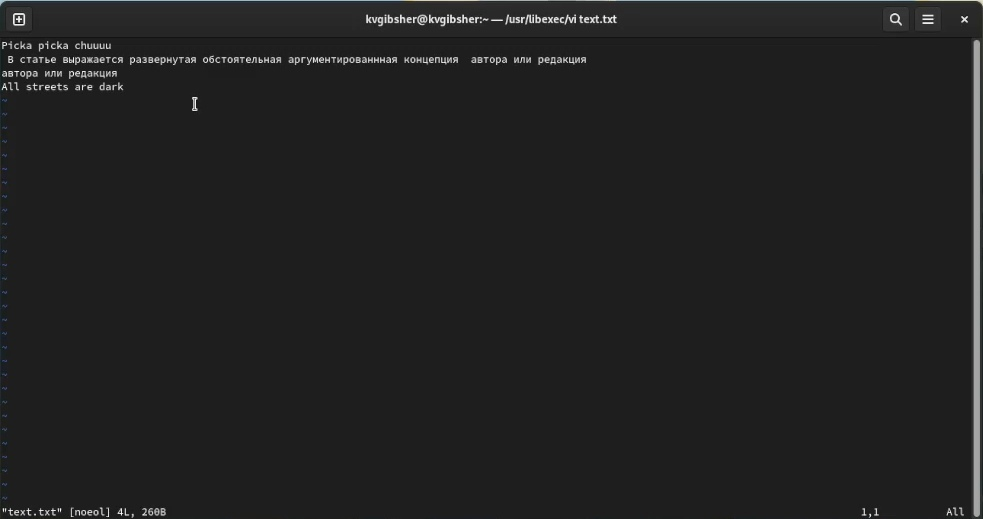
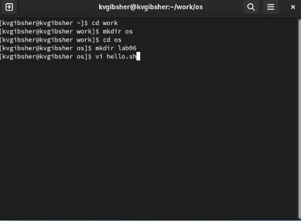
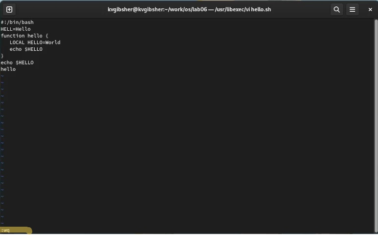
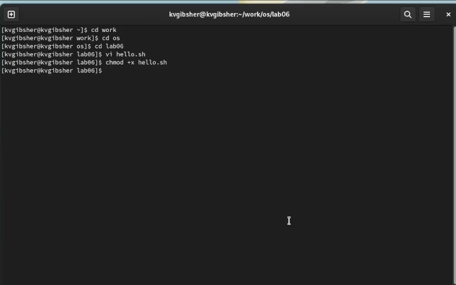
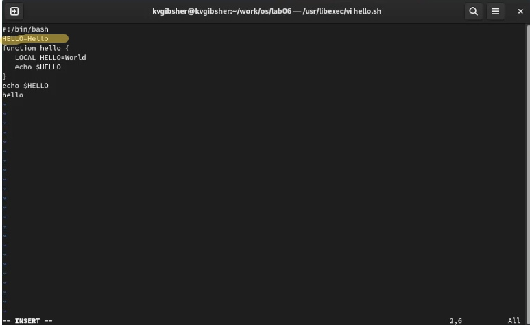
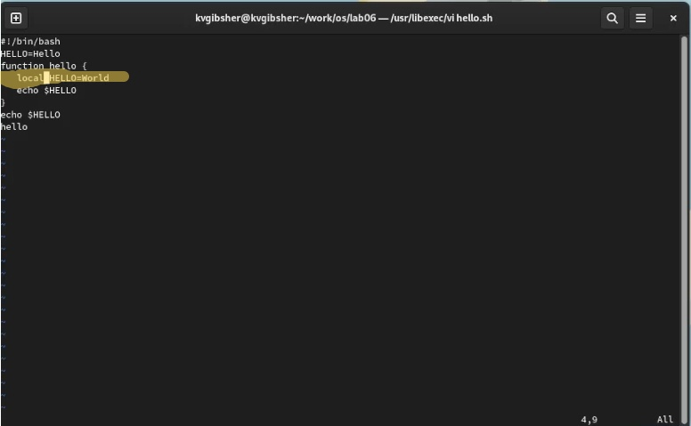
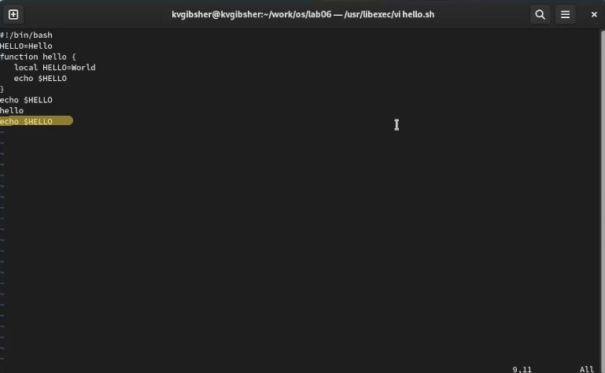
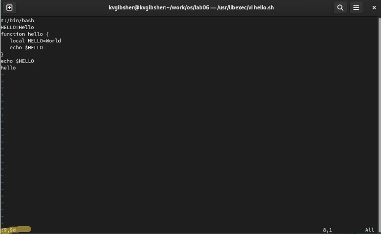
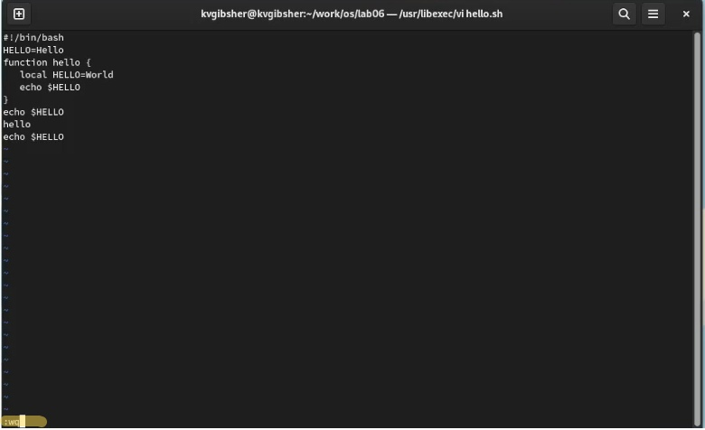

---
## Front matter
title: "Лабораторная работа №8"
subtitle: "Дисциплина: Операционные системы"
author: "Гибшер Кирилл Владимирович"

## Generic otions
lang: ru-RU
toc-title: "Содержание"

## Bibliography
bibliography: bib/cite.bib
csl: pandoc/csl/gost-r-7-0-5-2008-numeric.csl

## Pdf output format
toc: true # Table of contents
toc-depth: 2
lof: true # List of figures
lot: true # List of tables
fontsize: 12pt
linestretch: 1.5
papersize: a4
documentclass: scrreprt
## I18n polyglossia
polyglossia-lang:
  name: russian
  options:
  - spelling=modern
  - babelshorthands=true
polyglossia-otherlangs:
  name: english
## I18n babel
babel-lang: russian
babel-otherlangs: english
## Fonts
mainfont: PT Serif
romanfont: PT Serif
sansfont: PT Sans
monofont: PT Mono
mainfontoptions: Ligatures=TeX
romanfontoptions: Ligatures=TeX
sansfontoptions: Ligatures=TeX,Scale=MatchLowercase
monofontoptions: Scale=MatchLowercase,Scale=0.9
## Biblatex
biblatex: true
biblio-style: "gost-numeric"
biblatexoptions:
  - parentracker=true
  - backend=biber
  - hyperref=auto
  - language=auto
  - autolang=other*
  - citestyle=gost-numeric
## Pandoc-crossref LaTeX customization
figureTitle: "Рис."
tableTitle: "Таблица"
listingTitle: "Листинг"
lofTitle: "Список иллюстраций"
lotTitle: "Список таблиц"
lolTitle: "Листинги"
## Misc options
indent: true
header-includes:
  - \usepackage{indentfirst}
  - \usepackage{float} # keep figures where there are in the text
  - \floatplacement{figure}{H} # keep figures where there are in the text
---

# Цель работы

Познакомиться с операционной системой Linux. Получить практические навыки работы с редактором vi, установленным по умолчанию практически во всех дистрибутивах.

# Задание

Часть 1:
1. Создайте каталог с именем ~/work/os/lab06.

2. Перейдите во вновь созданный каталог.

3. Вызовите vi и создайте файл hello.sh

4. Вписать текст с лабораторной работы

5. Нажмите клавишу Esc для перехода в командный режим после завершения ввода текста.

6. Нажмите : для перехода в режим последней строки и внизу вашего экрана появится приглашение в виде двоеточия.

7. Нажмите w (записать) и q (выйти), а затем нажмите клавишу Enter для сохранения вашего текста и завершения работы.

8. Сделайте файл исполняемым

Часть 2:

1. Вызовите vi на редактирование файла

2. Установите курсор в конец слова HELL второй строки.

3. Перейдите в режим вставки и замените на HELLO. Нажмите Esc для возврата в командный режим.

4. Установите курсор на четвертую строку и сотрите слово LOCAL.

5. Перейдите в режим вставки и наберите следующий текст: local, нажмите Esc для возврата в командный режим.

6. Установите курсор на последней строке файла. Вставьте после неё строку, содержащую следующий текст: echo $HELLO.

7. Нажмите Esc для перехода в командный режим.

8. Удалите последнюю строку.

9. Введите команду отмены изменений u для отмены последней команды.

10. Введите символ : для перехода в режим последней строки. Запишите произведённые изменения и выйдите из vi.

# Теоретическое введение

1. Команды позиционирования
- 0 (ноль) — переход в начало строки;

- $ — переход в конец строки;

- G — переход в конец файла;

- 𝑛 G — переход на строку с номером 𝑛.

2.  Команды перемещения по файлу

- Ctrl-d — перейти на пол-экрана вперёд;

- Ctrl-u — перейти на пол-экрана назад;

- Ctrl-f — перейти на страницу вперёд;

- Ctrl-b — перейти на страницу назад.

3. Команды перемещения по словам

- W или w — перейти на слово вперёд;

- 𝑛 W или 𝑛 w — перейти на 𝑛 слов вперёд;

- b или B — перейти на слово назад;

- 𝑛 b или 𝑛 B — перейти на 𝑛 слов назад.

4.  Вставка текста

- а — вставить текст после курсора;

- А — вставить текст в конец строки;

- i — вставить текст перед курсором;

-  𝑛 i — вставить текст 𝑛 раз;

- I — вставить текст в начало строки.

5.  Вставка строки

- о — вставить строку под курсором;

- О — вставить строку над курсором.

6. Удаление текста

- x — удалить один символ в буфер;

- d w — удалить одно слово в буфер;

- d $ — удалить в буфер текст от курсора до конца строки;

- d 0 — удалить в буфер текст от начала строки до позиции курсора;

- d d — удалить в буфер одну строку;

- 𝑛 d d — удалить в буфер 𝑛 строк

7. Отмена и повтор произведённых изменений

- u — отменить последнее изменение;

-  повторить последнее изменение.

8.  Копирование текста в буфер

- Y — скопировать строку в буфер;

-  𝑛 Y — скопировать 𝑛 строк в буфер;

- y w — скопировать слово в буфер.

9. Вставка текста из буфера

- p — вставить текст из буфера после курсора;

- P — вставить текст из буфера перед курсором.

10. Замена текста

- c w — заменить слово;

- 𝑛 c w — заменить 𝑛 слов;

- c $ — заменить текст от курсора до конца строки;

- r — заменить слово;

- R — заменить текст.

11. Поиск текста

- / текст — произвести поиск вперёд по тексту указанной строки символов текст;

- ? текст — произвести поиск назад по тексту указанной строки символов текст.

12. Копирование и перемещение текста

- : 𝑛,𝑚 d — удалить строки с 𝑛 по 𝑚;

- : 𝑖,𝑗 m 𝑘 — переместить строки с 𝑖 по 𝑗, начиная со строки 𝑘;

-  : 𝑖,𝑗 t 𝑘 — копировать строки с 𝑖 по 𝑗 в строку 𝑘;

- : 𝑖,𝑗 w имя-файла — записать строки с 𝑖 по 𝑗 в файл с именем имя-файла.

13. Запись в файл и выход из редактора

- : w — записать изменённый текст в файл, не выходя из vi;

- : w имя-файла — записать изменённый текст в новый файл с именем имя-файла;

- : w ! имя-файла — записать изменённый текст в файл с именем имя-файла;

- : w q — записать изменения в файл и выйти из vi;

- : q — выйти из редактора vi;

- : q ! — выйти из редактора без записи;

# Выполнение лабораторной работы

1. Ознакомимся с редактором vi (рис. [-@fig:001])

{ #fig:001 width=70% }

2. Cоздадим указанный в лаб. работе каталог ~/work/os/lab06 (рис. [-@fig:002])

{ #fig:002 width=70% }

3. Вызовем vi , создадим файл hello.sh и заполним его текстом указанным в лаб. работе (рис. [-@fig:003])

{ #fig:003 width=70% }

4. Сделаем файл hello.sh  исполняемым с помощью chmod (рис. [-@fig:004])

{ #fig:004 width=70% }

5. Вызовем vi на редактирование файла Установите курсор в конец слова HELL второй строки, перейдем в режим вставки и заменим на HELLO. Нажмем Esc для возврата в командный режим (рис. [-@fig:005])

{ #fig:005 width=70% }

6. Установим курсор на четвертую строку и сотрем слово LOCAL.Перейдем в режим вставки и наберем следующий текст: local, нажмем Esc для возврата в командный режим. (рис. [-@fig:006])

{ #fig:006 width=70% }

7. Установим курсор на последней строке файла. Вставим после неё строку, содержащую следующий текст: echo $HELLO. (рис. [-@fig:007])

{ #fig:007 width=70% }

8. Удалим последнюю строку с помощью команды внутри vi :9,9d (рис. [-@fig:008])

{ #fig:008 width=70% }

9. Введем команду отмены изменений u для отмены последней команды. Введем символ : для перехода в режим последней строки. Запишем произведённые изменения и выйдите из vi.(рис. [-@fig:009])

{ #fig:009 width=70% }

# Ответы на контрольные вопросы

1. Дайте краткую характеристику режимам работы редактора vi.

- командный режим — предназначен для ввода команд редактирования и навигации по редактируемому файлу;

- режим вставки — предназначен для ввода содержания редактируемого файла;

- режим последней (или командной) строки — используется для записи изменений в файл и выхода из редактора.

2. Как выйти из редактора, не сохраняя произведённые изменения?

- Можно нажимать символ q (или q!), если требуется выйти из редактора без сохранения.

3. Назовите и дайте краткую характеристику командам позиционирования.
- 0 (ноль) — переход в начало строки;
- $ — переход в конец строки;
- G — переход в конец файла;
- n G — переход на строку с номером n.
4. Что для редактора vi является словом?
- Редактор vi предполагает, что слово - это строка символов, которая может включать в себя буквы, цифры и символы подчеркивания.

5. Каким образом из любого места редактируемого файла перейти в начало (конец) файла?
- С помощью G — переход в конец файла

6. Назовите и дайте краткую характеристику основным группам команд редактирования.
- Вставка текста – а — вставить текст после курсора; – А — вставить текст в конец строки; – i — вставить текст перед курсором; – n i — вставить текст n раз; – I — вставить текст в начало строки.
- Вставка строки – о — вставить строку под курсором; – О — вставить строку над курсором.
- Удаление текста – x — удалить один символ в буфер; – d w — удалить одно слово в буфер; – d $ — удалить в буфер текст от курсора до конца строки; – d 0 — удалить в буфер текст от начала строки до позиции курсора; – d d — удалить в буфер одну строку; – n d d — удалить в буфер n строк.
- Отмена и повтор произведённых изменений – u — отменить последнее изменение; – . — повторить последнее изменение.
- Копирование текста в буфер – Y — скопировать строку в буфер; – n Y — скопировать n строк в буфер; – y w — скопировать слово в буфер.
- Вставка текста из буфера – p — вставить текст из буфера после курсора; – P — вставить текст из буфера перед курсором.
- Замена текста – c w — заменить слово; – n c w — заменить n слов; – c $ — заменить текст от курсора до конца строки; – r — заменить слово; – R — заменить текст.
- Поиск текста – / текст — произвести поиск вперёд по тексту указанной строки символов текст; – ? текст — произвести поиск назад по тексту указанной строки символов текст.
7. Необходимо заполнить строку символами $. Каковы ваши действия?
- Перейти в режим вставки.

8. Как отменить некорректное действие, связанное с процессом редактирования?
- С помощью u — отменить последнее изменение

9. Назовите и дайте характеристику основным группам команд режима последней строки.
- Режим последней строки — используется для записи изменений в файл и выхода из редактора.

10. Как определить, не перемещая курсора, позицию, в которой заканчивается строка?
- $ — переход в конец строки

11. Выполните анализ опций редактора vi (сколько их, как узнать их назначение и т.д.).
- Опции редактора vi позволяют настроить рабочую среду. Для задания опций используется команда set (в режиме последней строки): – : set all — вывести полный список опций; – : set nu — вывести номера строк; – : set list — вывести невидимые символы; – : set ic — не учитывать при поиске, является ли символ прописным или строчным.

12. Как определить режим работы редактора vi?
- В редакторе vi есть два основных режима: командный режим и режим вставки. По умолчанию работа начинается в командном режиме. В режиме вставки клавиатура используется для набора текста. Для выхода в командный режим используется клавиша Esc или комбинация Ctrl + c .

# Вывод

Познакомился  с операционной системой Linux. Получил практические навыки работы с редактором vi, установленным по умолчанию практически во всех дистрибутивах.

