---
## Front matter
lang: ru-RU
title: Лабораторная работа №9
subtitle: Курс "Операционные Системы"
author:
  - Гибшер К.В. , НКАбд-01-22
institute:
  - Российский университет дружбы народов, Москва, Россия
  
date: 6 апреля 2023

## i18n babel
babel-lang: russian
babel-otherlangs: english

## Formatting pdf
toc: false
toc-title: Содержание
slide_level: 2
aspectratio: 169
section-titles: true
theme: metropolis
header-includes:
 - \metroset{progressbar=frametitle,sectionpage=progressbar,numbering=fraction}
 - '\makeatletter'
 - '\beamer@ignorenonframefalse'
 - '\makeatother'
---

## Докладчик

:::::::::::::: {.columns align=center}
::: {.column width="70%"}

  * Гибшер Кирилл Владимирович
  * студент группы НКАбд-01-22
  *  кафедры Компьютерные и информационные науки 
  * Российский университет дружбы народов
  * [kirill.gibsher@gmail.com](mailto:kirill.gibsher@gmail.com)
  

:::
::: {.column width="30%"}

:::
::::::::::::::

## Цели и задачи

Познакомиться с операционной системой Linux. Получить практические навыки работы с редактором Emacs.

1. Ознакомиться с теоретическим материалом.

2. Ознакомиться с редактором emacs.

3. Выполнить упражнения.

# Выполнение лабораторной работы 

## Ознакомление с редактором emacs

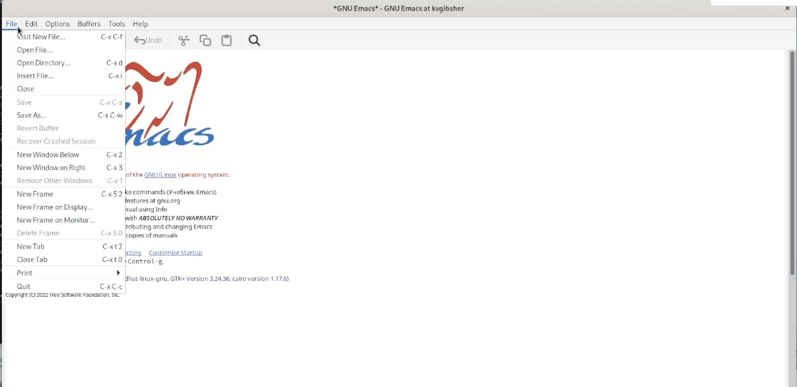{ #fig:001 width=70% }

## Создание файла lab07.sh 

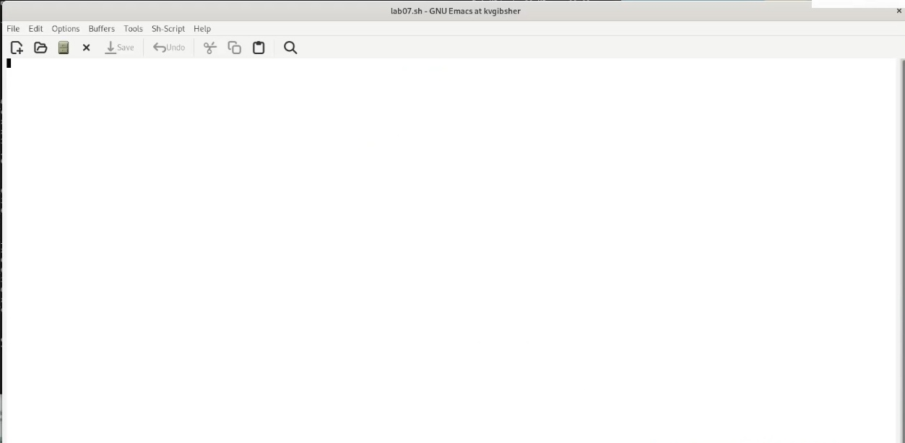{ #fig:002 width=70% }

## Меняем файл и сохраняем изменения

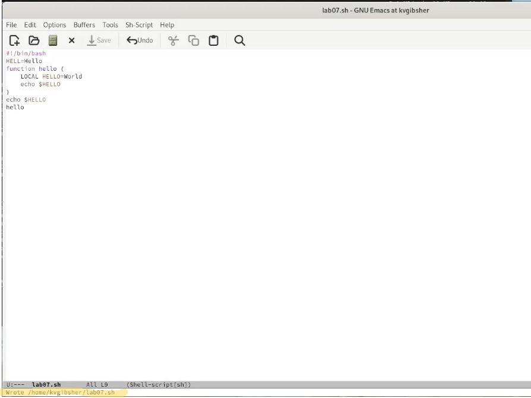{ #fig:003 width=70% }

## Вырезка строки

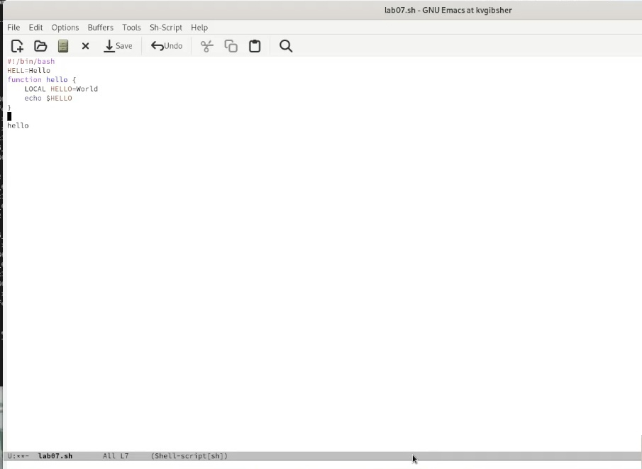{ #fig:004 width=70% }

## Вставка строки в конец файла

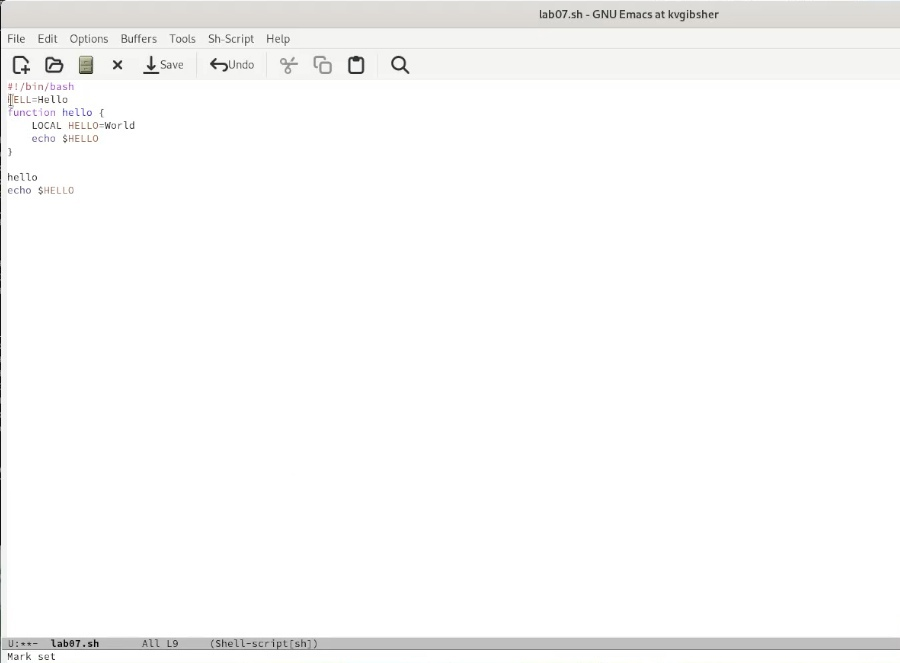{ #fig:005 width=70% }

## Выделение области текста 

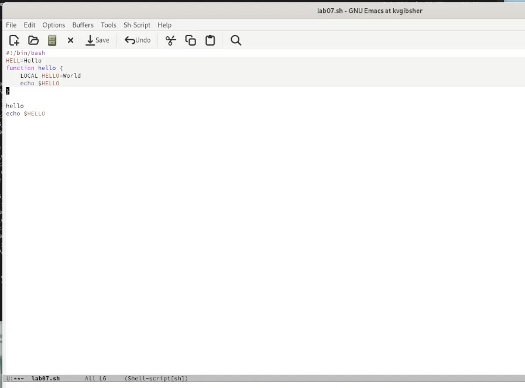{ #fig:006 width=70% }

##  Перемещение курсора в начало строки

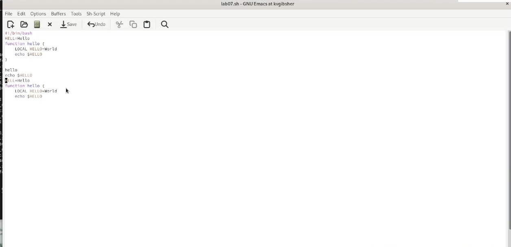{ #fig:009 width=70% }

## Перемещение курсора в конец строки

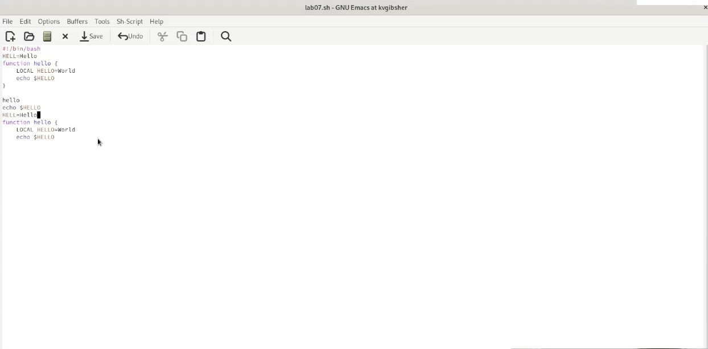{ #fig:010 width=70% }

## Вывод списка активных буферов

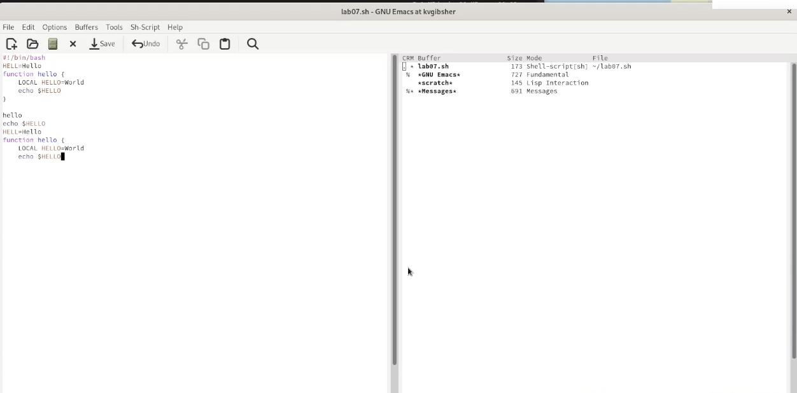{ #fig:013 width=70% }

## Деление фрейма на 4 части

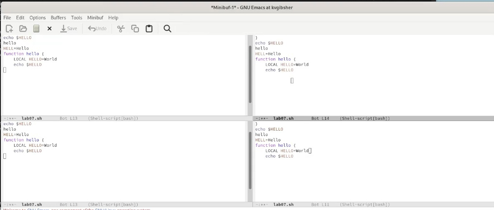{ #fig:014 width=70% }

## Режим поиска 

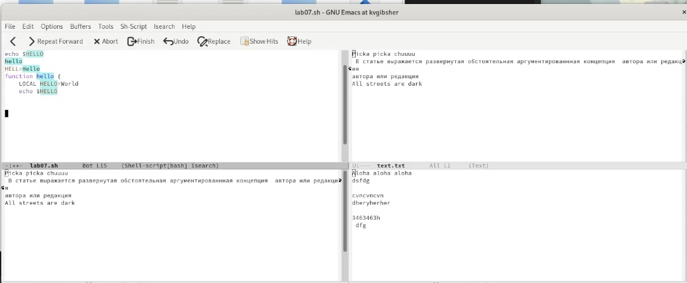{ #fig:016 width=70% }

## Режим поиска с заменой 

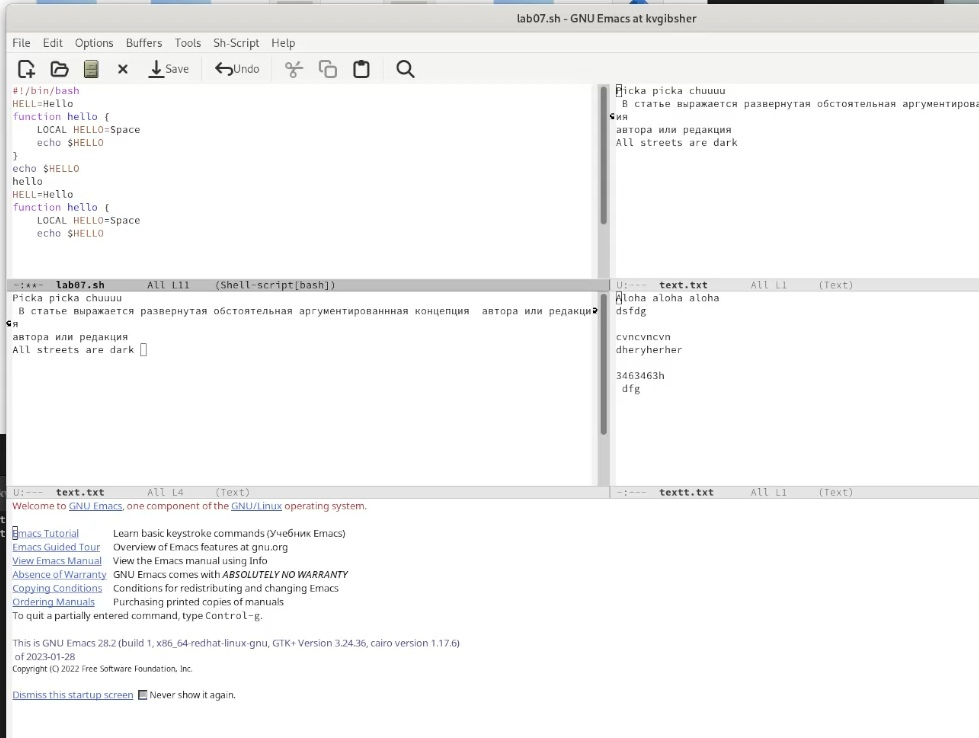{ #fig:018 width=70% }

## Дополнительный режим поиска 

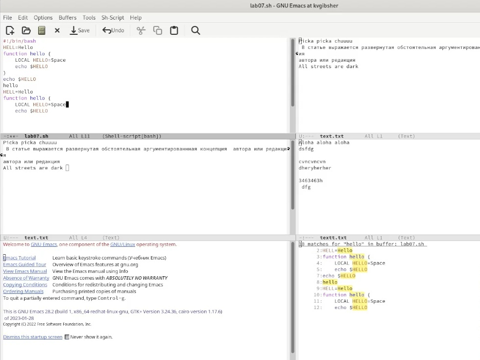{ #fig:019 width=70% }

## Выводы

- Я Познакомился с операционной системой Linux. Получил практические навыки работы с редактором Emacs.

:::

