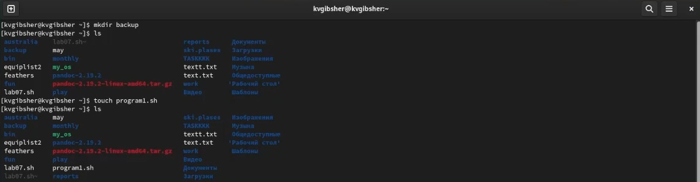
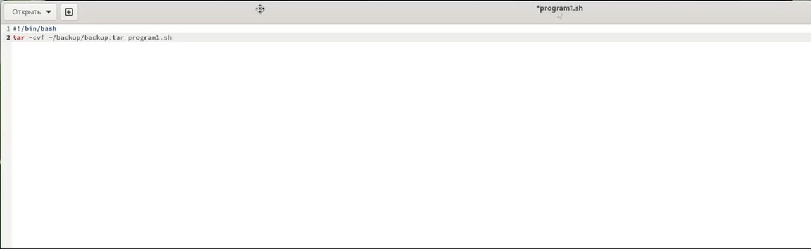
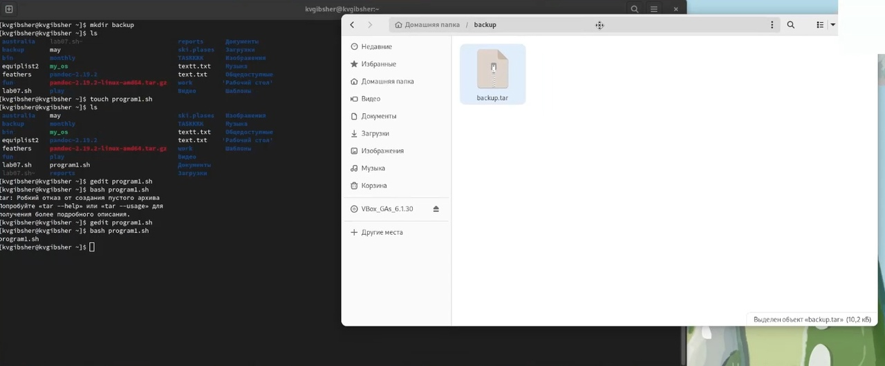
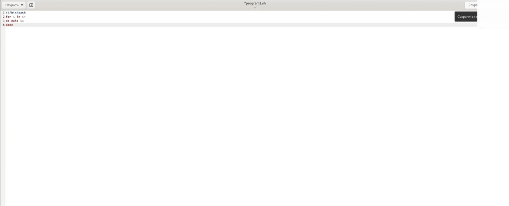
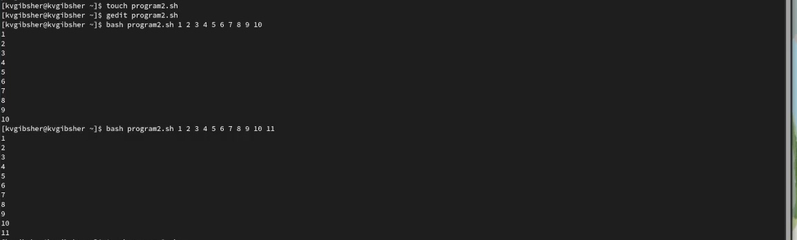
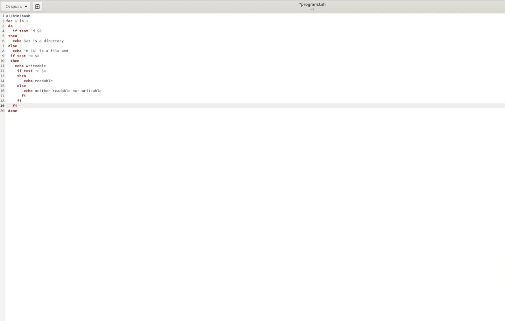
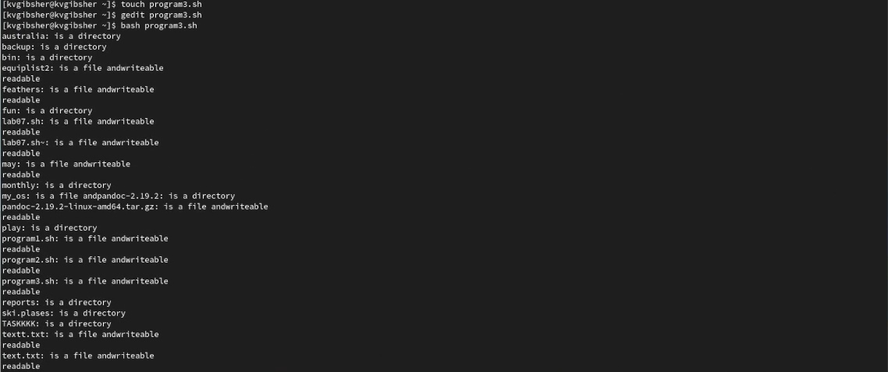
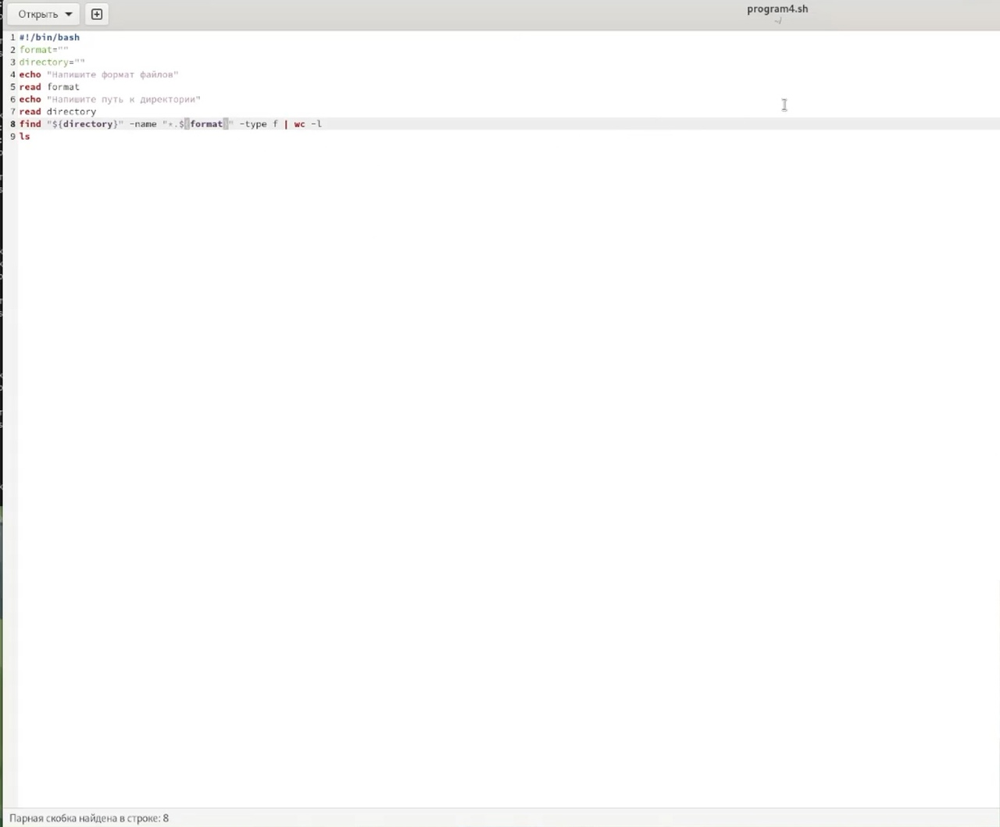
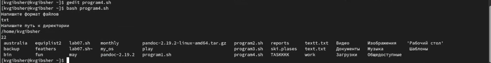

---
## Front matter
lang: ru-RU
title: Лабораторная работа №10
subtitle: Курс "Операционные Системы"
author:
  - Гибшер К.В. , НКАбд-01-22
institute:
  - Российский университет дружбы народов, Москва, Россия
  
date: 13 апреля 2023

## i18n babel
babel-lang: russian
babel-otherlangs: english

## Formatting pdf
toc: false
toc-title: Содержание
slide_level: 2
aspectratio: 169
section-titles: true
theme: metropolis
header-includes:
 - \metroset{progressbar=frametitle,sectionpage=progressbar,numbering=fraction}
 - '\makeatletter'
 - '\beamer@ignorenonframefalse'
 - '\makeatother'
---

## Докладчик

:::::::::::::: {.columns align=center}
::: {.column width="70%"}

  * Гибшер Кирилл Владимирович
  * студент группы НКАбд-01-22
  *  кафедры Компьютерные и информационные науки 
  * Российский университет дружбы народов
  * [kirill.gibsher@gmail.com](mailto:kirill.gibsher@gmail.com)
  

:::
::: {.column width="30%"}

:::
::::::::::::::

## Цели и задачи

- Изучить основы программирования в оболочке ОС UNIX/Linux. Научиться писать небольшие командные файлы.

1. Написать скрипт, который при запуске будет делать резервную копию самого себя (то есть файла, в котором содержится его исходный код) в другую директорию backup в вашем домашнем каталоге. При этом файл должен архивироваться одним из архиваторов на выбор zip, bzip2 или tar. 
Способ использования команд архивации необходимо узнать, изучив справку.

2. Написать пример командного файла, обрабатывающего любое произвольное число аргументов командной строки, в том числе превышающее десять. Например, скрипт может последовательно распечатывать значения всех переданных аргументов.

3. Написать командный файл — аналог команды ls (без использования самой этой команды и команды dir). Требуется, чтобы он выдавал информацию о нужном каталоге и выводил информацию о возможностях доступа к файлам этого каталога.

4. Написать командный файл, который получает в качестве аргумента командной строки формат файла (.txt, .doc, .jpg, .pdf и т.д.) и вычисляет количество таких файлов в указанной директории. Путь к директории также передаётся в виде аргумента командной строки.

# Выполнение лабораторной работы 

## Подготовка к выполнению лабораторной работы

{ #fig:001 width=70% }

## Текст первого скрипта

{ #fig:002 width=70% }

## Запуск первого исполняемого файла и проверка работоспособности 

{ #fig:003 width=70% }

## Текст второго скрипта 

{ #fig:004 width=70% }

## Запуск второго исполняемого файла и проверка работоспособности

{ #fig:005 width=70% }

## Текст третьего скрипта

{ #fig:006 width=70% }

## Запуск третьего исполняемого файла и проверка работоспособности

{ #fig:007 width=70% }

## Текст четвертого скрипта

{ #fig:008 width=70% }

## Запуск четвертого исполняемого файла и проверка работоспособности

{ #fig:009 width=70% }

## Выводы

-  Я изучил основы программирования в оболочке ОС UNIX/Linux. Научился писать небольшие командные файлы.

:::

