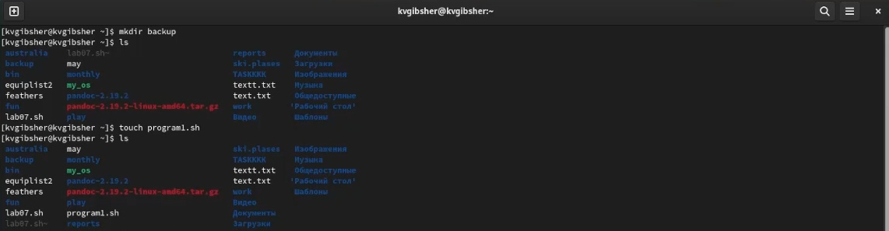
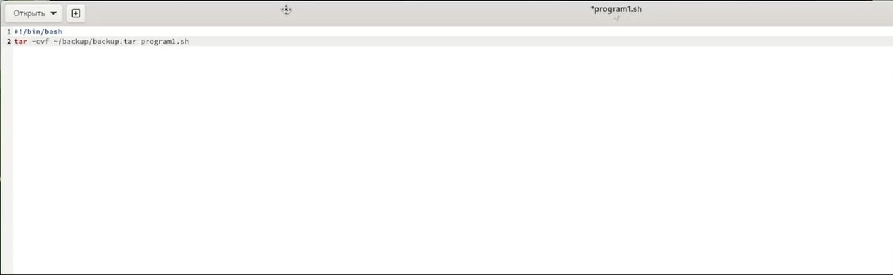
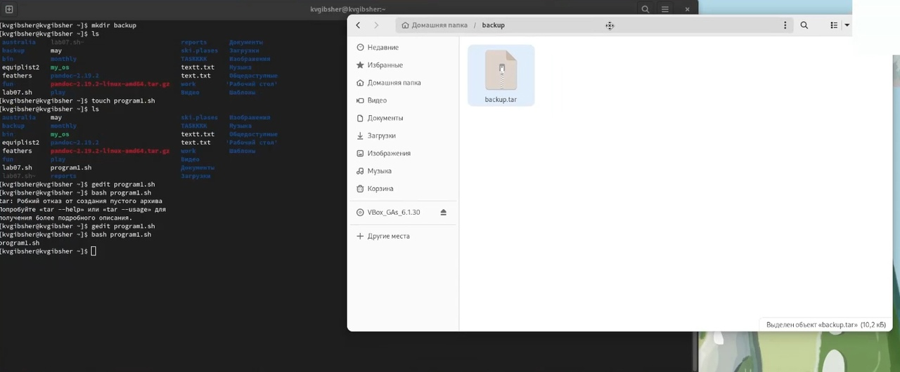
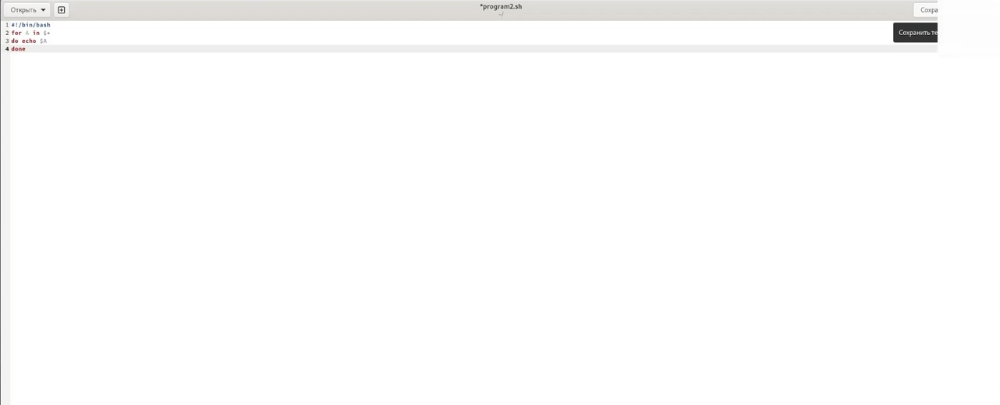
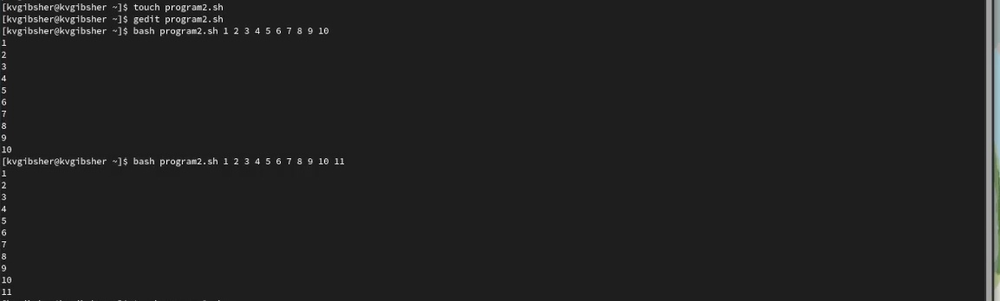
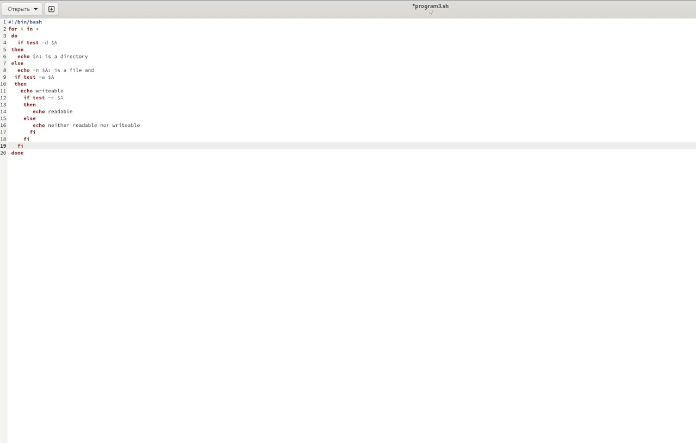
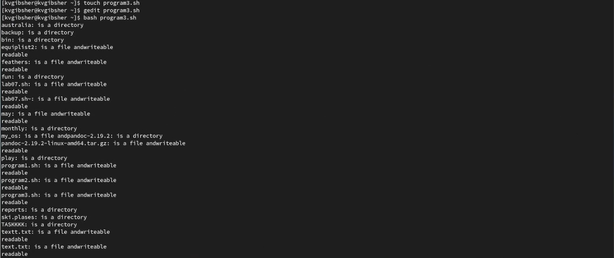
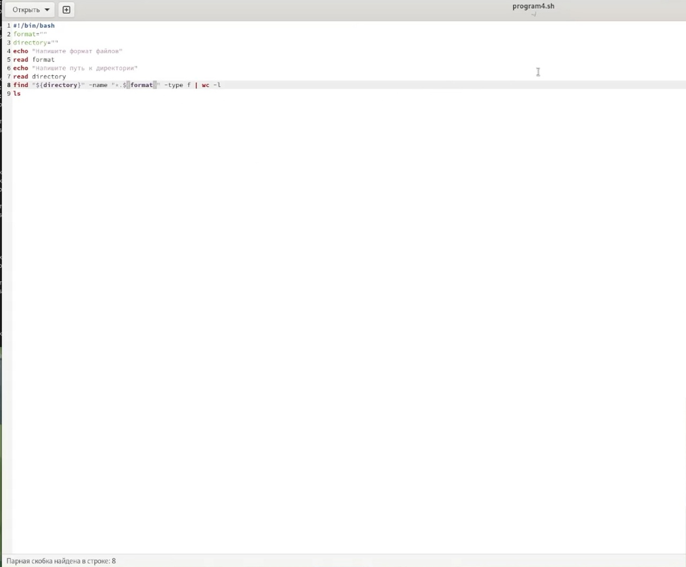
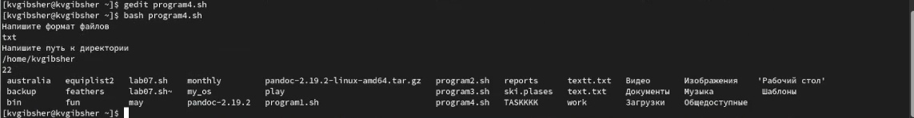

---
## Front matter
title: "Лабораторная работа №10"
subtitle: "Дисциплина: Операционные системы"
author: "Гибшер Кирилл Владимирович"

## Generic otions
lang: ru-RU
toc-title: "Содержание"

## Bibliography
bibliography: bib/cite.bib
csl: pandoc/csl/gost-r-7-0-5-2008-numeric.csl

## Pdf output format
toc: true # Table of contents
toc-depth: 2
lof: true # List of figures
lot: true # List of tables
fontsize: 12pt
linestretch: 1.5
papersize: a4
documentclass: scrreprt
## I18n polyglossia
polyglossia-lang:
  name: russian
  options:
  - spelling=modern
  - babelshorthands=true
polyglossia-otherlangs:
  name: english
## I18n babel
babel-lang: russian
babel-otherlangs: english
## Fonts
mainfont: PT Serif
romanfont: PT Serif
sansfont: PT Sans
monofont: PT Mono
mainfontoptions: Ligatures=TeX
romanfontoptions: Ligatures=TeX
sansfontoptions: Ligatures=TeX,Scale=MatchLowercase
monofontoptions: Scale=MatchLowercase,Scale=0.9
## Biblatex
biblatex: true
biblio-style: "gost-numeric"
biblatexoptions:
  - parentracker=true
  - backend=biber
  - hyperref=auto
  - language=auto
  - autolang=other*
  - citestyle=gost-numeric
## Pandoc-crossref LaTeX customization
figureTitle: "Рис."
tableTitle: "Таблица"
listingTitle: "Листинг"
lofTitle: "Список иллюстраций"
lotTitle: "Список таблиц"
lolTitle: "Листинги"
## Misc options
indent: true
header-includes:
  - \usepackage{indentfirst}
  - \usepackage{float} # keep figures where there are in the text
  - \floatplacement{figure}{H} # keep figures where there are in the text
---

# Цель работы

Изучить основы программирования в оболочке ОС UNIX/Linux. Научиться писать небольшие командные файлы.

# Задание

1. Написать скрипт, который при запуске будет делать резервную копию самого себя (то есть файла, в котором содержится его исходный код) в другую директорию backup в вашем домашнем каталоге. При этом файл должен архивироваться одним из архиваторов на выбор zip, bzip2 или tar. 
Способ использования команд архивации необходимо узнать, изучив справку.

2. Написать пример командного файла, обрабатывающего любое произвольное число аргументов командной строки, в том числе превышающее десять. Например, скрипт может последовательно распечатывать значения всех переданных аргументов.

3. Написать командный файл — аналог команды ls (без использования самой этой команды и команды dir). Требуется, чтобы он выдавал информацию о нужном каталоге и выводил информацию о возможностях доступа к файлам этого каталога.

4. Написать командный файл, который получает в качестве аргумента командной строки формат файла (.txt, .doc, .jpg, .pdf и т.д.) и вычисляет количество таких файлов в указанной директории. Путь к директории также передаётся в виде аргумента командной строки.

# Теоретическое введение

## Переменные в языке программирования bash

Командный процессор bash обеспечивает возможность использования переменных типа строка символов. Имена переменных могут быть выбраны пользователем. Пользователь имеет возможность присвоить переменной значение некоторой строки символов. Например, команда

- mark=/usr/andy/bin присваивает значение строки символов /usr/andy/bin переменной mark типа строка символов.

Значение, присвоенное некоторой переменной, может быть впоследствии использовано. Для этого в соответствующем месте командной строки должно быть употреблено имя этой переменной, которому предшествует метасимвол $. Например, команда

- mv afile ${mark}
переместит файл afile из текущего каталога в каталог с абсолютным полным именем /usr/andy/bin.

Использование значения, присвоенного некоторой переменной, называется подстановкой. Для того чтобы имя переменной не сливалось с символами, которые могут следовать за ним в командной строке, при подстановке в общем случае используется следующая форма записи: ${имя переменной}

## Использование арифметических вычислений. Операторы let и read.

Оболочка bash поддерживает встроенные арифметические функции. Команда let является показателем того, что последующие аргументы представляют собой выражение, подлежащее вычислению. Простейшее выражение — это единичный терм (term), обычно целочисленный. Целые числа можно записывать как последовательность цифр или в любом базовом формате типа radix\#number, где radix (основание системы счисления) — любое число не более 26. Для большинства команд используются следующие основания систем исчисления: 2 (двоичная), 8 (восьмеричная) и 16 (шестнадцатеричная). Простейшими математическими выражениями являются сложение (+), вычитание (-), умножение (*), целочисленное деление (/) и целочисленный остаток от деления (%). Команда let берет два операнда и присваивает их переменной. Положительным моментом команды let можно считать то, что для идентификации переменной ей ненужен знак доллара; вы можете писать команды типа let sum=x+7, и let будет искать переменную x и добавлять к ней 7. Команда let также расширяет другие выражения let, если они заключены в двойные круглые скобки. Таким способом вы можете создавать довольно сложные выражения. Команда let не ограничена простыми арифметическими выражениями. Табл. 10.1 показывает полный набор let-операций. Подобно С оболочка bash может присваивать переменной любое значение, а произвольное выражение само имеет значение, которое может использоваться. При этом «ноль» воспринимается как «ложь», а любое другое значение выражения — как «истина». Для облегчения программирования можно записывать условия оболочки bash в двойные скобки — (( )).Можно присваивать результаты условных выражений переменным, также как и использовать результаты арифметических вычислений в качестве условий.

Наиболее распространённым является сокращение, избавляющееся от слова let в программах оболочек. Если объявить переменные целыми значениями, то любое присвоение автоматически будет трактоваться как арифметическое действие. Если использовать typeset -i для объявления и присвоения переменной, то при последующем её применении она станет целой. Также можно использовать ключевое слово integer (псевдоним для typeset -i) и объявлять таким образом переменные целыми. Выражения типа х=y+z будет восприниматься в это случае как арифметические. Команда read позволяет читать значения переменных со стандартного ввода

Переменные PS1 и PS2 предназначены для отображения промптера командного процессора. PS1 — это промптер командного процессора, по умолчанию его значение равно символу $ или #. Если какая-то интерактивная программа, запущенная команднымпроцессором, требует ввода, то используется промптер PS2. Он по умолчанию имеет значение символа >.

Другие стандартные переменные:

- HOME — имя домашнего каталога пользователя. Если команда cd вводится без аргументов, то происходит переход в каталог, указанный в этой переменной.

- IFS — последовательность символов, являющихся разделителями в командной строке, например, пробел, табуляция и перевод строки (new line).

- MAIL — командный процессор каждый раз перед выводом на экран промптера проверяет содержимое файла, имя которого указано в этой переменной, и если содержимое этого файла изменилось с момента последнего ввода из него, то перед тем как вывестина терминал промптер, командный процессор выводит на терминал сообщение You have mail (у Вас есть почта).

- TERM — тип используемого терминала.

- LOGNAME — содержит регистрационное имя пользователя, которое устанавливается автоматически при входе в систему. В командном процессоре Си имеется ещё несколько стандартных переменных. Значение всех переменных можно просмотреть с помощью команды set.

##  Метасимволы и их экранирование

При перечислении имён файлов текущего каталога можно использовать следующие
символы:
- * — соответствует произвольной, в том числе и пустой строке;

- ? — соответствует любому одинарному символу;

– [c1-c1] — соответствует любому символу, лексикографически находящемуся между  символами c1 и с2. Например,

- echo * — выведет имена всех файлов текущего каталога, что представляет собой простейший аналог команды ls;

- ls *.c — выведет все файлы с последними двумя символами, совпадающими с .c.

- echo prog.? — выведет все файлы, состоящие из пяти или шести символов, первыми пятью символами которых являются prog..

- [a-z]* — соответствует произвольному имени файла в текущем каталоге, начинающемуся с любой строчной буквы латинского алфавита.

 
Такие символы, как ' < > * ? | \ " &, являются метасимволами и имеют для командного процессора специальный смысл. Снятие специального смысла с метасимвола называется экранированием метасимвола. Экранирование может быть осуществлено с помощью предшествующего метасимволу символа \, который, в свою очередь, является метасимволом.Для экранирования группы метасимволов нужно заключить её в одинарные кавычки. Строка, заключённая в двойные кавычки, экранирует все метасимволы, кроме $, ' , \, ". Например,

- echo \* выведет на экран символ *,

- echo ab’*\|*’cd выведет на экран строку ab*\|*cd.

# Выполнение лабораторной работы

1. Создадим каталог backup и sh файл program1 (рис. [-@fig:001])

{ #fig:001 width=70% }

2. Напишем скрипт к 1 заданию. Благодаря данной записи наш файл при запуске файла архивирует свою собственную резервную копию в созданный нами каталог ~/backup (рис. [-@fig:002])

{ #fig:002 width=70% }

3. Запустим готовый файл и проверим получилось ли выполнить задание перейдя в каталог ~/backup (рис. [-@fig:003])

{ #fig:003 width=70% }

4.  Напишем скрипт ко 2 заданию. Благодаря данной записи при запуске файла мы сможем ввести некоторые значения и командная строка по завершению обработки последовательно выведет нам те же самые значения, при чем даже больше 10 (рис. [-@fig:004])

{ #fig:004 width=70% }

5. Запустим готовый файл и проверим работоспособность скрипта.(рис. [-@fig:005])

{ #fig:005 width=70% }

6. Используем приложенный к лабораторной работе скрипт в разделе условного оператора if , отредактируем и получим следующий скрипт, который сделает из исполняемого файла некоторый аналог команды ls. Файл будет выдывать информацию о нужном каталоге и выведет информацию о возможностях доступа к файлам данного каталога. (рис. [-@fig:006])

{ #fig:006 width=70% }

7. Запусти исполняемый файл в домашнем каталоге и проверим работоспособность скрипта  (рис. [-@fig:007])

{ #fig:007 width=70% }

8. Напишем текст четвертого скрипта , благодаря которому исполняемый файл будет настроен на подсчет файлов желаемого формата. Командная строка запросит ввести искомый формат файлов и путь к деректории в которой будет производить поиск и подсчет.(рис. [-@fig:008])

{ #fig:008 width=70% }

9. Запустим исполняемый файл , укажем формат файлов txt и каталогом для подсчета и поиска выберем домашнюю папку пользователя kvgibsher (рис. [-@fig:009])

{ #fig:009 width=70% }

# Вывод

 Я изучил основы программирования в оболочке ОС UNIX/Linux. Научился писать небольшие командные файлы.
