---
## Front matter
lang: ru-RU
title: Лабораторная работа №11
subtitle: Курс "Операционные Системы"
author:
  - Гибшер К.В. , НКАбд-01-22
institute:
  - Российский университет дружбы народов, Москва, Россия
  
date: 19 апреля 2023

## i18n babel
babel-lang: russian
babel-otherlangs: english

## Formatting pdf
toc: false
toc-title: Содержание
slide_level: 2
aspectratio: 169
section-titles: true
theme: metropolis
header-includes:
 - \metroset{progressbar=frametitle,sectionpage=progressbar,numbering=fraction}
 - '\makeatletter'
 - '\beamer@ignorenonframefalse'
 - '\makeatother'
---

## Докладчик

:::::::::::::: {.columns align=center}
::: {.column width="70%"}

  * Гибшер Кирилл Владимирович
  * студент группы НКАбд-01-22
  *  кафедры Компьютерные и информационные науки 
  * Российский университет дружбы народов
  * [kirill.gibsher@gmail.com](mailto:kirill.gibsher@gmail.com)
  

:::
::: {.column width="30%"}

:::
::::::::::::::

## Цели и задачи

- Изучить основы программирования в оболочке ОС UNIX. Научится писать более сложные командные файлы с использованием логических управляющих конструкций и циклов.

1. Используя команды getopts grep, написать командный файл, который анализирует командную строку с ключами:

- -iinputfile — прочитать данные из указанного файла;

- -ooutputfile — вывести данные в указанный файл;

- -pшаблон — указать шаблон для поиска;

- -C — различать большие и малые буквы;

- -n — выдавать номера строк.

а затем ищет в указанном файле нужные строки, определяемые ключом -p

2. Написать на языке Си программу, которая вводит число и определяет, является ли оно больше нуля, меньше нуля или равно нулю. Затем программа завершается с помощью функции exit(n), передавая информацию в о коде завершения в оболочку. Командный файл должен вызывать эту программу и, проанализировав с помощью команды $?, выдать сообщение о том, какое число было введено.

3. Написать командный файл, создающий указанное число файлов, пронумерованных последовательно от 1 до 𝑁 (например 1.tmp, 2.tmp, 3.tmp,4.tmp и т.д.). Число файлов, которые необходимо создать, передаётся в аргументы командной строки. Этот же командный файл должен уметь удалять все созданные им файлы (если они существуют)

4. Написать командный файл, который с помощью команды tar запаковывает в архив все файлы в указанной директории. Модифицировать его так, чтобы запаковывались только те файлы, которые были изменены менее недели тому назад (использовать команду find).

# Выполнение лабораторной работы 

## Скрипт первого задания

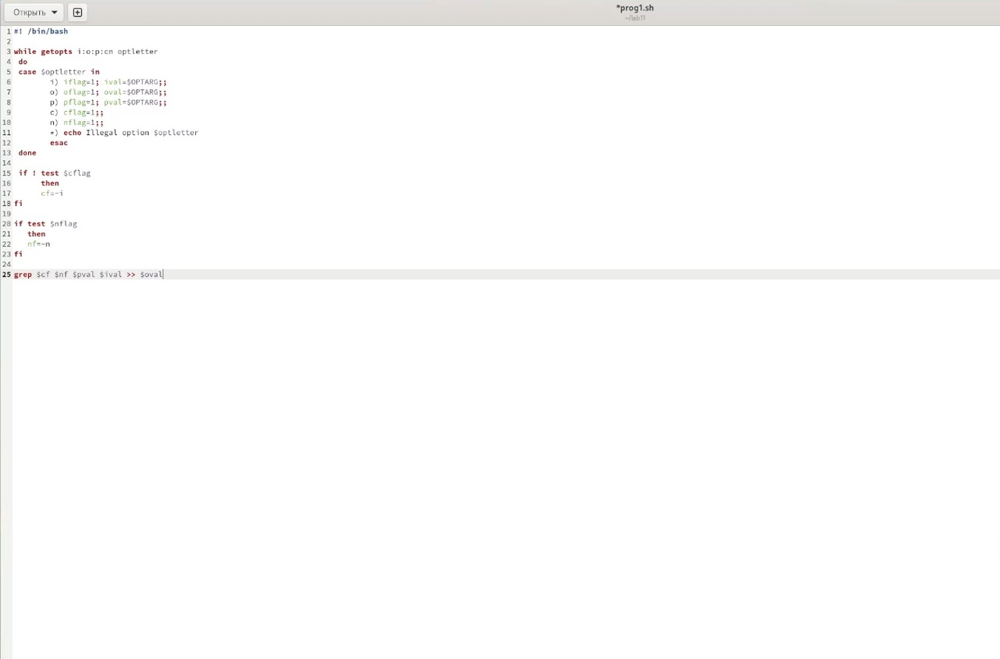{ #fig:001 width=70% }

## Запуск

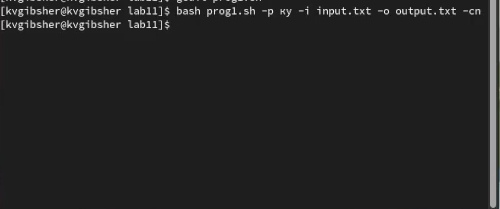{ #fig:002 width=70% }

## Файл input

{ #fig:003 width=70% }

## Файл output

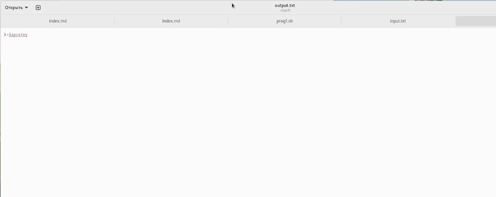{ #fig:004 width=70% }

## Код Си , решаемый задание 2

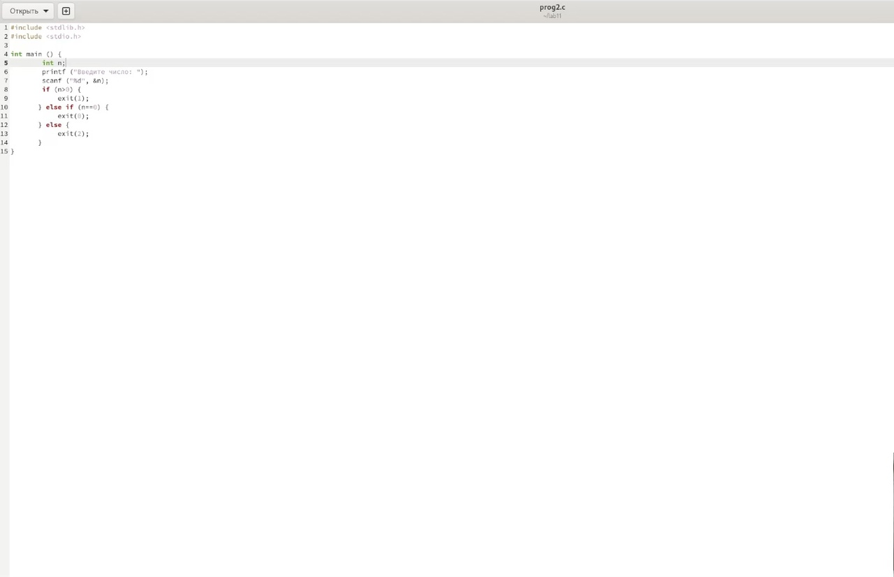{ #fig:005 width=70% }

## Скрипт командного файла с использованием кода Си

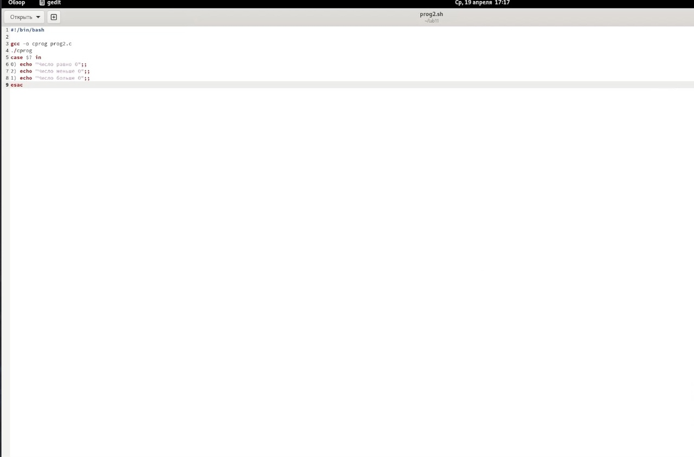{ #fig:006 width=70% }

## Запуск командного файла 

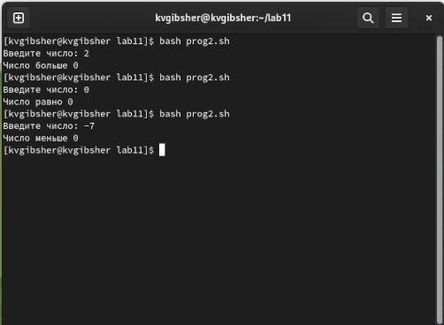{ #fig:007 width=70% }

## Скрипт третьего задания

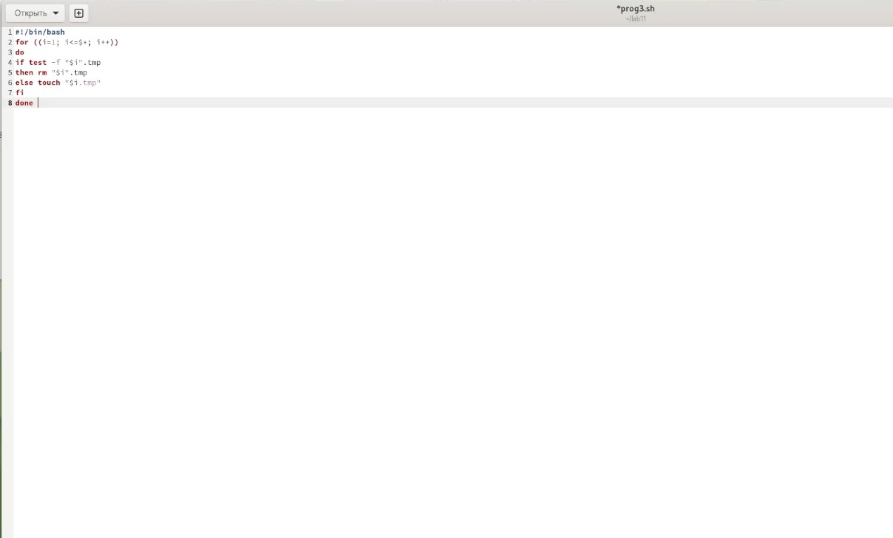{ #fig:008 width=70% }

## Запуск командного файла

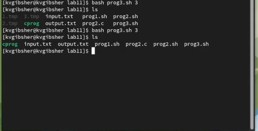{ #fig:009 width=70% }

## Скрипт четвертого задания

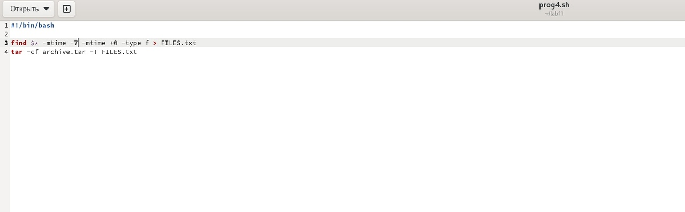{ #fig:010 width=70% }

## Запуск командного файла

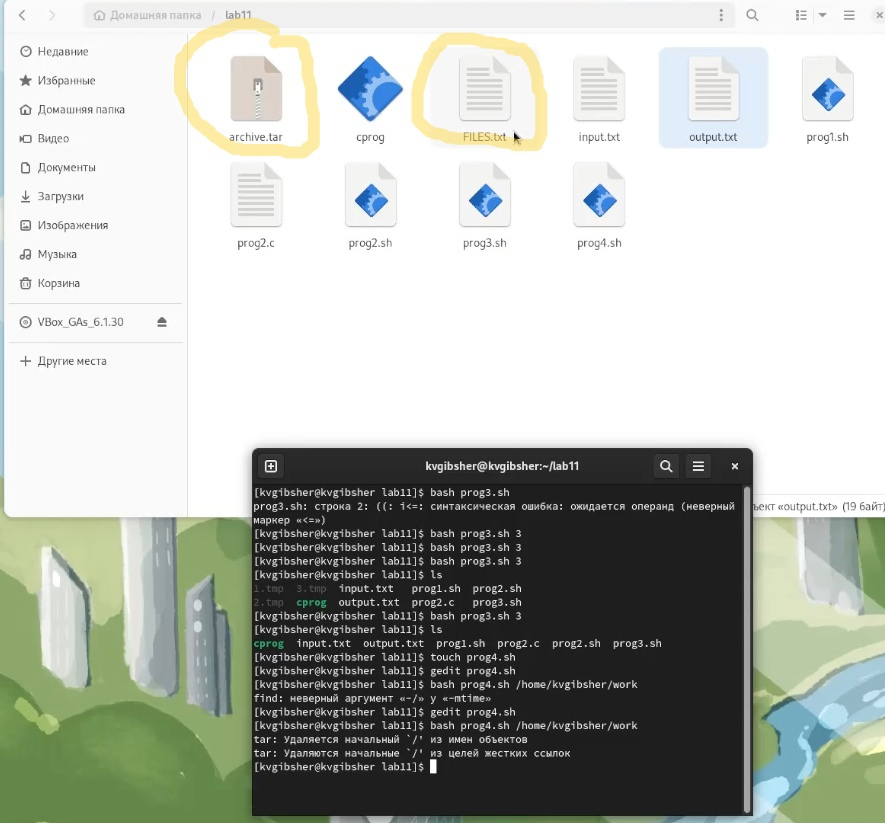{ #fig:011 width=70% }

## Результаты работы командного файла , отраженные в FILES.txt

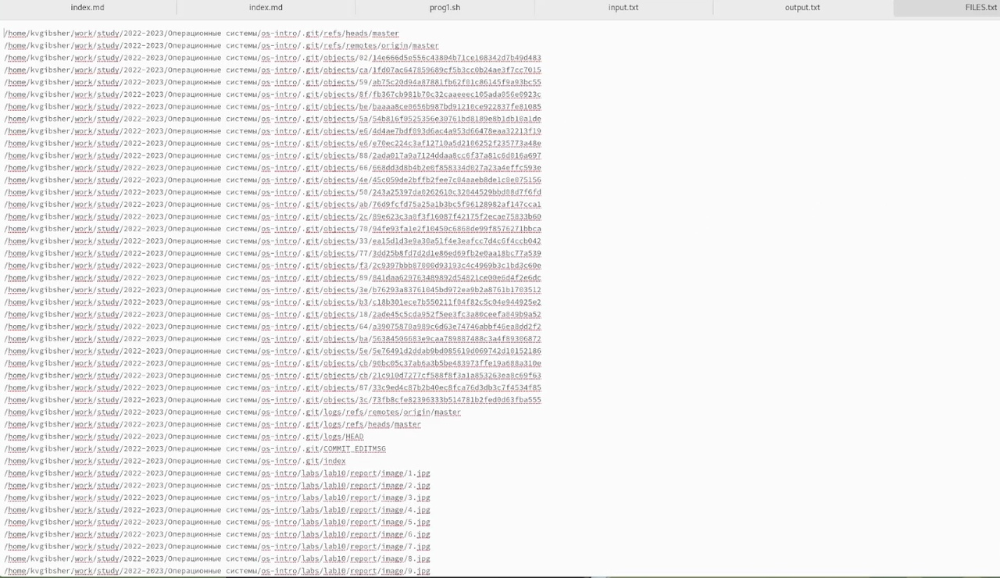{ #fig:012 width=70% }

## Выводы

- Я изучил основы программирования в оболочке ОС UNIX. Научился писать более сложные командные файлы с использованием логических управляющих конструкций и циклов.

:::

