---
## Front matter
title: "Лабораторная работа №11"
subtitle: "Дисциплина: Операционные системы"
author: "Гибшер Кирилл Владимирович"

## Generic otions
lang: ru-RU
toc-title: "Содержание"

## Bibliography
bibliography: bib/cite.bib
csl: pandoc/csl/gost-r-7-0-5-2008-numeric.csl

## Pdf output format
toc: true # Table of contents
toc-depth: 2
lof: true # List of figures
lot: true # List of tables
fontsize: 12pt
linestretch: 1.5
papersize: a4
documentclass: scrreprt
## I18n polyglossia
polyglossia-lang:
  name: russian
  options:
  - spelling=modern
  - babelshorthands=true
polyglossia-otherlangs:
  name: english
## I18n babel
babel-lang: russian
babel-otherlangs: english
## Fonts
mainfont: PT Serif
romanfont: PT Serif
sansfont: PT Sans
monofont: PT Mono
mainfontoptions: Ligatures=TeX
romanfontoptions: Ligatures=TeX
sansfontoptions: Ligatures=TeX,Scale=MatchLowercase
monofontoptions: Scale=MatchLowercase,Scale=0.9
## Biblatex
biblatex: true
biblio-style: "gost-numeric"
biblatexoptions:
  - parentracker=true
  - backend=biber
  - hyperref=auto
  - language=auto
  - autolang=other*
  - citestyle=gost-numeric
## Pandoc-crossref LaTeX customization
figureTitle: "Рис."
tableTitle: "Таблица"
listingTitle: "Листинг"
lofTitle: "Список иллюстраций"
lotTitle: "Список таблиц"
lolTitle: "Листинги"
## Misc options
indent: true
header-includes:
  - \usepackage{indentfirst}
  - \usepackage{float} # keep figures where there are in the text
  - \floatplacement{figure}{H} # keep figures where there are in the text
---

# Цель работы

Изучить основы программирования в оболочке ОС UNIX. Научится писать более сложные командные файлы с использованием логических управляющих конструкций и циклов.

# Задание

1. Используя команды getopts grep, написать командный файл, который анализирует командную строку с ключами:

- -iinputfile — прочитать данные из указанного файла;

- -ooutputfile — вывести данные в указанный файл;

- -pшаблон — указать шаблон для поиска;

- -C — различать большие и малые буквы;

- -n — выдавать номера строк.

а затем ищет в указанном файле нужные строки, определяемые ключом -p

2. Написать на языке Си программу, которая вводит число и определяет, является ли оно больше нуля, меньше нуля или равно нулю. Затем программа завершается с помощью функции exit(n), передавая информацию в о коде завершения в оболочку. Командный файл должен вызывать эту программу и, проанализировав с помощью команды $?, выдать сообщение о том, какое число было введено.

3. Написать командный файл, создающий указанное число файлов, пронумерованных последовательно от 1 до 𝑁 (например 1.tmp, 2.tmp, 3.tmp,4.tmp и т.д.). Число файлов, которые необходимо создать, передаётся в аргументы командной строки. Этот же командный файл должен уметь удалять все созданные им файлы (если они существуют)

4. Написать командный файл, который с помощью команды tar запаковывает в архив все файлы в указанной директории. Модифицировать его так, чтобы запаковывались только те файлы, которые были изменены менее недели тому назад (использовать команду find).

# Теоретическое введение

Командный процессор (командная оболочка, интерпретатор команд shell) — это программа, позволяющая пользователю взаимодействовать с операционной системой компьютера. В операционных системах типа UNIX/Linux наиболее часто используются следующие реализации командных оболочек: - оболочка Борна (Bourne shell или sh) — стандартная командная оболочка UNIX/Linux, содержащая базовый, но при этом полный набор функций;

- С-оболочка (или csh) — надстройка на оболочкой Борна, использующая С-подобный синтаксис команд с возможностью сохранения истории выполнения команд;

- оболочка Корна (или ksh) — напоминает оболочку С, но операторы управления программой совместимы с операторами оболочки Борна;

- BASH — сокращение от Bourne Again Shell (опять оболочка Борна), в основе своей совмещает свойства оболочек С и Корна (разработка компании Free Software Foundation).

- POSIX (Portable Operating System Interface for Computer Environments) — набор стандартов описания интерфейсов взаимодействия операционной системы и прикладных программ. Стандарты POSIX разработаны комитетом IEEE (Institute of Electrical and Electronics Engineers) для обеспечения совместимости различных UNIX/Linux-подобных операционных систем и переносимости прикладных программ на уровне исходного кода. POSIX-совместимые оболочки разработаны на базе оболочки Корна. Рассмотрим основные элементы программирования в оболочке bash. В других оболочках большинство команд будет совпадать с описанными ниже. 

# Выполнение лабораторной работы

1. Используя команды getopts grep, напишем скрипт для первого задания (рис. [-@fig:001])

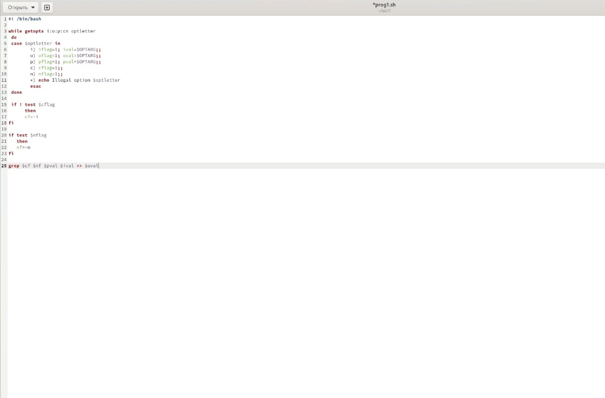{ #fig:001 width=70% }

2. Запустим командный файл и проверим его работоспособность , прописав соответствующие опции в команде. Результат работы проверим в файле output (рис. [-@fig:002])

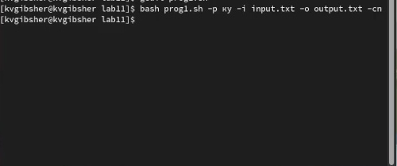{ #fig:002 width=70% }

3. Содержимое файла input (рис. [-@fig:003])

{ #fig:003 width=70% }

4. Содержимое файла output (рис. [-@fig:004])

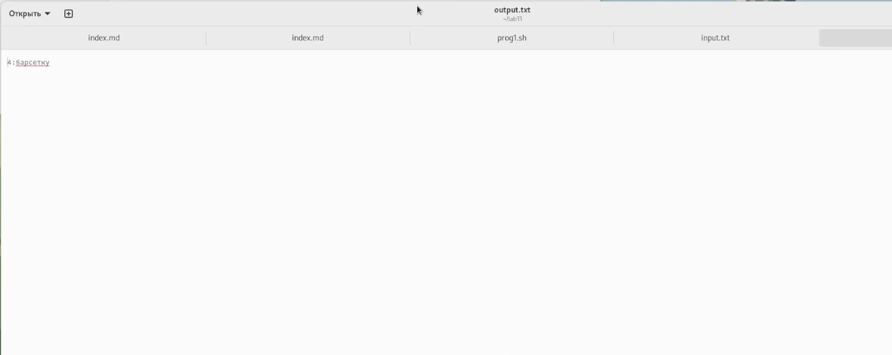{ #fig:004 width=70% }

5. Напишем код для файла с поддержкой Си (рис. [-@fig:005])

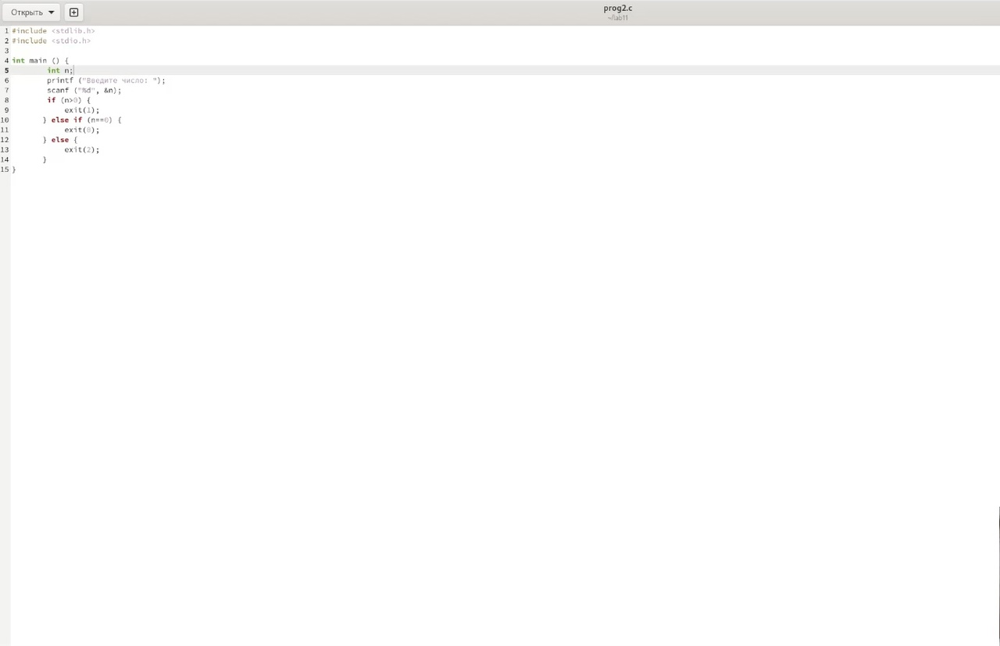{ #fig:005 width=70% }

6. Используя раннее написанный код СИ , напишем скрипт для командного файла, который будет удовлетворять условия задания 2 (рис. [-@fig:006])

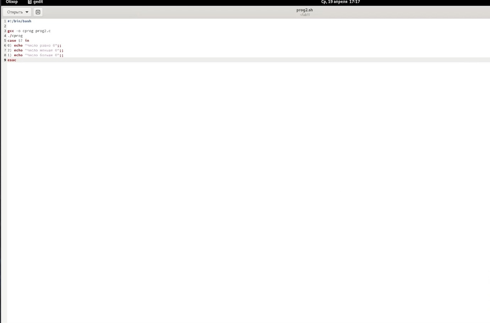{ #fig:006 width=70% }

7. Запуск командного файла и проверка работоспособности кода. Действительно, все необходимые проверки над вводимыми пользователем числами проводятся. Задание выполнено (рис. [-@fig:007])

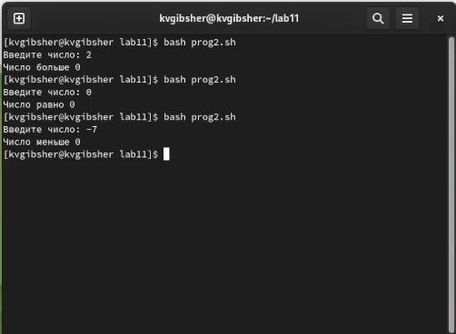{ #fig:007 width=70% }

8. Напишем скрипт для третьего задания (рис. [-@fig:008])

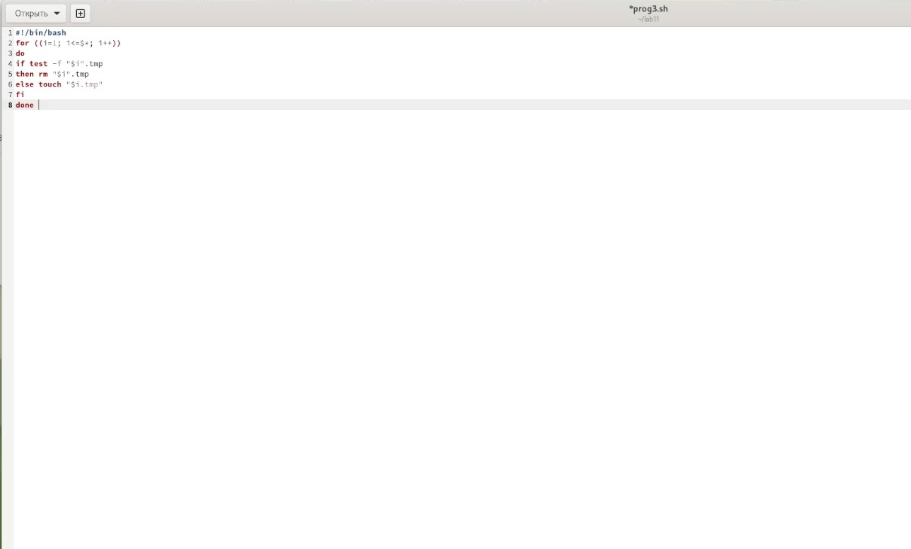{ #fig:008 width=70% }

9. Запустим командный файл и увидим, что при первом запуске создается 3 файла тмп и при повторном запуске, созданные им файлы удаляются, тем самым программа соответствует условиям задания. (рис. [-@fig:009])

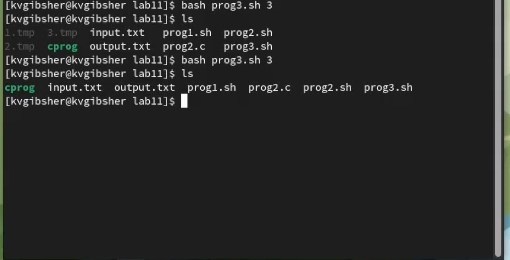{ #fig:009 width=70% }

10. Напишем скрипт для последнего задания (рис. [-@fig:010])

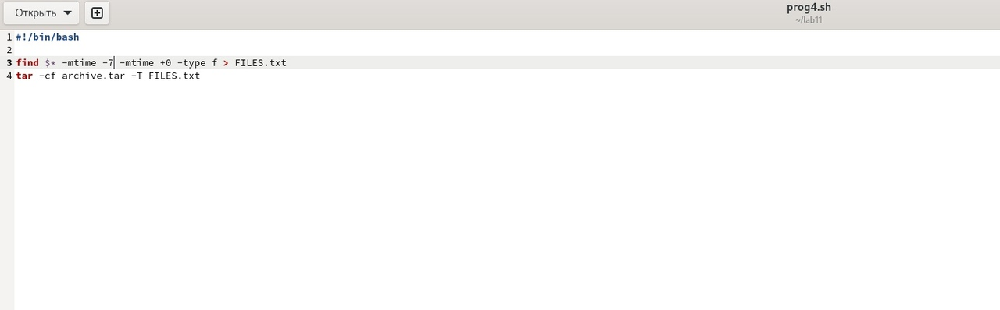{ #fig:010 width=70% }

11. Запустим командный файл и увидим, что при запуске архив и файл FILES.txt были успешно созданы. (рис. [-@fig:011])

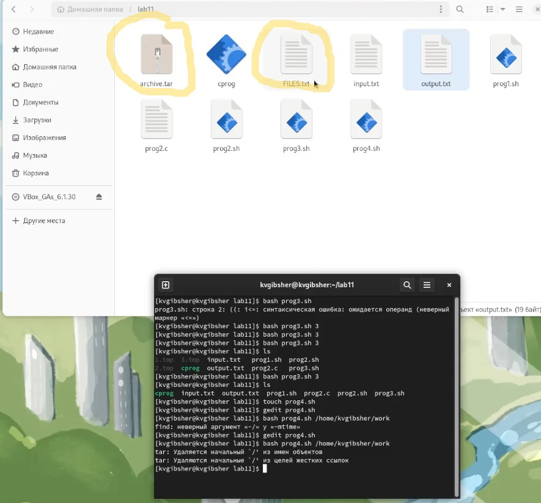{ #fig:011 width=70% }

12. Проверим результат, открыв файл  FILES.txt , в которой и указываются все архивированные файлы  (рис. [-@fig:012])

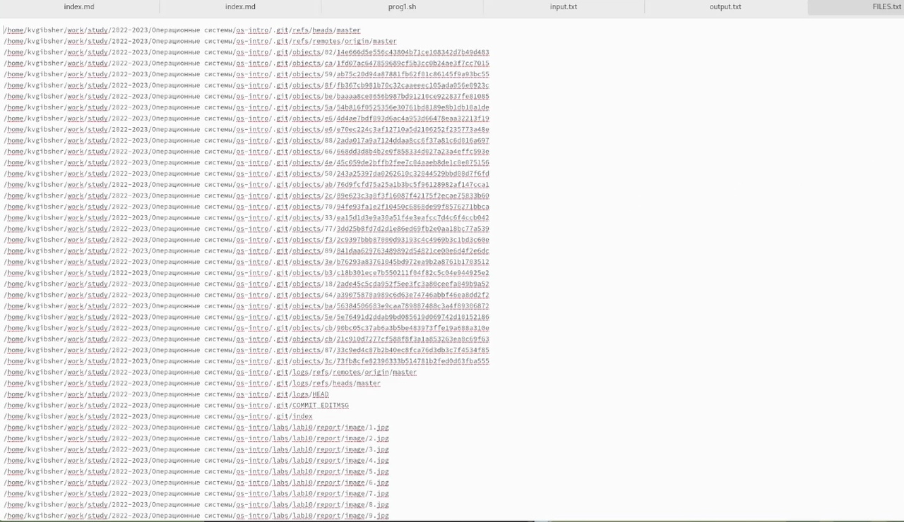{ #fig:012 width=70% }

# Вывод

Я изучил основы программирования в оболочке ОС UNIX. Научился писать более сложные командные файлы с использованием логических управляющих конструкций и циклов.
