---
## Front matter
lang: ru-RU
title: 1 этап Индвидуального проекта
subtitle: Курс "Операционные Системы"
author:
  - Гибшер К.В. , НКАбд-01-22
institute:
  - Российский университет дружбы народов, Москва, Россия
  
date: 24 февраля 2023

## i18n babel
babel-lang: russian
babel-otherlangs: english

## Formatting pdf
toc: false
toc-title: Содержание
slide_level: 2
aspectratio: 169
section-titles: true
theme: metropolis
header-includes:
 - \metroset{progressbar=frametitle,sectionpage=progressbar,numbering=fraction}
 - '\makeatletter'
 - '\beamer@ignorenonframefalse'
 - '\makeatother'
---

## Докладчик

:::::::::::::: {.columns align=center}
::: {.column width="70%"}

  * Гибшер Кирилл Владимирович
  * студент группы НКАбд-01-22
  *  кафедры Компьютерные и информационные науки 
  * Российский университет дружбы народов
  * [kirill.gibsher@gmail.com](mailto:kirill.gibsher@gmail.com)
  

:::
::: {.column width="30%"}

:::
::::::::::::::

## Цели и задачи

- Адаптировать виртуальную машину под дальнейшую работу с сайтом путем создания новых каталогов и внедрения генератора статических сайтов hugo.

1. Скачать расширение для работы с сайтом.

2. Используя шаблоны с github создать необходимые каталоги и настроить их работу.

3. Проверить работоспособность сайта после завершения всех настроек. 

# Выполнение лабораторной работы 

## Hugo-extended

 Устанавливаем архив hugo-extended на нашу ОС и затем распаковываем этот архив.

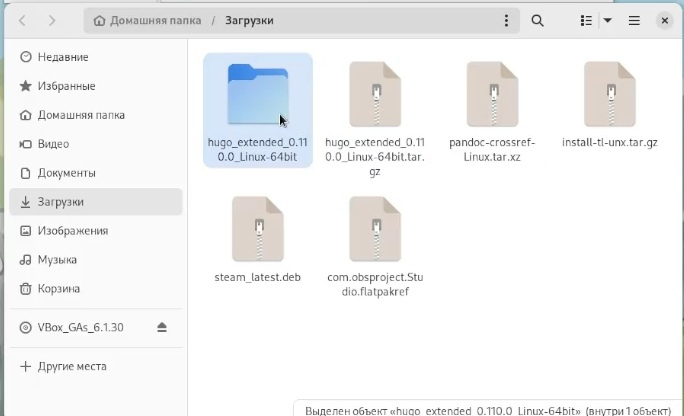

## Создание репозитория blog 

Используя шаблон с github создаем новый репозиторий blog.

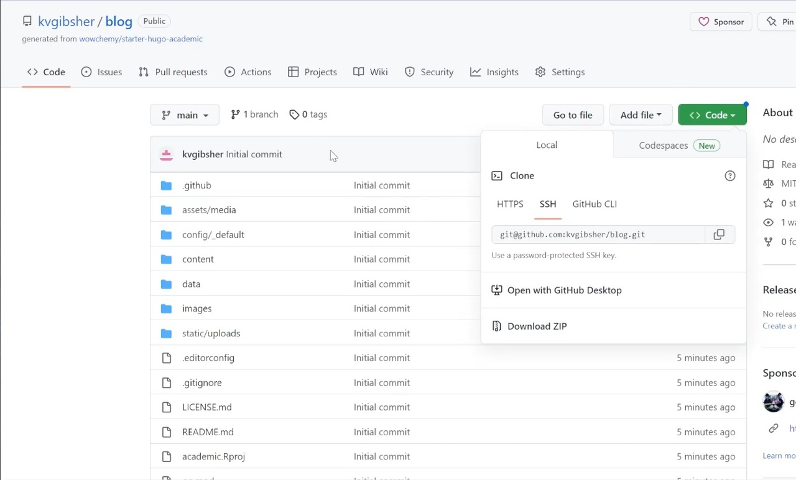

## Клонирование репозитория blog в нашу ОС 

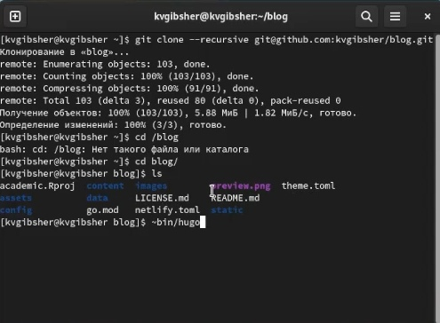

## Запуск исполняемого файла hugo

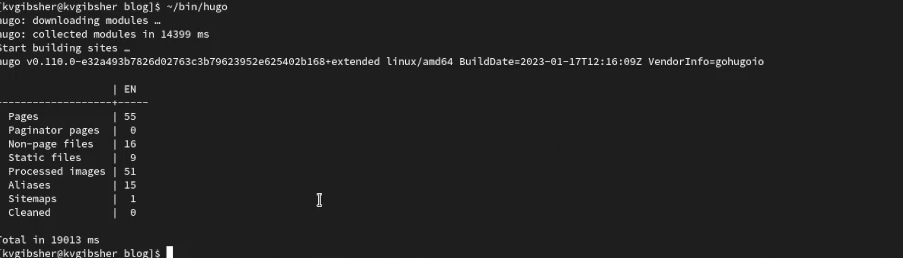

## Hugo-server

Находясь в каталоге blog прописываем команду hugo server , которая создает локальный хост на сайт и выдает ссылку рабочую лишь в той ОС и на там устройстве, в котором произошла ее генерация.

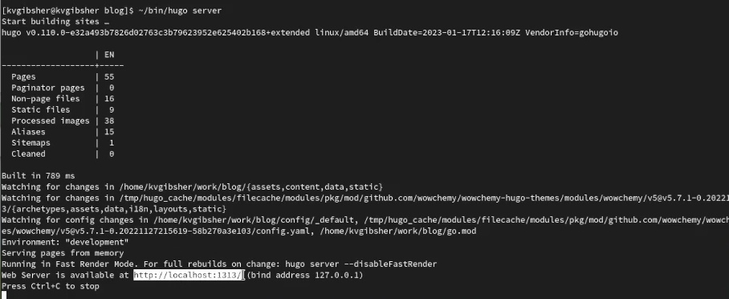

## Проверка хост ссылки 

## Создание репозитория github.io 

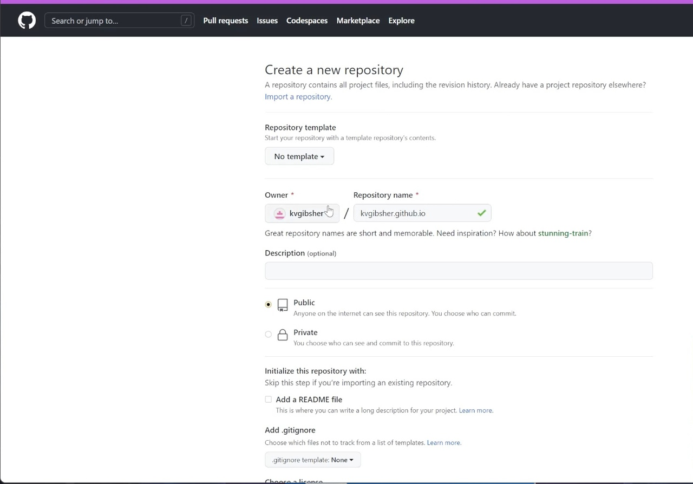

## Клонирование репозитория github.io

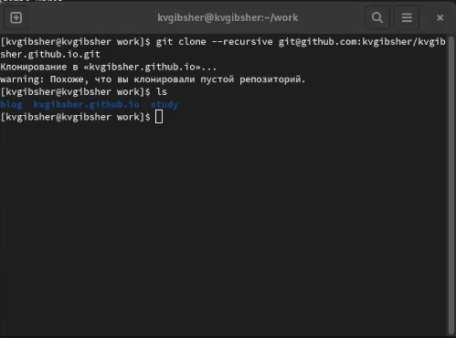

## Активация репозитория

Создаем главную ветку в каталоге и называем ее main. Затем, чтобы активировать репозиторий создаем пустой файл README.md и прописываем git push origin main для выгрузки на github. 

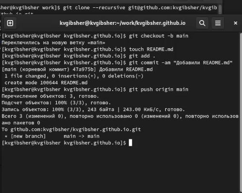

## Добавление сабмодуля и создание каталога public 

Прописываем git submodule add -b main находясь в каталоге blog.

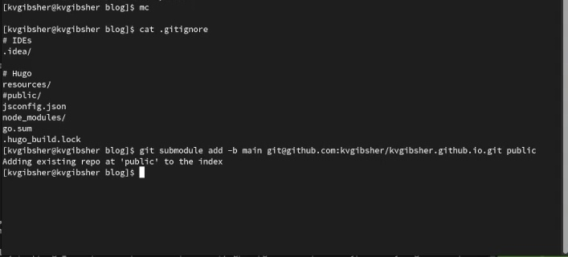

## Повторный запуск исполняемого файла hugo 

Запускаем вновь исполняемый файл hugo в каталоге blog и все содержимое автоматически выгружается в каталог public. 

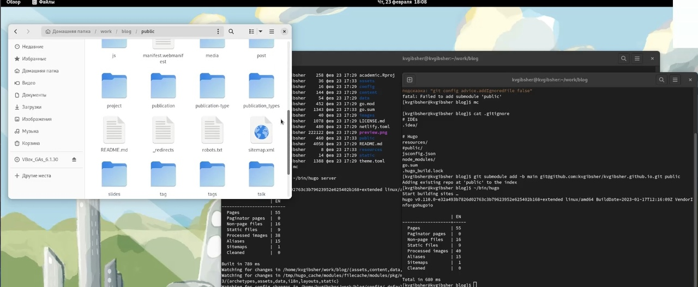

## Отправка файлов на Github 

Отправляем файлы сайта на сервер с помощью git add . и git push и проверяем непосредственно на гитхаб успех наших действий.

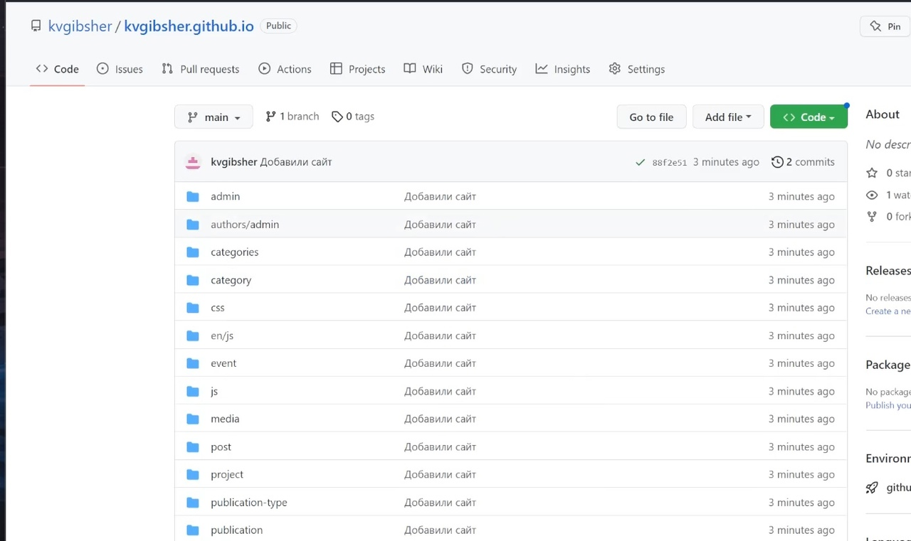

## Запуск первоначальной версии нашего сайта 

Копируем часть ссылки на одноименный репозиторий и проверяем работоспособность нашего личного сайта. 

# Результаты

## Выводы

Мы установили генератор статичных сайтов hugo , создали необходимые для сайта репозитории , связали их с нашей ОС и проверили работоспособность первоначальной версии нашего сайта. 

:::

