---
## Front matter
title: "Отчет по созданию проекта"
subtitle: "1 этап проекта"
author: "Гибшер Кирилл Владимирович"

## Generic otions
lang: ru-RU
toc-title: "Содержание"

## Bibliography
bibliography: bib/cite.bib
csl: pandoc/csl/gost-r-7-0-5-2008-numeric.csl

## Pdf output format
toc: true # Table of contents
toc-depth: 2
lof: true # List of figures
lot: true # List of tables
fontsize: 12pt
linestretch: 1.5
papersize: a4
documentclass: scrreprt
## I18n polyglossia
polyglossia-lang:
  name: russian
  options:
	- spelling=modern
	- babelshorthands=true
polyglossia-otherlangs:
  name: english
## I18n babel
babel-lang: russian
babel-otherlangs: english
## Fonts
mainfont: PT Serif
romanfont: PT Serif
sansfont: PT Sans
monofont: PT Mono
mainfontoptions: Ligatures=TeX
romanfontoptions: Ligatures=TeX
sansfontoptions: Ligatures=TeX,Scale=MatchLowercase
monofontoptions: Scale=MatchLowercase,Scale=0.9
## Biblatex
biblatex: true
biblio-style: "gost-numeric"
biblatexoptions:
  - parentracker=true
  - backend=biber
  - hyperref=auto
  - language=auto
  - autolang=other*
  - citestyle=gost-numeric
## Pandoc-crossref LaTeX customization
figureTitle: "Рис."
tableTitle: "Таблица"
listingTitle: "Листинг"
lofTitle: "Список иллюстраций"
lotTitle: "Список таблиц"
lolTitle: "Листинги"
## Misc options
indent: true
header-includes:
  - \usepackage{indentfirst}
  - \usepackage{float} # keep figures where there are in the text
  - \floatplacement{figure}{H} # keep figures where there are in the text
---

# Цель работы

- Адаптировать виртуальную машину под дальнейшую работу с сайтом путем создания новых каталогов и внедрения генератора статических сайтов hugo.

# Задание

1. Скачать расширение для работы с сайтом.

2. Используя шаблоны с github создать необходимые каталоги и настроить их работу.

3. Проверить работоспособность сайта после завершения всех настроек. 

# Теоретическое введение

**Сайт** - одна или несколько логически связанных между собой веб-страниц; также место расположения контента сервера. Обычно сайт в Интернете представляет собой массив связанных данных, имеющий уникальный адрес и воспринимаемый пользователями как единое целое.

# Выполнение лабораторной работы

 Устанавливаем архив hugo-extended на нашу ОС и затем распаковываем этот архив. (рис. [-@fig:001]).

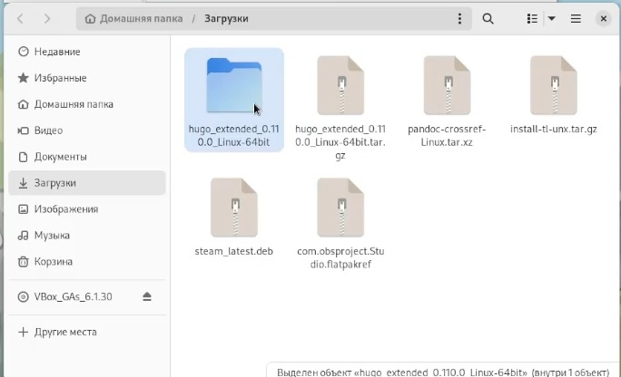{#fig:001 width=70%}

Создаем в домашнем каталоге пользователя папку bin. Из исходного распакованного архива hugo-extended забираем только лишь исполняемый файл hugo и перемещаем в созданную папку bin. (рис. [-@fig:002]).

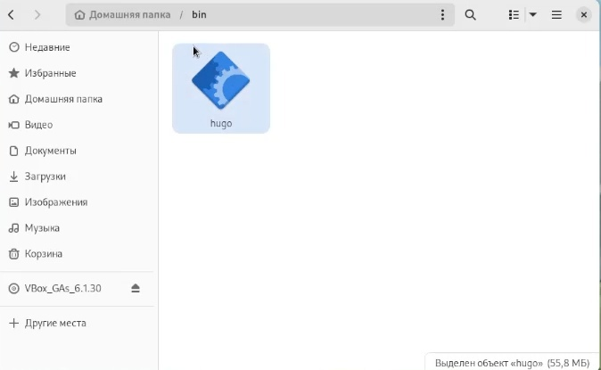{#fig:002 width=70%}

Используя шаблон с github создаем новый репозиторий blog. (рис. [-@fig:003]).

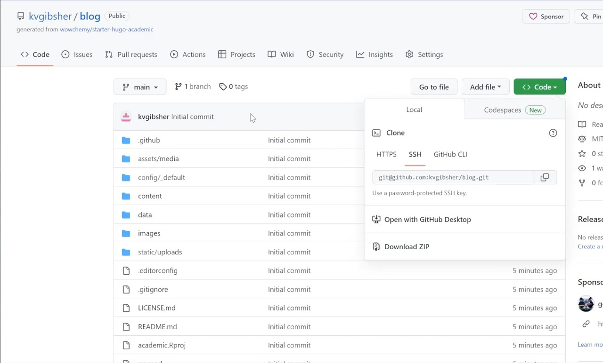{#fig:003 width=70%}

С помощью команды git clone клонируем репозиторий blog в нашу ОС с последующим созданием каталога соответственно. (рис. [-@fig:004]).

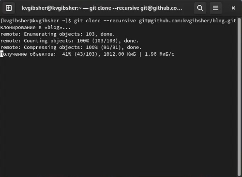{#fig:004 width=70%}	

Проверяем успешность загрузки файлов с github с  помощью команды ls  (рис. [-@fig:005]).

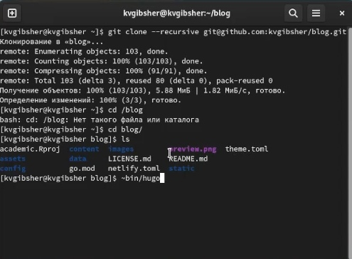{#fig:005 width=70%}

Запускаем исполняемый файл hugo раннее перемещенный в созданную нами в домашнем каталоге пользователя папку bin. (рис. [-@fig:006]).

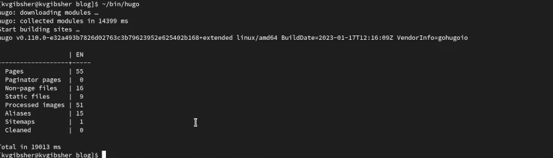{#fig:006 width=70%}

Удаляем каталог public находящийся в blog ввиду его ненадобности. (рис. [-@fig:007]).

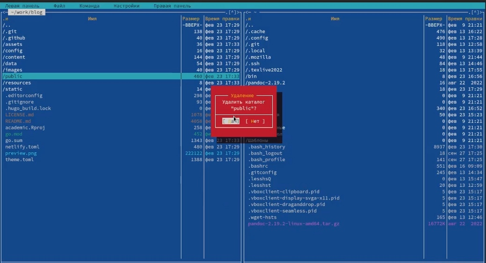{#fig:007 width=70%}

Находясь в каталоге blog прописываем команду hugo server , которая создает локальный хост на сайт и выдает ссылку рабочую лишь в той ОС и на там устройстве, в котором произошла ее генерация  (рис. [-@fig:008]).

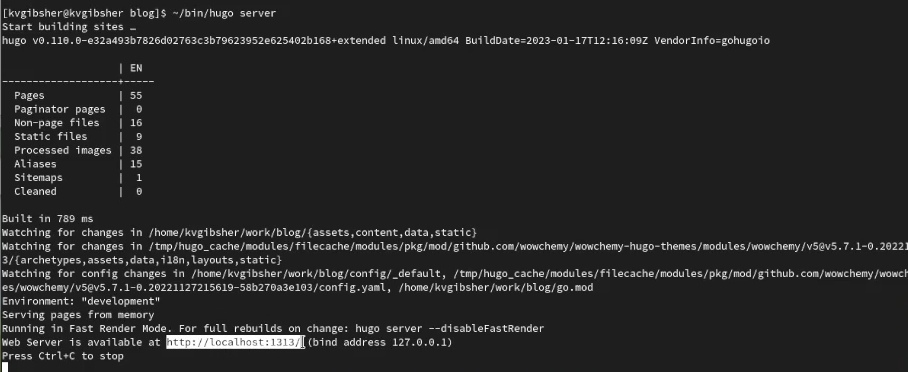{#fig:008 width=70%}

Проверяем работоспособность ссылки  и переходим по ней. (рис. [-@fig:009]).

{#fig:009 width=70%}

Создание нового репозитория на github , который будет иметь прямую связь с нашим будущим сайтом. (рис. [-@fig:010]).

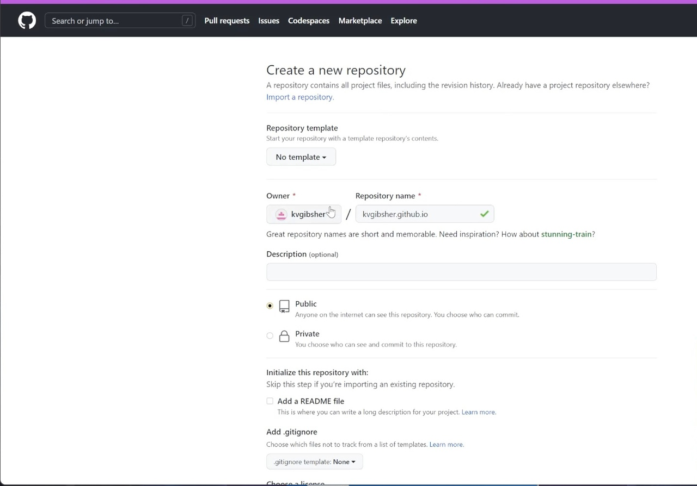{#fig:010 width=70%}

Клонируем только что созданный нами репозиторий в нашу ОС и с помощью команды ls проверяем, что все успешно получилось. Каталог склонировался, но пустой.(рис. [-@fig:011]).

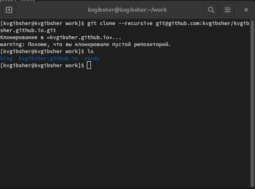{#fig:011 width=70%}

Создаем главную ветку в каталоге и называем ее main. Затем, чтобы активировать репозиторий создаем пустой файл README.md и прописываем git push origin main для выгрузки на github. (рис. [-@fig:012]).

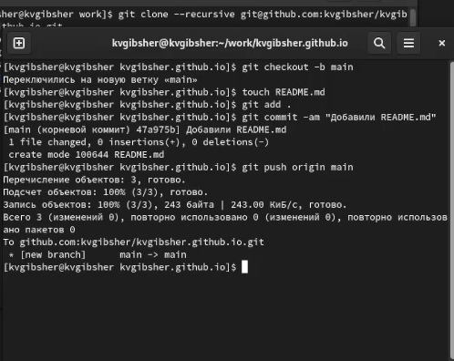{#fig:012 width=70%}

Прописываем git submodule add -b main находясь в каталоге blog. Но выполнение этой команды не очень успешно, т.к. некоторые пути игнорируются файлом gitignore. Потому попытка добавить submodule public проваливается. (рис. [-@fig:013]).

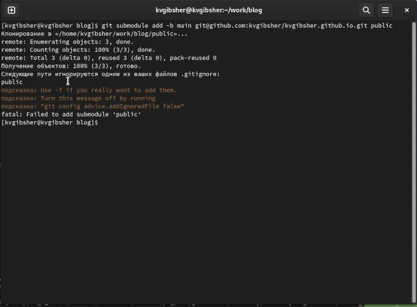{#fig:013 width=70%}

С помощью MightCommander переходим в файл gitignore и коммитим с помощью знака # необходимую строку. Затем повторяем команду из прошлого пункта  и на этот раз все получается и автоматически у нас создается каталог public в blog. (рис. [-@fig:014]).

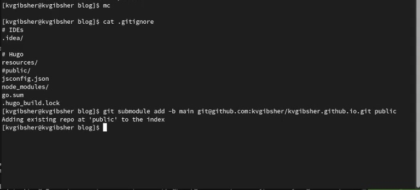{#fig:014 width=70%}

Запускаем вновь исполняемый файл hugo в каталоге blog и все содержимое автоматически выгружается в каталог public. (рис. [-@fig:015]).

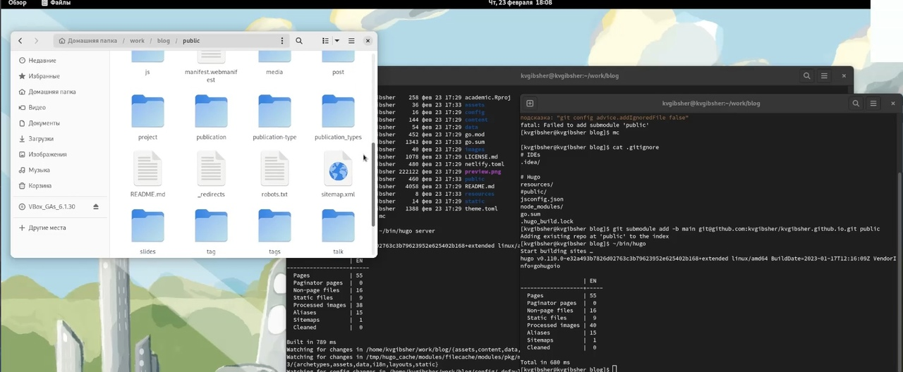{#fig:015 width=70%}

С помощью команды git remote -v проверяем точно ли необходимый для сайта репозиторий подключен к нашей ОС. Затем с помощью уже знакомых команд добавляем сайт и все сопутствующие файлы на гитхаб. (рис. [-@fig:016]).

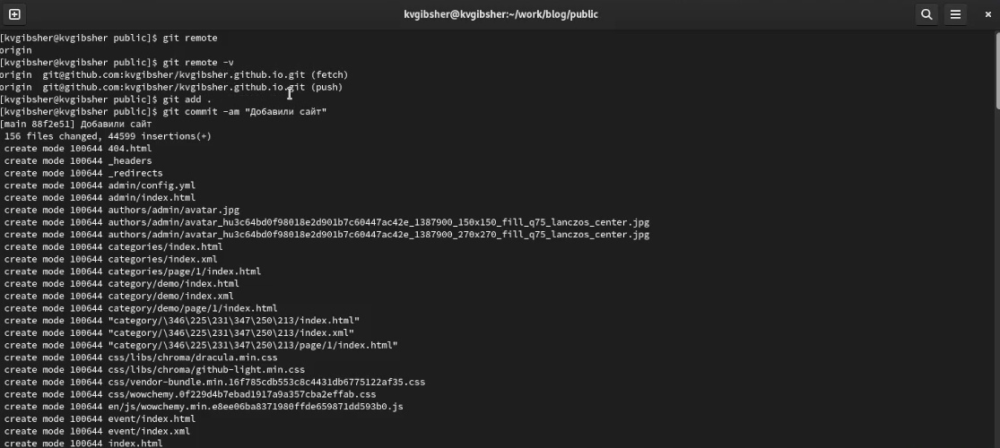{#fig:016 width=70%}

Заходим на гитхаб и убеждаемся в том, что все файлы сайта успешно загружены. (рис. [-@fig:017]).

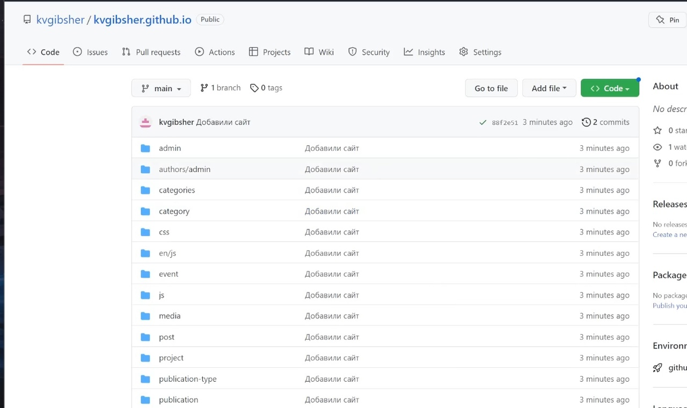{#fig:017 width=70%}

Копируем часть ссылки на одноименный репозиторий и проверяем работоспособность нашего личного сайта. (рис. [-@fig:018]).

{#fig:018 width=70%}

# Выводы

Мы установили генератор статичных сайтов hugo , создали необходимые для сайта репозитории , связали их с нашей ОС и проверили работоспособность первоначальной версии нашего сайта. 

# Список литературы{.unnumbered}

1. Первый этап индивидуального проекта by Кулябов Д.С. [Электронный ресурс] - Режим доступа:https://www.youtube.com/watch?v=OpsSv0RE3C4

::: {#refs}
:::
