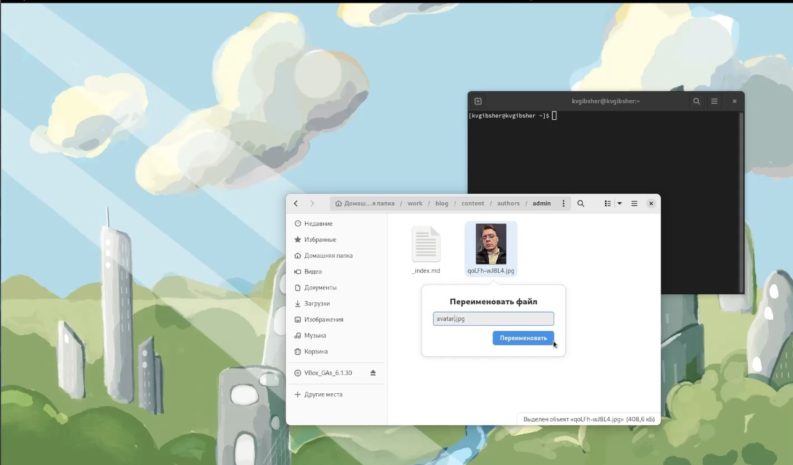

---
## Front matter
lang: ru-RU
title: 2 этап Индвидуального проекта
subtitle: Курс "Операционные Системы"
author:
  - Гибшер К.В. , НКАбд-01-22
institute:
  - Российский университет дружбы народов, Москва, Россия
  
date: 14 марта 2023

## i18n babel
babel-lang: russian
babel-otherlangs: english

## Formatting pdf
toc: false
toc-title: Содержание
slide_level: 2
aspectratio: 169
section-titles: true
theme: metropolis
header-includes:
 - \metroset{progressbar=frametitle,sectionpage=progressbar,numbering=fraction}
 - '\makeatletter'
 - '\beamer@ignorenonframefalse'
 - '\makeatother'
---

## Докладчик

:::::::::::::: {.columns align=center}
::: {.column width="70%"}

  * Гибшер Кирилл Владимирович
  * студент группы НКАбд-01-22
  *  кафедры Компьютерные и информационные науки 
  * Российский университет дружбы народов
  * [kirill.gibsher@gmail.com](mailto:kirill.gibsher@gmail.com)
  

:::
::: {.column width="30%"}

:::
::::::::::::::

## Цели и задачи

- Добавить к сайту данные о себе.

1. Разместить фотографию владельца сайта.

2. Разместить краткое описание владельца сайта (Biography).

3. Добавить информацию об интересах (Interests).

4. Добавить информацию от образовании (Education).

5. Сделать пост по прошедшей неделе.

6. Добавить пост на тему по выбору:

- Управление версиями. Git.

- Непрерывная интеграция и непрерывное развертывание (CI/CD).

# Выполнение лабораторной работы 

## Изменение аватара на сайте

## Добавление информации о себе 

## Первый пост об управлении версиями git

## Пост о прошедшей неделе

## Отображение двух наших новых постов на сайте

# Результаты

## Выводы

Добавил в свой личный сайт данные о себе начиная от основной информации и заканчивая учебными данными. Написал два поста: Один по учебной тематике и один по результатм моей прошедшей недели. 

:::

