---
## Front matter
title: "Отчет по созданию проекта"
subtitle: "2 этап проекта"
author: "Гибшер Кирилл Владимирович"

## Generic otions
lang: ru-RU
toc-title: "Содержание"

## Bibliography
bibliography: bib/cite.bib
csl: pandoc/csl/gost-r-7-0-5-2008-numeric.csl

## Pdf output format
toc: true # Table of contents
toc-depth: 2
lof: true # List of figures
lot: true # List of tables
fontsize: 12pt
linestretch: 1.5
papersize: a4
documentclass: scrreprt
## I18n polyglossia
polyglossia-lang:
  name: russian
  options:
	- spelling=modern
	- babelshorthands=true
polyglossia-otherlangs:
  name: english
## I18n babel
babel-lang: russian
babel-otherlangs: english
## Fonts
mainfont: PT Serif
romanfont: PT Serif
sansfont: PT Sans
monofont: PT Mono
mainfontoptions: Ligatures=TeX
romanfontoptions: Ligatures=TeX
sansfontoptions: Ligatures=TeX,Scale=MatchLowercase
monofontoptions: Scale=MatchLowercase,Scale=0.9
## Biblatex
biblatex: true
biblio-style: "gost-numeric"
biblatexoptions:
  - parentracker=true
  - backend=biber
  - hyperref=auto
  - language=auto
  - autolang=other*
  - citestyle=gost-numeric
## Pandoc-crossref LaTeX customization
figureTitle: "Рис."
tableTitle: "Таблица"
listingTitle: "Листинг"
lofTitle: "Список иллюстраций"
lotTitle: "Список таблиц"
lolTitle: "Листинги"
## Misc options
indent: true
header-includes:
  - \usepackage{indentfirst}
  - \usepackage{float} # keep figures where there are in the text
  - \floatplacement{figure}{H} # keep figures where there are in the text
---

# Цель работы

- Добавить к сайту данные о себе.

# Задание

1. Разместить фотографию владельца сайта.

2. Разместить краткое описание владельца сайта (Biography).

3. Добавить информацию об интересах (Interests).

4. Добавить информацию от образовании (Education).

5. Сделать пост по прошедшей неделе.

6. Добавить пост на тему по выбору:

- Управление версиями. Git.

- Непрерывная интеграция и непрерывное развертывание (CI/CD).

# Теоретическое введение

**Сайт** - одна или несколько логически связанных между собой веб-страниц; также место расположения контента сервера. Обычно сайт в Интернете представляет собой массив связанных данных, имеющий уникальный адрес и воспринимаемый пользователями как единое целое.

# Выполнение лабораторной работы

Добавляем фотографию для нашего аватарки на сайте. (рис. [-@fig:001]).

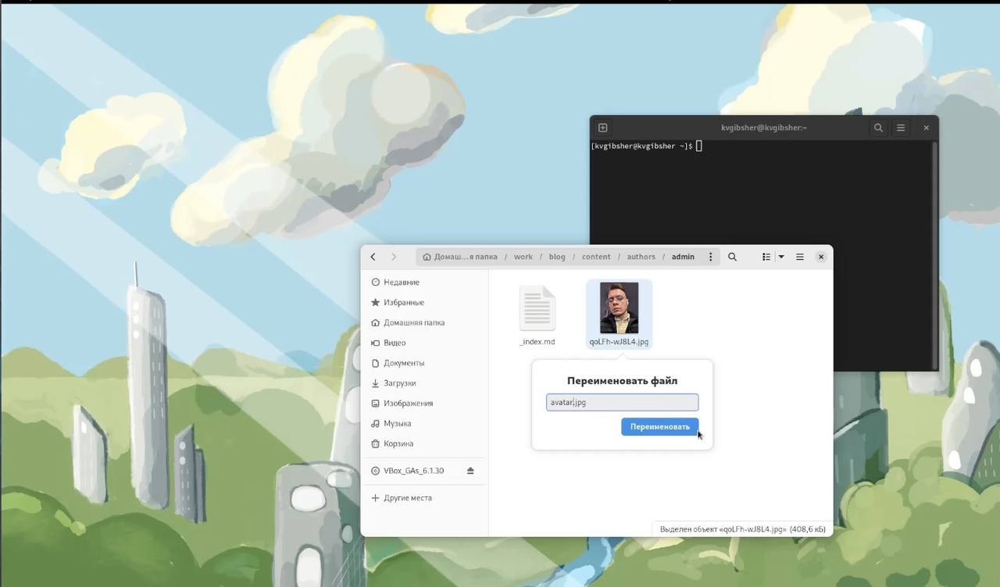{#fig:001 width=70%}

Проверяем изменения на сайте (рис. [-@fig:002]).

{#fig:002 width=70%}

Добавляем информацию о себе, об интересах, данные об образовании (рис. [-@fig:003]).

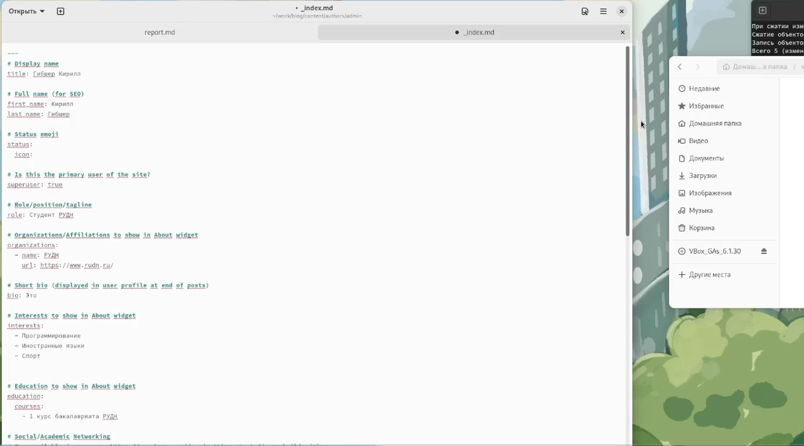{#fig:003 width=70%}

Загружаем все изменения на сервер github (рис. [-@fig:004]).

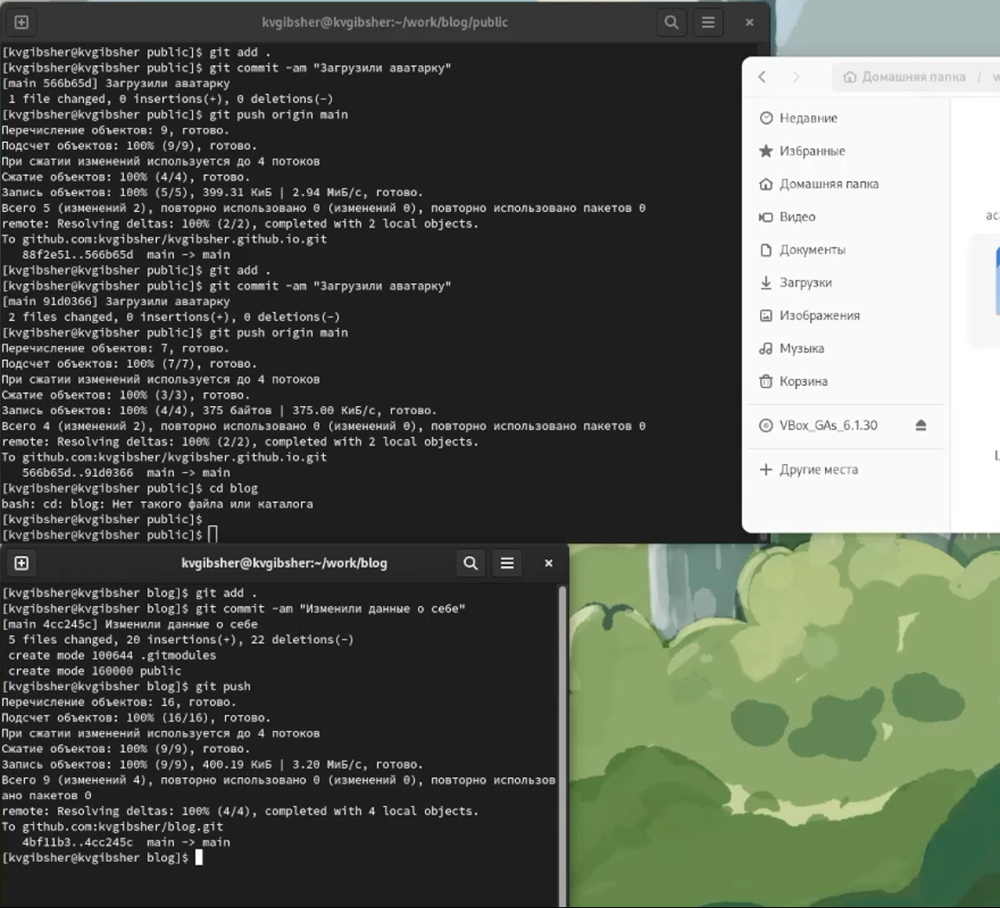{#fig:004 width=70%}	

Проверяем изменения на сайте (рис. [-@fig:005]).

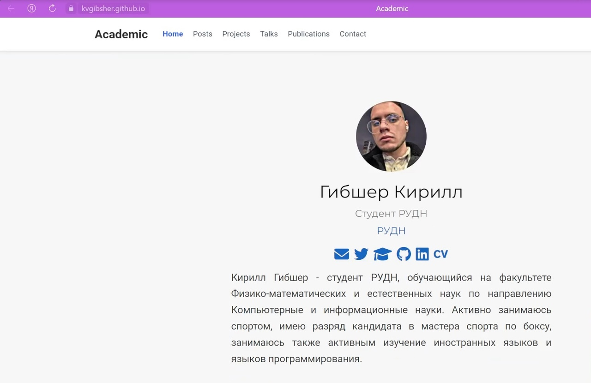{#fig:005 width=70%}

Пишем первый пост на тему "Управление версиями Git"  (рис. [-@fig:006]).

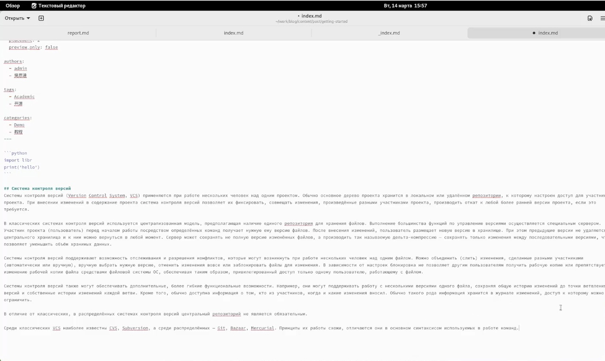{#fig:006 width=70%}

Загрузка поста на cервер github (рис. [-@fig:007]).

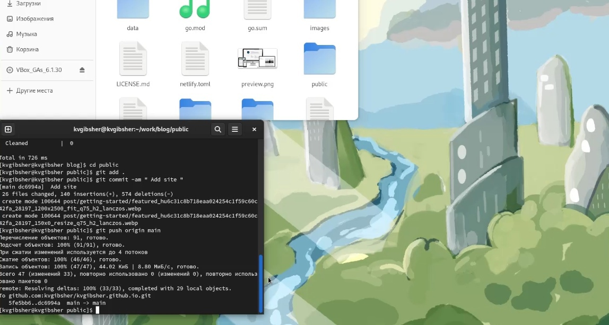{#fig:007 width=70%}

Проверяем изменения на сайте. Пост успешно выгружен. (рис. [-@fig:008]).

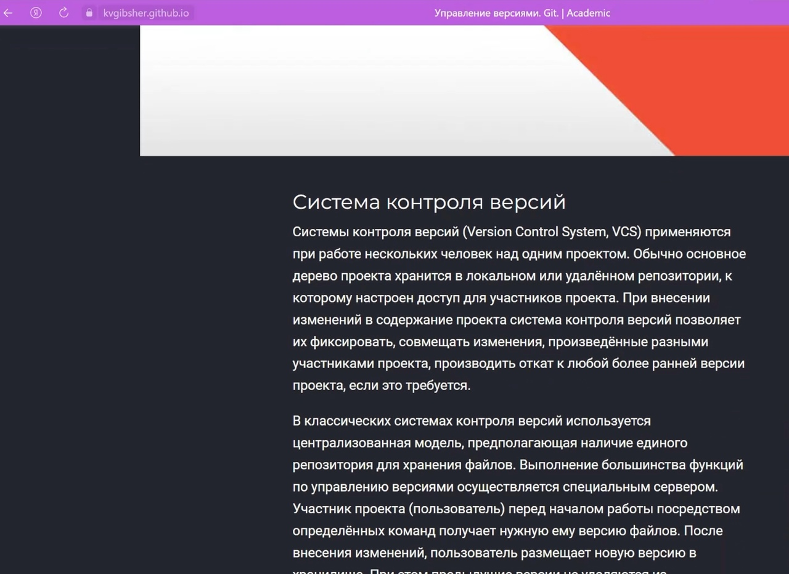{#fig:008 width=70%}

Пишем второй пост о прошедшей неделе. (рис. [-@fig:009]).

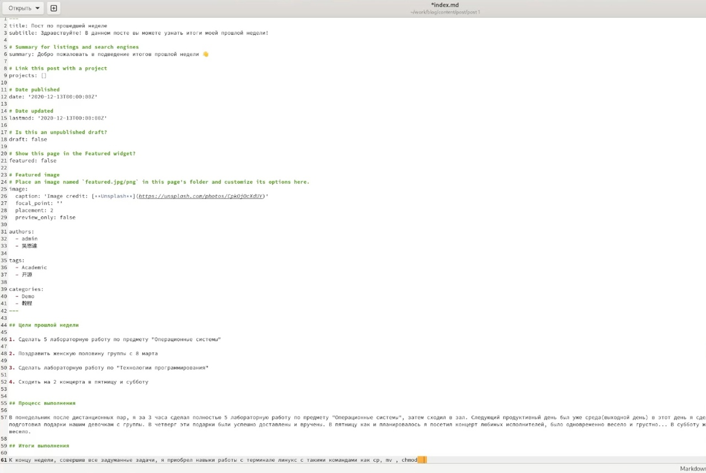{#fig:009 width=70%}

Сохраняем и загружаем пост на сервер github. (рис. [-@fig:010]).

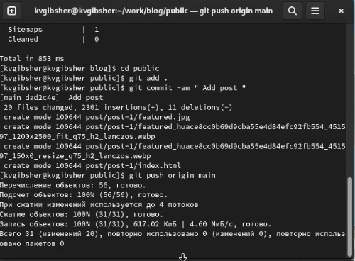{#fig:010 width=70%}

Проверка изменений на сайте. Видим два наших новых поста!!! (рис. [-@fig:011]).

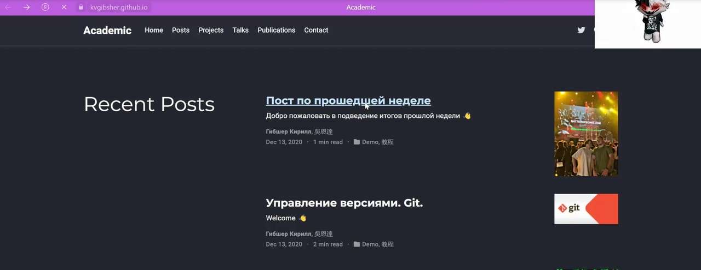{#fig:011 width=70%}

Проверяем содержимое поста о прошедшей неделе на сайте. (рис. [-@fig:012]).

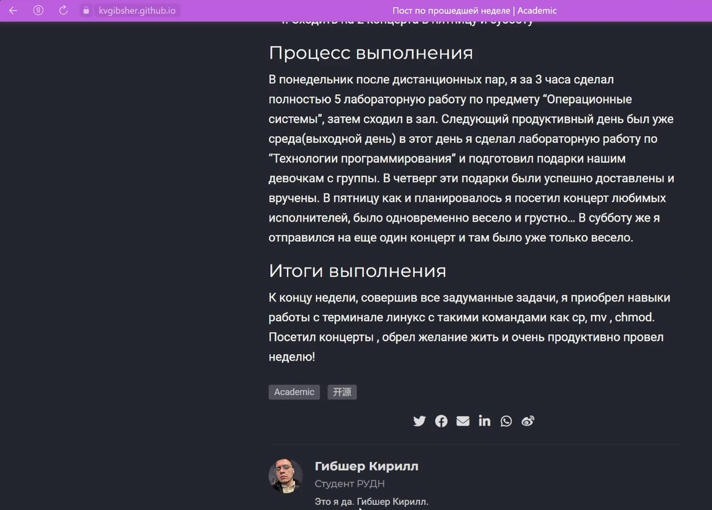{#fig:012 width=70%}

# Выводы

Добавил в свой личный сайт данные о себе начиная от основной информации и заканчивая учебными данными. Написал два поста: Один по учебной тематике и один по результатм моей прошедшей недели. 

# Список литературы{.unnumbered}

1. Этапы индивидуального проекта by Кулябов Д.С. [Электронный ресурс] - Режим доступа:https://esystem.rudn.ru/mod/page/view.php?id=970806

::: {#refs}
:::
