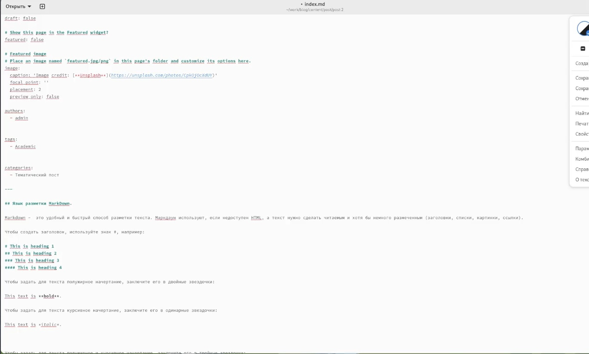

---
## Front matter
lang: ru-RU
title: 3 этап Индвидуального проекта
subtitle: Курс "Операционные Системы"
author:
  - Гибшер К.В. , НКАбд-01-22
institute:
  - Российский университет дружбы народов, Москва, Россия
  
date: 6 апреля 2023

## i18n babel
babel-lang: russian
babel-otherlangs: english

## Formatting pdf
toc: false
toc-title: Содержание
slide_level: 2
aspectratio: 169
section-titles: true
theme: metropolis
header-includes:
 - \metroset{progressbar=frametitle,sectionpage=progressbar,numbering=fraction}
 - '\makeatletter'
 - '\beamer@ignorenonframefalse'
 - '\makeatother'
---

## Докладчик

:::::::::::::: {.columns align=center}
::: {.column width="70%"}

  * Гибшер Кирилл Владимирович
  * студент группы НКАбд-01-22
  *  кафедры Компьютерные и информационные науки 
  * Российский университет дружбы народов
  * [kirill.gibsher@gmail.com](mailto:kirill.gibsher@gmail.com)
  

:::
::: {.column width="30%"}

:::
::::::::::::::

## Цели и задачи

- Добавить к сайту достижения и сделать 2 поста.

1. Добавить информацию о навыках (Skills).

2. Добавить информацию об опыте (Experience).

3. Добавить информацию о достижениях (Accomplishments).

4. Сделать пост по прошедшей неделе.

5. Добавить пост на тему по выбору:

- Легковесные языки разметки.

- Языки разметки. LaTeX.

- Язык разметки Markdown.

# Выполнение лабораторной работы 

## Файл, который необходим для работы

## Сайт для поиска иконок

## Измененный файл с разделом skills

## Визуализация на сайте раздела skills 

## Изменение раздела experience 

## Отображение на сайте 

## Изменение раздела Достижения

## Отображеие на сайте

## Создание тематического поста

## Результат на сайте

## Создание поста по прошедшей неделе 

## Результат на сайте 

## Отображение наших двух новых постов на сайте

# Результаты

## Выводы

Добавил в свой личный сайт данные о достижения, навыках и опыте. Создал два новых поста - один тематический, другой - по прошедшей неделе. 

:::

