---
## Front matter
title: "Отчет по созданию проекта"
subtitle: "3 этап проекта"
author: "Гибшер Кирилл Владимирович"

## Generic otions
lang: ru-RU
toc-title: "Содержание"

## Bibliography
bibliography: bib/cite.bib
csl: pandoc/csl/gost-r-7-0-5-2008-numeric.csl

## Pdf output format
toc: true # Table of contents
toc-depth: 2
lof: true # List of figures
lot: true # List of tables
fontsize: 12pt
linestretch: 1.5
papersize: a4
documentclass: scrreprt
## I18n polyglossia
polyglossia-lang:
  name: russian
  options:
	- spelling=modern
	- babelshorthands=true
polyglossia-otherlangs:
  name: english
## I18n babel
babel-lang: russian
babel-otherlangs: english
## Fonts
mainfont: PT Serif
romanfont: PT Serif
sansfont: PT Sans
monofont: PT Mono
mainfontoptions: Ligatures=TeX
romanfontoptions: Ligatures=TeX
sansfontoptions: Ligatures=TeX,Scale=MatchLowercase
monofontoptions: Scale=MatchLowercase,Scale=0.9
## Biblatex
biblatex: true
biblio-style: "gost-numeric"
biblatexoptions:
  - parentracker=true
  - backend=biber
  - hyperref=auto
  - language=auto
  - autolang=other*
  - citestyle=gost-numeric
## Pandoc-crossref LaTeX customization
figureTitle: "Рис."
tableTitle: "Таблица"
listingTitle: "Листинг"
lofTitle: "Список иллюстраций"
lotTitle: "Список таблиц"
lolTitle: "Листинги"
## Misc options
indent: true
header-includes:
  - \usepackage{indentfirst}
  - \usepackage{float} # keep figures where there are in the text
  - \floatplacement{figure}{H} # keep figures where there are in the text
---

# Цель работы

- Добавить к сайту достижения и сделать 2 поста.

# Задание

1. Добавить информацию о навыках (Skills).

2. Добавить информацию об опыте (Experience).

3. Добавить информацию о достижениях (Accomplishments).

4. Сделать пост по прошедшей неделе.

5. Добавить пост на тему по выбору:

- Легковесные языки разметки.

- Языки разметки. LaTeX.

- Язык разметки Markdown.

# Теоретическое введение

**Сайт** - одна или несколько логически связанных между собой веб-страниц; также место расположения контента сервера. Обычно сайт в Интернете представляет собой массив связанных данных, имеющий уникальный адрес и воспринимаемый пользователями как единое целое.

# Выполнение лабораторной работы

1. Переходим в файл _index.md_ и редактируем следующую часть текста, чтобы поменять раздел skills и визуально отобразить это на нашем сайте (рис. [-@fig:001]).

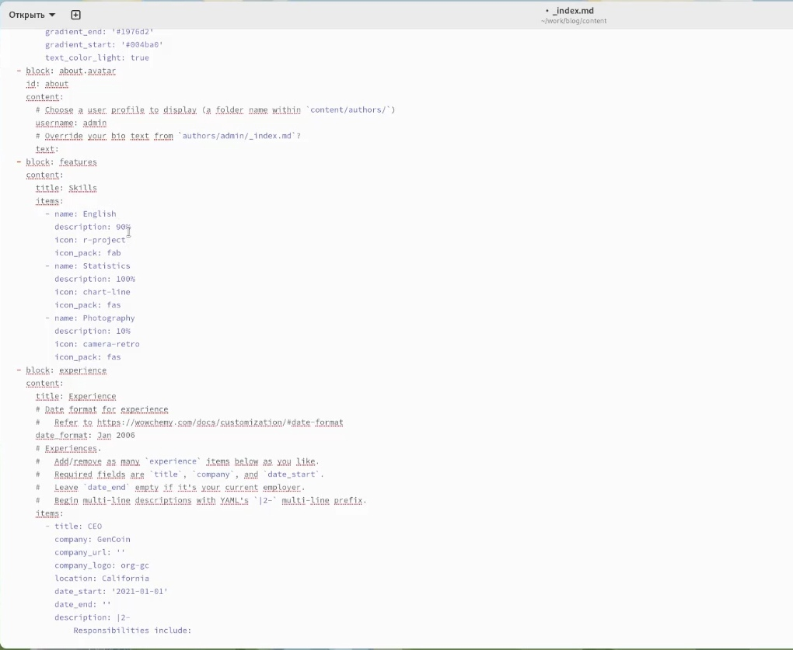{#fig:001 width=70%}

2. На данном сайте мы выбираем иконки для наших "навыков" (рис. [-@fig:002]).

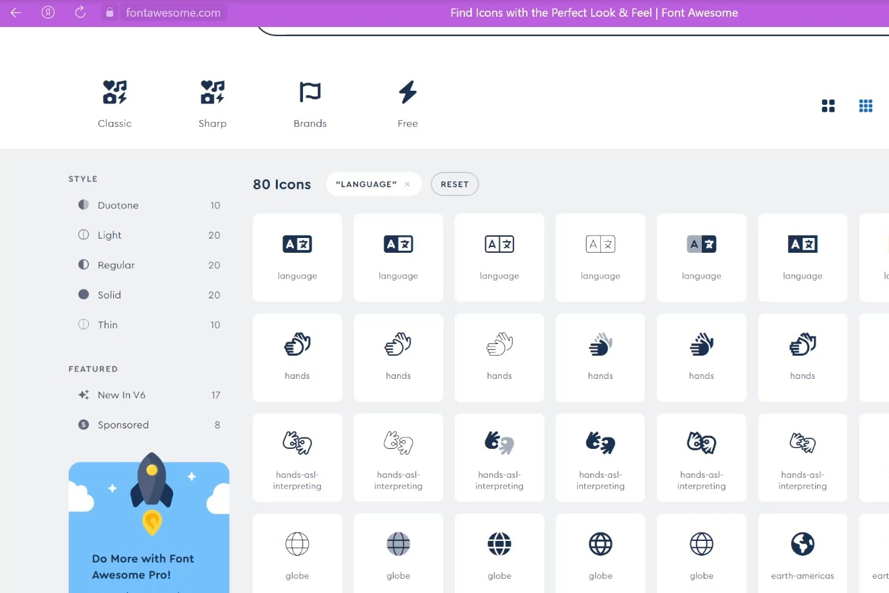{#fig:002 width=70%}

3. Результат измененного текста файла (рис. [-@fig:003]).

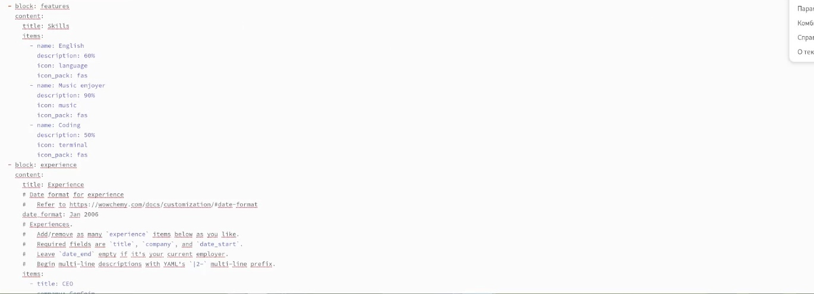{#fig:003 width=70%}

4. Сохраняемся и переходим на сайт для проверки изменений (рис. [-@fig:004]).

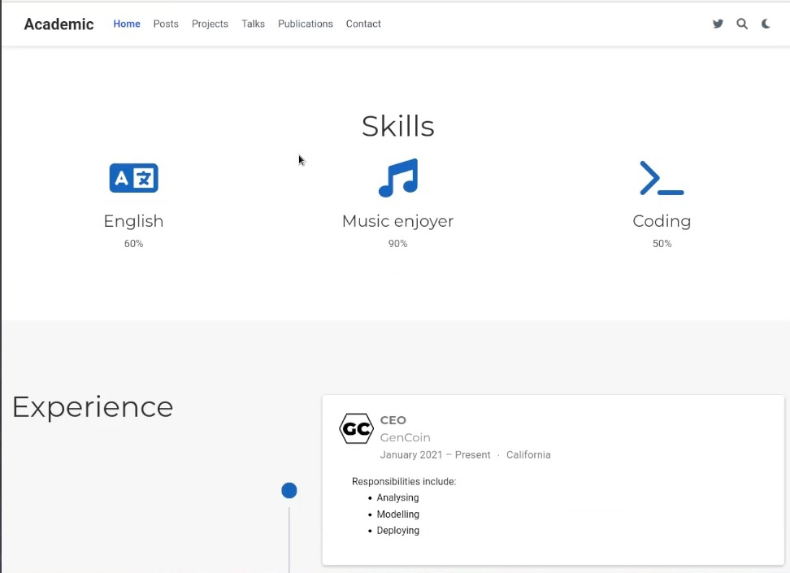{#fig:004 width=70%}	

5. Для изменение пункта expirience переходим все в тот же файл и редактированию подлежит следующая часть текста : (рис. [-@fig:005]).

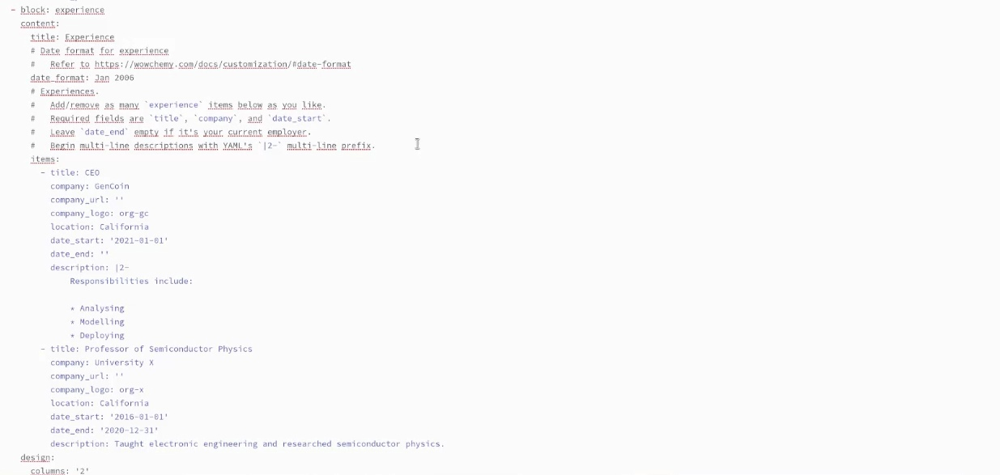{#fig:005 width=70%}

6. Результат изменений текста  (рис. [-@fig:006]).

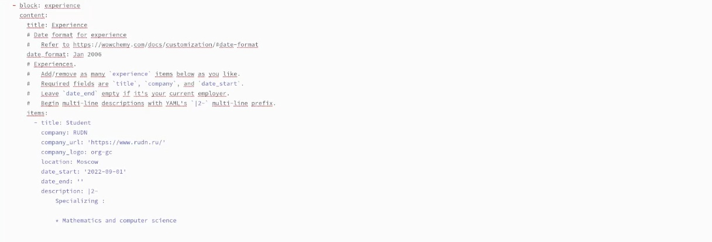{#fig:006 width=70%}

7. Сохраняем все изменения и переходим на сайт для просмотра изменений (рис. [-@fig:007]).

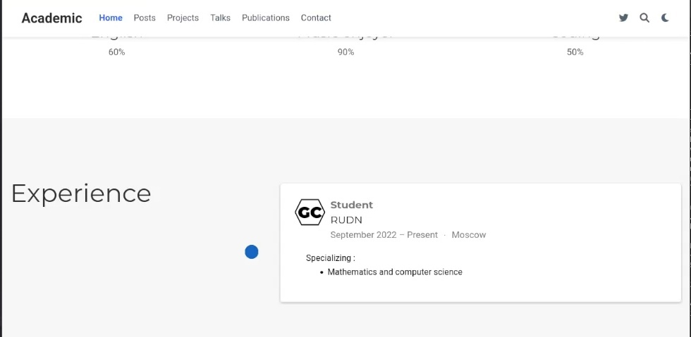{#fig:007 width=70%}

8. Начинаем редактировать раздел достижений, меняя следующую часть текста: (рис. [-@fig:008]).

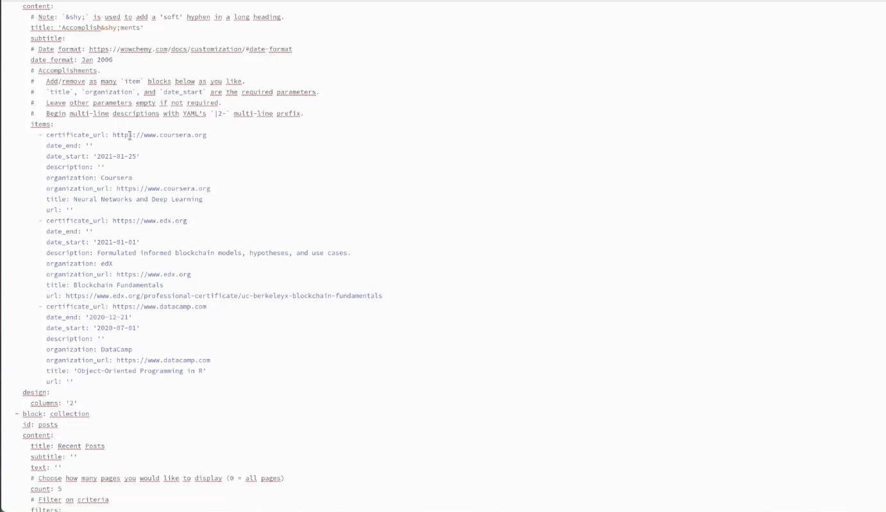{#fig:008 width=70%}

9. Результат изменений текста (рис. [-@fig:009]).

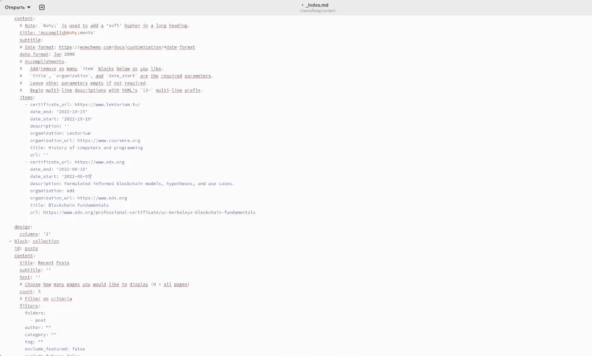{#fig:009 width=70%}

10. Сохраняем все изменения и переходим на сайт (рис. [-@fig:010]).

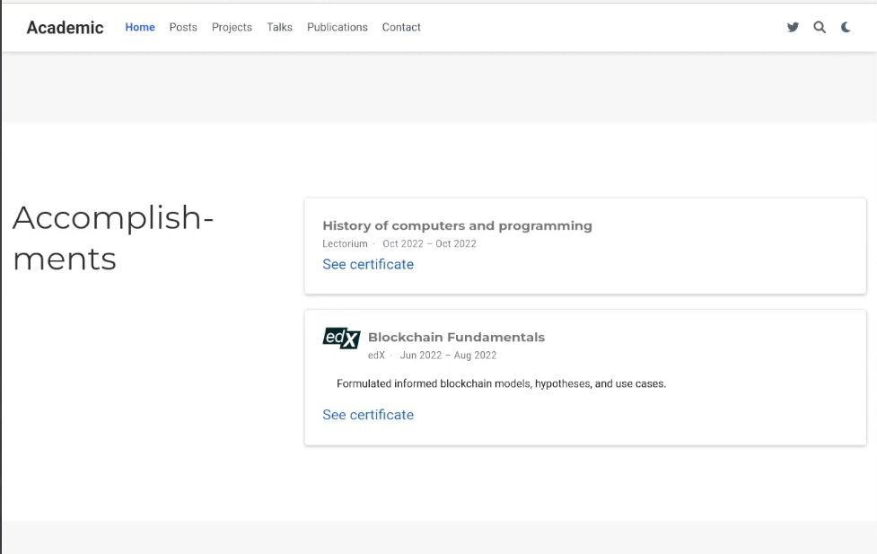{#fig:010 width=70%}

11. Создаем пост на тему "Язык разметки Markdown" (рис. [-@fig:011]).

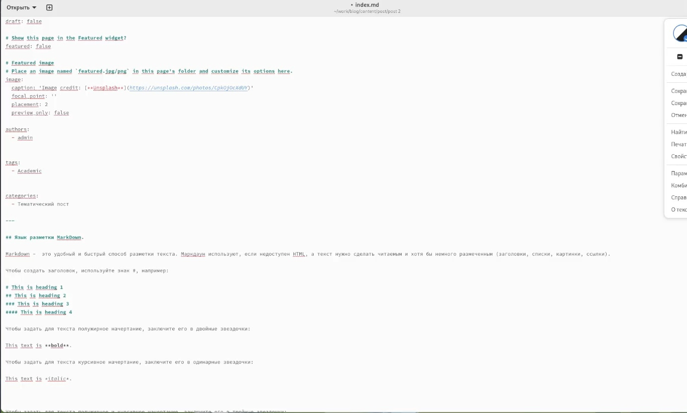{#fig:011 width=70%}

12. Сохраняем пост и выгружаем на сайт (рис. [-@fig:012]).

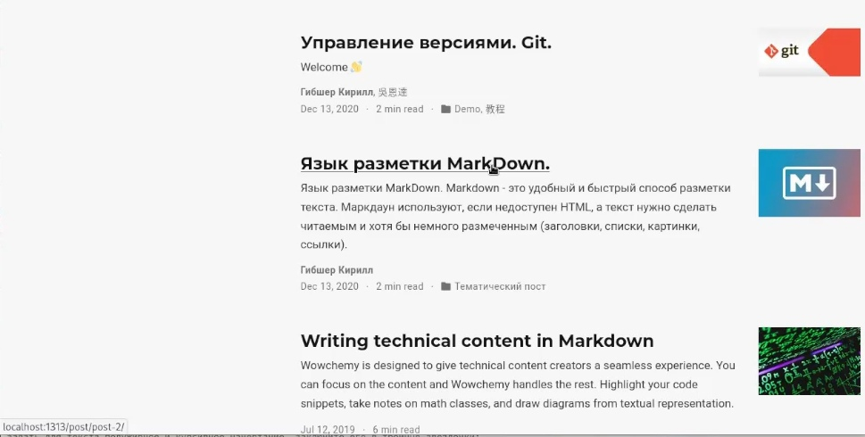{#fig:012 width=70%}

13. Открываем написанный пост (рис. [-@fig:013]).

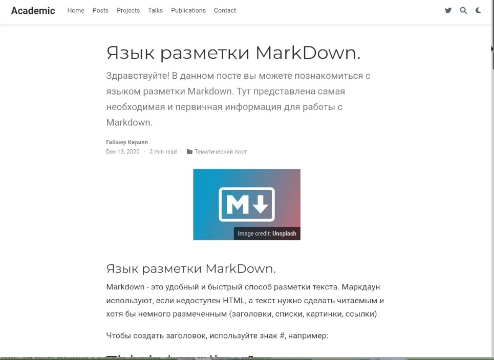{#fig:013 width=70%}

14. Пишем пост по прошедшей неделе (рис. [-@fig:014]).

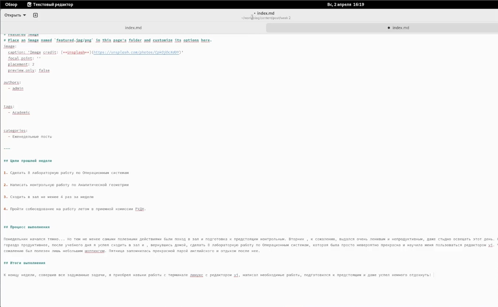{#fig:014 width=70%}

13. Сохраняем пост и выгружаем на сайт (рис. [-@fig:015]).

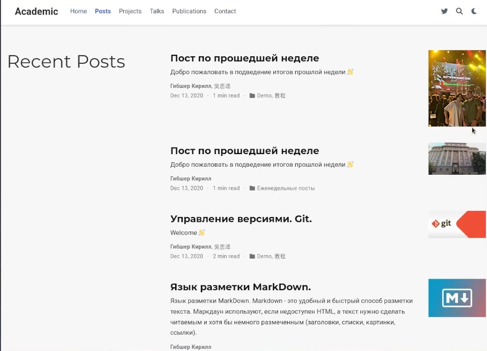{#fig:015 width=70%}

13. Открываем написанный пост по прошедшей неделе (рис. [-@fig:016]).

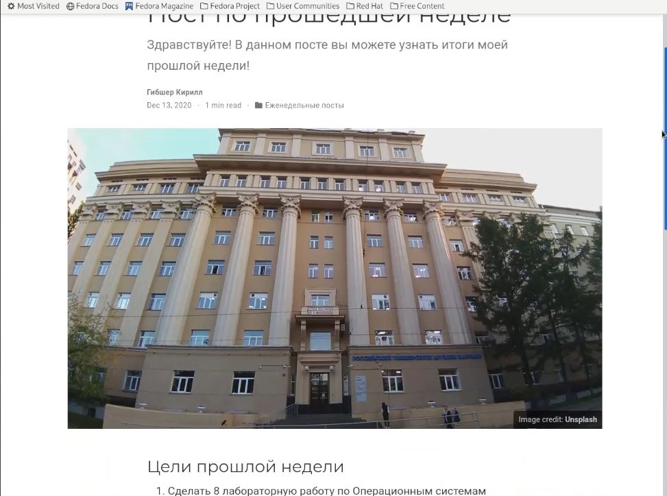{#fig:016 width=70%}

# Выводы

Добавил в свой личный сайт данные о достижениях, опыте и написал два новых поста - один по теме ,  другой по прошедщей неделе.

# Список литературы{.unnumbered}

1. Этапы индивидуального проекта by Кулябов Д.С. [Электронный ресурс] - Режим доступа:https://esystem.rudn.ru/mod/page/view.php?id=970806

::: {#refs}
:::
