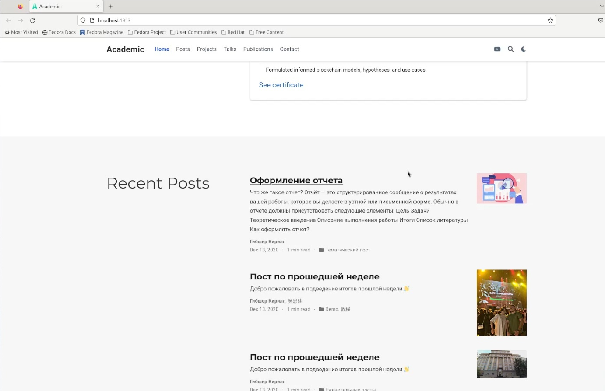

---
## Front matter
lang: ru-RU
title: 4 этап Индвидуального проекта
subtitle: Курс "Операционные Системы"
author:
  - Гибшер К.В. , НКАбд-01-22
institute:
  - Российский университет дружбы народов, Москва, Россия
  
date: 26 апреля 2023

## i18n babel
babel-lang: russian
babel-otherlangs: english

## Formatting pdf
toc: false
toc-title: Содержание
slide_level: 2
aspectratio: 169
section-titles: true
theme: metropolis
header-includes:
 - \metroset{progressbar=frametitle,sectionpage=progressbar,numbering=fraction}
 - '\makeatletter'
 - '\beamer@ignorenonframefalse'
 - '\makeatother'
---

## Докладчик

:::::::::::::: {.columns align=center}
::: {.column width="70%"}

  * Гибшер Кирилл Владимирович
  * студент группы НКАбд-01-22
  *  кафедры Компьютерные и информационные науки 
  * Российский университет дружбы народов
  * [kirill.gibsher@gmail.com](mailto:kirill.gibsher@gmail.com)
  

:::
::: {.column width="30%"}

:::
::::::::::::::

## Цели и задачи

- Зарегистрироваться на соответствующих ресурсах и разместить на них ссылки на сайте.

1. Зарегистрироваться на необходимых ресурсах.

2. Обновить ссылки на собственные аккаунты в этих ресурсах в файле index.md 

3. Обновить иконки для отображения на сайте. 

4. Сделать пост по прошедшей неделе.

5. Добавить пост на тему по выбору:

- Оформление отчёта.

- Создание презентаций.

- Работа с библиографией.

# Выполнение лабораторной работы 

## Редактирование index.md 

## Проверка изменений на сайте

## Создание поста по прошедшей неделе

## Отображение написанного поста на сайте

## Развернутый вид поста на сайте

## Создание тематического поста

## Отображение тематического поста на сайте

## Развернутый вариант тематического поста

# Результаты

## Выводы

Добавил в свой личный сайт ссылки на наши ресурсы ( Youtube, github, google schoolar) и написала два поста (По прошедшей неделе и  на тему "Офомрление отчета") 

:::

