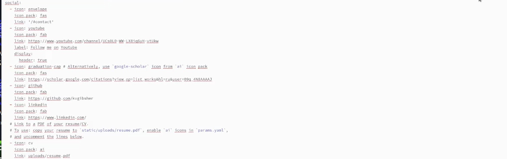
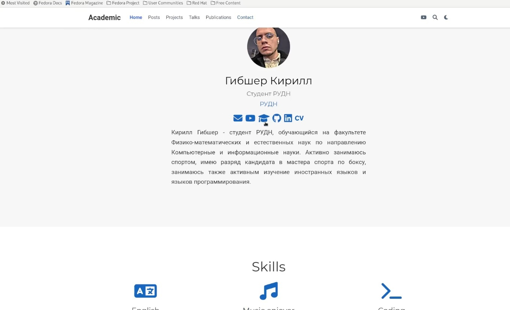
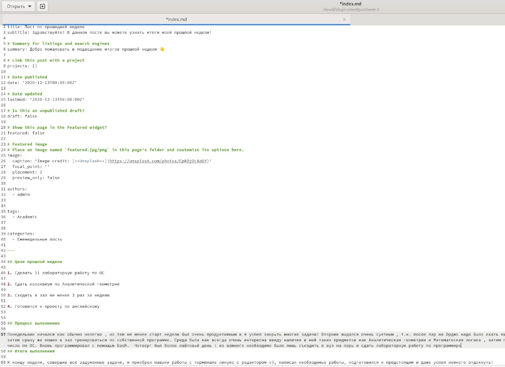
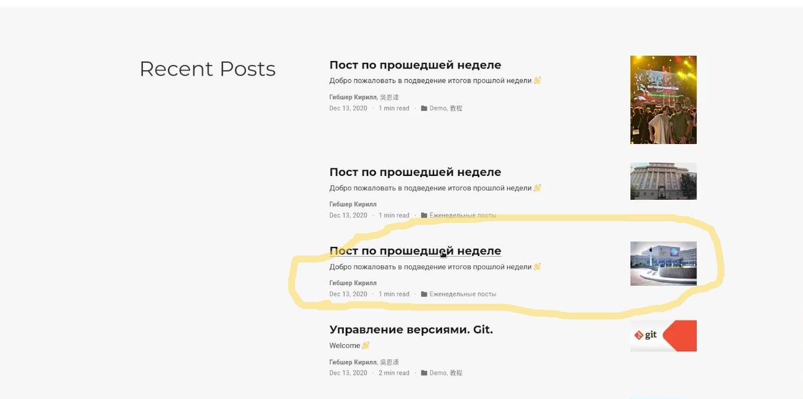
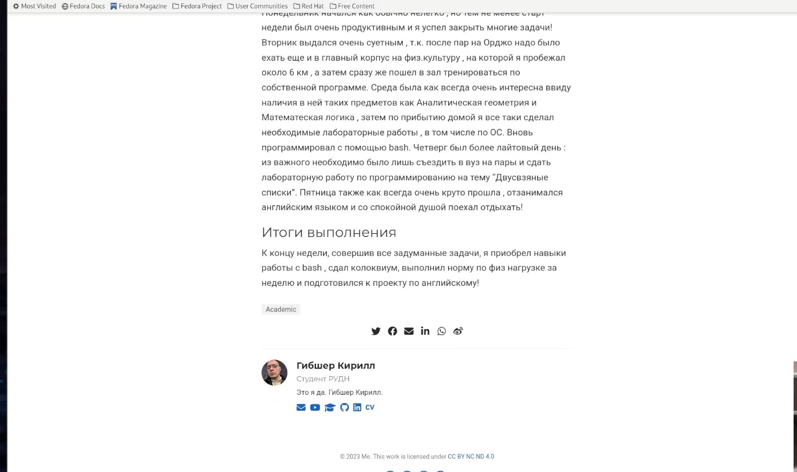
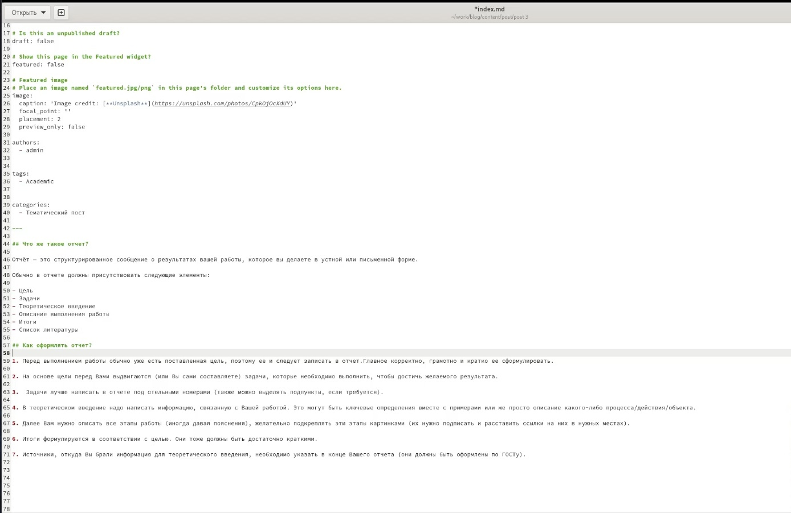
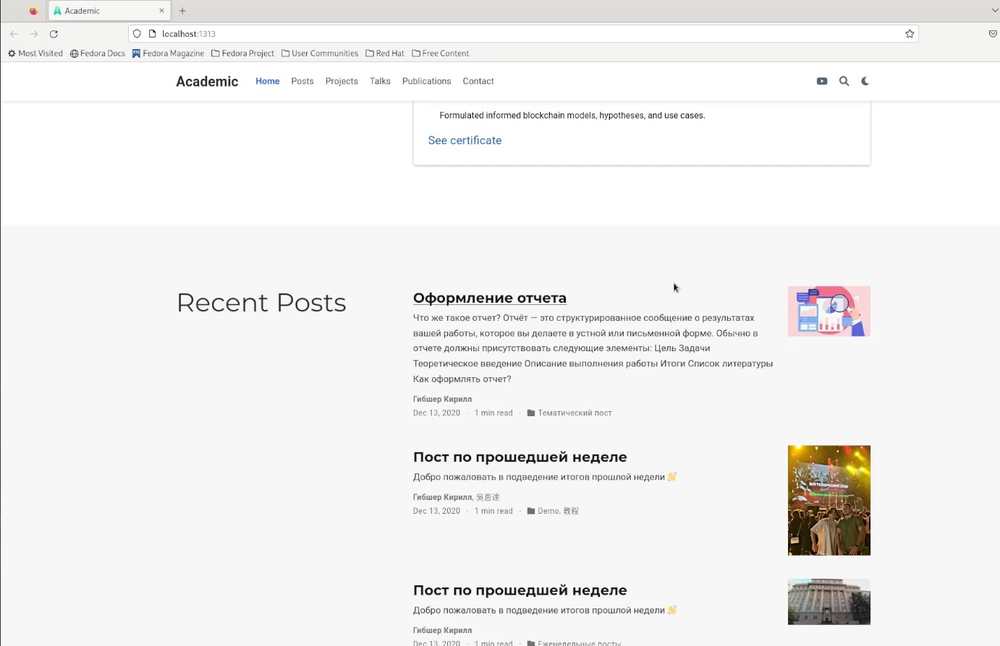
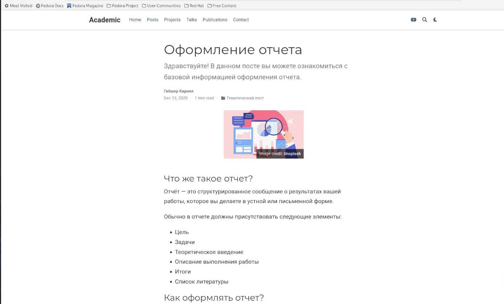

---
## Front matter
title: "Отчет по созданию проекта"
subtitle: "4 этап проекта"
author: "Гибшер Кирилл Владимирович"

## Generic otions
lang: ru-RU
toc-title: "Содержание"

## Bibliography
bibliography: bib/cite.bib
csl: pandoc/csl/gost-r-7-0-5-2008-numeric.csl

## Pdf output format
toc: true # Table of contents
toc-depth: 2
lof: true # List of figures
lot: true # List of tables
fontsize: 12pt
linestretch: 1.5
papersize: a4
documentclass: scrreprt
## I18n polyglossia
polyglossia-lang:
  name: russian
  options:
	- spelling=modern
	- babelshorthands=true
polyglossia-otherlangs:
  name: english
## I18n babel
babel-lang: russian
babel-otherlangs: english
## Fonts
mainfont: PT Serif
romanfont: PT Serif
sansfont: PT Sans
monofont: PT Mono
mainfontoptions: Ligatures=TeX
romanfontoptions: Ligatures=TeX
sansfontoptions: Ligatures=TeX,Scale=MatchLowercase
monofontoptions: Scale=MatchLowercase,Scale=0.9
## Biblatex
biblatex: true
biblio-style: "gost-numeric"
biblatexoptions:
  - parentracker=true
  - backend=biber
  - hyperref=auto
  - language=auto
  - autolang=other*
  - citestyle=gost-numeric
## Pandoc-crossref LaTeX customization
figureTitle: "Рис."
tableTitle: "Таблица"
listingTitle: "Листинг"
lofTitle: "Список иллюстраций"
lotTitle: "Список таблиц"
lolTitle: "Листинги"
## Misc options
indent: true
header-includes:
  - \usepackage{indentfirst}
  - \usepackage{float} # keep figures where there are in the text
  - \floatplacement{figure}{H} # keep figures where there are in the text
---

# Цель работы

- Зарегистрироваться на соответствующих ресурсах и разместить на них ссылки на сайте.

# Задание

1. Зарегистрироваться на необходимых ресурсах.

2. Обновить ссылки на собственные аккаунты в этих ресурсах в файле index.md 

3. Обновить иконки для отображения на сайте. 

4. Сделать пост по прошедшей неделе.

5. Добавить пост на тему по выбору:

- Оформление отчёта.

- Создание презентаций.

- Работа с библиографией.

# Теоретическое введение

**Сайт** - одна или несколько логически связанных между собой веб-страниц; также место расположения контента сервера. Обычно сайт в Интернете представляет собой массив связанных данных, имеющий уникальный адрес и воспринимаемый пользователями как единое целое.

# Выполнение лабораторной работы

1. Переходим в файл _index.md_ и редактируем следующую часть текста, чтобы поменять раздел contact, находящийся прямо под нашей аватаркой и должностью "Студент РУДН"  и визуально отобразить это на нашем сайте. Сохраняем изменения. (рис. [-@fig:001]).

{#fig:001 width=70%}

2. После сохранения изменений запускаем локальный хост и проверяем работоспособность иконок и их изменение. (рис. [-@fig:002]).

{#fig:002 width=70%}

3. Пишем текст для поста по прошедшей неделе. (рис. [-@fig:003]).

{#fig:003 width=70%}

4. Сохраняемся и переходим на сайт для проверки изменений (рис. [-@fig:004]).

{#fig:004 width=70%}	

5. Развернутый вид поста на нашем сайте (рис. [-@fig:005]).

{#fig:005 width=70%}

6. Пишем текст для поста на тему "Оформление отчета". (рис. [-@fig:006]).

{#fig:006 width=70%}

7. Сохраняем все изменения и переходим на сайт для просмотра изменений (рис. [-@fig:007]).

{#fig:007 width=70%}

8. Развернутый вариант нашего поста по теме на сайте. (рис. [-@fig:008]).

{#fig:008 width=70%}

# Выводы

Добавил в свой личный сайт ссылки на наши ресурсы ( Youtube, github, google schoolar) и написала два поста (По прошедшей неделе и  на тему "Офомрление отчета") 

# Список литературы{.unnumbered}

1. Этапы индивидуального проекта by Кулябов Д.С. [Электронный ресурс] - Режим доступа:https://esystem.rudn.ru/mod/page/view.php?id=970806

::: {#refs}
:::
